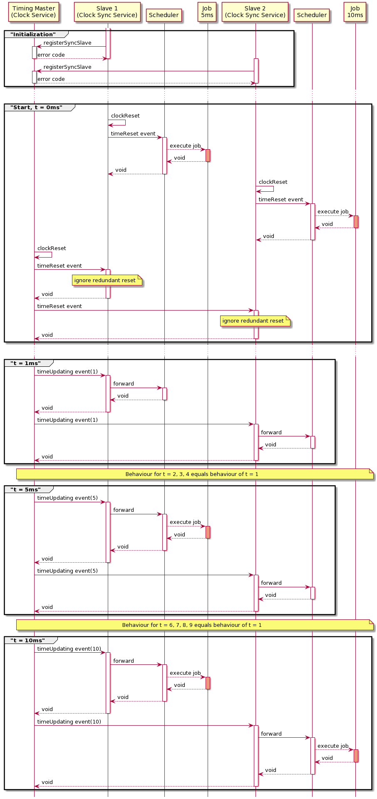
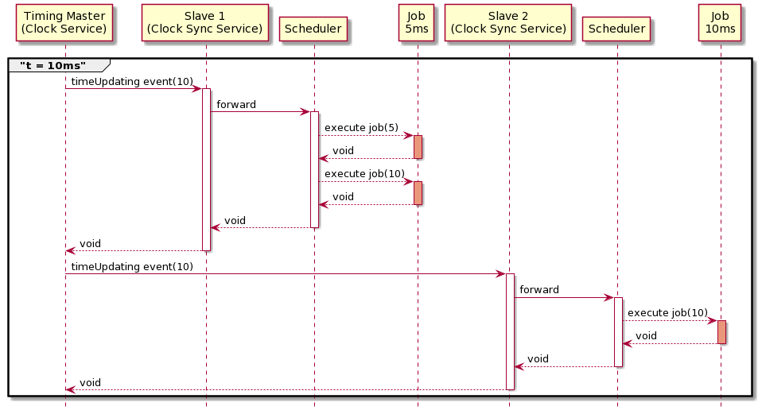
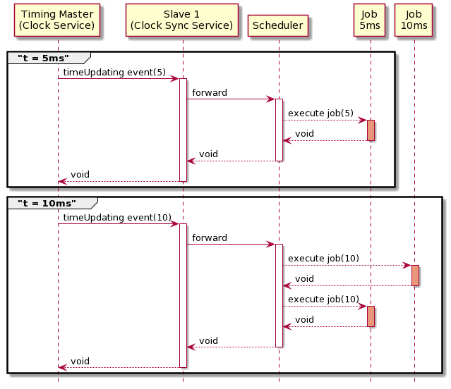

.. Copyright @ 2021 VW Group. All rights reserved.
.. 
.. This Source Code Form is subject to the terms of the Mozilla 
.. Public License, v. 2.0. If a copy of the MPL was not distributed 
.. with this file, You can obtain one at https://mozilla.org/MPL/2.0/.

.. sidebar:: Time Synchronization and Scheduling explained

        .. contents::

.. _label_guide_timing:

=============================================
Time Synchronization and Scheduling explained
=============================================

This page introduces a more detailed look into the time synchronization and scheduling mechanisms used.

The section :ref:`label_continuous_synchronization` refers to the setups in :ref:`label_guide_timing_use_cases_continuous_synchronization`.
The section :ref:`label_discrete_synchronization` refers to the setups in :ref:`label_guide_timing_use_cases_discrete_synchronization`.

.. _label_continuous_synchronization:

Continuous Time Synchronization
===============================

In case of a :ref:`label_continuous_synchronization` the master and the slave will each run with their own continuously increasing clock.
In an interval of :c:macro:`FEP3_CLOCKSYNC_SERVICE_CONFIG_SLAVE_SYNC_CYCLE_TIME` the slave will ask the master for its current time and synchronize its clock to that time.
The frequency at which a continuous timing slave clock shall synchronize its time with the corresponding timing master depends heavily on the use case.
One has to weigh up the necessity to stay in sync with the timing master and the communication overhead which comes along with clock synchronization.
The :ref:`label_scheduler_service` of the slaves will schedule jobs based on that time.

For this Use Case the following components are used:

    * :ref:`label_clock_service` (:ref:`label_clock_implementation_local_system_realtime`) for *Timing Master*
    * :ref:`label_clock_sync_service` (:ref:`label_clock_sync_slave_master_on_demand`) for all *Timing Slaves*
    * :ref:`label_scheduler_service` (:ref:`label_clock_based_scheduler`) for all participants

An Example
----------

The following demonstrates such a time synchronization.

We have the following setup:

    * A *Timing Master* (:ref:`label_clock_implementation_local_system_realtime`).
    * A *Timing Slave 1* which has one job with a cycle time of 5ms (:ref:`label_clock_sync_slave_master_on_demand` with a sync cycle time of 100 ms).
    * A *Timing Slave 2* which has one job with a cycle time of 10ms (:ref:`label_clock_sync_slave_master_on_demand` with a sync cycle time of 50 ms).

Due to the :c:macro:`FEP3_CLOCKSYNC_SERVICE_CONFIG_SLAVE_SYNC_CYCLE_TIME` the *Timing Slave 1* will ask for the master's time every 100 ms and synchronize its clock to that time.
The *Timing Slave 2* will do the same but every 50 ms.
*Timing Slave 1* will then, based on his synchronized clock, schedule a job every 5ms. *Timing Slave 2* will schedule a job every 10ms.

If using this kind of time synchronization, the clocks of the participants could drift apart in between the synchronization intervals,
because every participant and its configured clock progress independently from the timing master or any other FEP participant.
In contrast to :ref:`label_discrete_synchronization`, this type of synchronization allows timing slaves to synchronize its continuously
progressing clocks with a continously progressing timing master clock and execution of jobs without blocking execution of other participants in the same FEP system.

.. _label_discrete_synchronization:

Discrete Time Synchronization
=============================

The master emits *timeUpdating* events whenever its time changes. This event is sent to all timing slaves. If a timing slave receives such an event it might schedule one or more jobs.
The frequency of *timeUpdating* events depends on the implementation of the main clock.
For example the :ref:`label_clock_implementation_local_system_simtime` clock sends *timeUpdating* events in the resolution of properties :c:macro:`FEP3_CLOCK_SERVICE_CLOCK_SIM_TIME_STEP_SIZE`
and :c:macro:`FEP3_CLOCK_SERVICE_CLOCK_SIM_TIME_TIME_FACTOR` based on the clock of the operating system.
It waits for acknowledgments of all timing slaves and continues progressing once all acknowledgments have been received.
While it does not publish *timeUpdating* events if acknowledgments are pending, it does take into account the time which passes while waiting for acknowledgments and might immediately publish another *timeUpdating* event
if the next time step has passed already while waiting for the timing slave acknowledgments.

In contrast an *external_player* might send *timeUpdating* events whenever it processes data with a new timestamp.
The :ref:`label_clock_sync_slave_master_on_demand_discrete` sync clock on the slave side will receive the *timeUpdating* events and update the local clock of the slave accordingly.
The :ref:`label_scheduler_service` and the corresponding scheduler might then schedule jobs based on the new time and concrete scheduler implementation.
For further information regarding the scheduling behaviour of the native scheduler have a look at :ref:`label_clock_based_scheduler`.

Timing slaves have to register to the timing master to receive *timeUpdating* events. To do so the slaves have to specify the property :c:macro:`FEP3_CLOCKSYNC_SERVICE_CONFIG_TIMING_MASTER`.

For this Use Case the following components (and settings) are used:

    * :ref:`label_clock_service` (:ref:`label_clock_implementation_local_system_simtime`) for *Timinig Master*
    * :ref:`label_clock_sync_service` (:ref:`label_clock_sync_slave_master_on_demand_discrete`) for all *Timing Slaves*
    * :ref:`label_scheduler_service` (:ref:`label_clock_based_scheduler`) for all participants

.. _label_discrete_synchronization_example_1:

Example 1
----------

The following demonstrates such a time synchronization.

We have the following setup:

    * A *Timing Master* emitting *timeUpdating* events for every 1 ms (:ref:`label_clock_implementation_local_system_simtime` (1ms)).
    * A *Timing Slave 1* which has one job with a cycle time of 5 ms (:ref:`label_clock_sync_slave_master_on_demand_discrete`).
    * A *Timing Slave 2* which has one job with a cycle time of 10 ms (:ref:`label_clock_sync_slave_master_on_demand_discrete`).

Due to the :c:macro:`FEP3_CLOCK_SERVICE_CLOCK_SIM_TIME_STEP_SIZE` of 1 ms the master sends a *timeUpdating* event for every 1 ms it simulates.
The time update message is broadcasted to all simulation participants.
For every participant it waits for the acknowledgement that the event has been processed and the new simulation time has been reached.
If new jobs are triggered then the acknowledgement is delayed until all jobs are completed.

In detail this will lead to the following behaviour:

While time update and reset event calls to multiple participants are being performed simultaneously, the timing master waits for all of them to be finished until he progesses.
All other calls in the previous overview are blocking which means the timing master will not progress until all timing slaves have acknowledged the progress in time
and potential job executions.

The following table outlines the behaviour for a simulation duration of 10ms.

+-----------------------+--------------------------------------------------------------------------------------------------------------------+
| Time                  |  What happens                                                                                                      |
+=======================+====================================================================================================================+
|                       | During initialization *Slave 1* and *Slave 2* will register themselves as timing slaves.                           |
+-----------------------+--------------------------------------------------------------------------------------------------------------------+
|  0 ms                 | All participants start their components. The participant clocks are started and reset. A local time reset event is |
|                       | published by each participant which triggers the local schedulers and therefore every job with *time == 0*.        |
|                       | The *master* will emit the *timeReset* event with *time == 0*. The *slaves* will ignore the *timeReset* event as   |
|                       | it is redundant.                                                                                                   |
+-----------------------+--------------------------------------------------------------------------------------------------------------------+
| 1 ms - 4 ms           | *timeUpdating* events will be emitted but no Job will be executed.                                                 |
+-----------------------+--------------------------------------------------------------------------------------------------------------------+
|  5 ms                 | At simulation time 5 ms the *Slave 1* will trigger its 5 ms Job. *Slave 2* won't execute its 10 ms Job.            |
|                       | The Timing master waits until the scheduler of *Slave 1* has executed the job.                                     |
+-----------------------+--------------------------------------------------------------------------------------------------------------------+
| 6 ms - 9 ms           | *timeUpdating* events will be emitted but no Job will be executed.                                                 |
+-----------------------+--------------------------------------------------------------------------------------------------------------------+
|  10 ms                | At simulation time 10 ms the *Slave 1* will trigger its 5 ms Job again.                                            |
|                       | The *Slave 2* will trigger its 10 ms job for the first time.                                                       |
|                       | The *Timing Master* waits until the schedulers of *Slave 1* and *Slave 2* have both executed the jobs.             |
+-----------------------+--------------------------------------------------------------------------------------------------------------------+

.. _label_discrete_synchronization_example_2:

Example 2
----------

We have the following setup:

    * A *Timing Master* emitting *timeUpdating* events for every 10 ms (:ref:`label_clock_implementation_local_system_simtime` (10ms)).
    * A *Timing Slave 1* which has one job with a cycle time of 5 ms (:ref:`label_clock_sync_slave_master_on_demand_discrete`).
    * A *Timing Slave 2* which has one job with a cycle time of 10 ms (:ref:`label_clock_sync_slave_master_on_demand_discrete`).

Due to the :c:macro:`FEP3_CLOCK_SERVICE_CLOCK_SIM_TIME_STEP_SIZE` of 10 ms the master sends a *timeUpdating* event for every 10 ms it simulates.
As the simulation step size is higher than the cycle time of the job registered at the *Timing Slave 1* participant, the job will be triggered multiple times if
the *Timing Master* participant sends a *timeUpdating* event.

In detail this will lead to the following behaviour:

Behaviour similar to previous examples, e.g. initialization and start phase of :ref:`label_discrete_synchronization_example_1`, is skipped for the sake of clarity.

The following table outlines the behaviour for a simulation duration of 10ms.

+-----------------------+--------------------------------------------------------------------------------------------------------------------+
| Time                  |  What happens                                                                                                      |
+=======================+====================================================================================================================+
|  10 ms                | At simulation time 10 ms the *Slave 1* will trigger its 5 ms Job with *time == 5*.                                 |
|                       | Afterwards it will trigger the same Job again with *time == 10*.                                                   |
|                       | The second trigger does not take into account any more time update or reset events and is not synchronized with    |
|                       | other participants or the timing master in any way. Therefore such a configuration is not recommended.             |
|                       | The *Slave 2* will trigger its 10 ms job with *time == 10*.                                                        |
|                       | The *Timing Master* waits until the schedulers of *Slave 1* and *Slave 2* have both executed the jobs.             |
+-----------------------+--------------------------------------------------------------------------------------------------------------------+

.. _label_discrete_synchronization_example_3:

Example 3
----------

We have the following setup:

    * A *Timing Master* emitting *timeUpdating* events for every 5 ms (:ref:`label_clock_implementation_local_system_simtime` (5ms)).
    * A *Timing Slave 1* which has two jobs with a cycle time of 5 ms and 10 ms (:ref:`label_clock_sync_slave_master_on_demand_discrete`).

Due to the :c:macro:`FEP3_CLOCK_SERVICE_CLOCK_SIM_TIME_STEP_SIZE` of 5 ms the master sends a *timeUpdating* event for every 5 ms it simulates.
As the *Timing Slave 1* participant has two jobs with varying cycle times registered it will trigger different jobs at different times.

In detail this will lead to the following behaviour:

Behaviour similar to previous examples, e.g. initialization and start phase of :ref:`label_discrete_synchronization_example_1`, is skipped for the sake of clarity.

The following table outlines the behaviour for a simulation duration of 10ms.

+-----------------------+--------------------------------------------------------------------------------------------------------------------+
| Time                  |  What happens                                                                                                      |
+=======================+====================================================================================================================+
|  5 ms                 | At simulation time 5 ms the *Slave 1* will trigger its 5 ms Job. It wont execute its 10 ms Job.                    |
|                       | The Timing master waits until the scheduler of *Slave 1* has executed the job.                                     |
+-----------------------+--------------------------------------------------------------------------------------------------------------------+
|  10 ms                | At simulation time 10 ms the *Slave 1* will trigger its 10 ms Job with *time == 10* and its 5 ms Job with          |
|  10 ms                | *time == 10*.                                                                                                      |
|                       | The *Timing Master* waits until the schedulers of *Slave 1* and *Slave 2* have both executed the jobs.             |
+-----------------------+--------------------------------------------------------------------------------------------------------------------+
