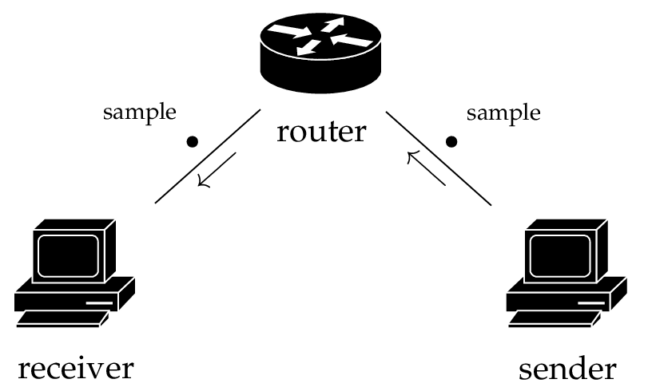

.. Copyright 2023 CARIAD SE.
.. 
.. This Source Code Form is subject to the terms of the Mozilla 
.. Public License, v. 2.0. If a copy of the MPL was not distributed 
.. with this file, You can obtain one at https://mozilla.org/MPL/2.0/.

.. _label_performance:

===========
Performance
===========

As *FEP SDK 3* is the glue that holds *FEP Elements* together and provides the infrastructure
for exchanging data between the elements, you might be interested in the efficiency of this data
exchange. Therefore, a performance test was created to measure the *throughput* of the data between
two FEP Elements.

.. _label_performance_how_we_tested:

How We Tested
=============

For the test two equally equipped workspaces (see :ref:`tab_hardware_spec`) are connected over the
*Ethernet* with the help of a *router*. On the *sender* side, samples of a pre-defined size are
created by a *FEP Participant* and sent over the *simulation bus* to another FEP Participant on a
second host (See Figure :ref:`fig_test_setup`).

.. _fig_test_setup:

   The Setup of the Performance Test.

The FEP Participant on the *receiver* side of the test setup then sums up the amount of data and
the number of samples it is able to receive during one second (or a little bit more). For each of
these durations the amount of received data is divided through the timespan during which the data
was accumulated to retrieve the throughput in :math:`\text{MB}/\text{s}`

.. _tab_hardware_spec:

.. table:: Hardware Specification of the Test Hosts

    +----------------------------+------------------------------------+
    |                            | Host                               |
    +============================+====================================+
    | CPU                        | Intel® Xeon® Processor E5-1650 v3  |
    +----------------------------+------------------------------------+
    | Number of Cores            | 6                                  |
    +----------------------------+------------------------------------+
    | number of Threads          | 12                                 |
    +----------------------------+------------------------------------+
    | Processor Base Frequency   | 3.5 GHz                            |
    +----------------------------+------------------------------------+
    | Main Memory                | 32 GB                              |
    +----------------------------+------------------------------------+
    | Ethernet Controller        | Intel® Ethernet Connection I218-LM |
    +----------------------------+------------------------------------+
    | Network Data Rate Per Port | 1 GbE                              |
    +----------------------------+------------------------------------+

Each test run with a constant set of variables (i.e. *sample size* (:math:`\text{B}`), *cycle time*
(:math:`\text{ms}`) and *synchronization mode*) is done for five minutes. From the gathered
throughput data of each second, the first three and the last entry is removed, and the remaining
data is used to calculate the arithmetic mean of the throughput as well as its variance.

The results of each of the test runs can be seen below in the Table :ref:`tab_test_results`.

.. _label_performance_the_results:

The Results
===========

In the Table :ref:`tab_test_results` the results by using the following variables are shown:

* :math:`10 \text{B}` with a cycle time of :math:`1 \text{ms} \equiv 1 \text{kHz}` with
  *continuous* and *discrete* synchronization mode, respectively
* :math:`500 \text{B}` with a cycle time of :math:`1 \text{ms} \equiv 1 \text{kHz}` with
  *continuous* and *discrete* synchronization mode, respectively
* :math:`10 \text{MB}` with a cycle time of :math:`100 \text{ms} \equiv 10 \text{Hz}` with
  *continuous* and *discrete* synchronization mode, respectively

.. table:: The Test Results
   :name:  tab_test_results
   :class: perf-test-results-table

   +---------------------+---------------------+------------------------+-----------------+-----------------+----------------------+
   | throughput (⌀ MB/s) | throughput variance | samples received (⌀ #) | sample size (B) | cycle time (ms) | synchronization mode |
   +=====================+=====================+========================+=================+=================+======================+
   |               0.010 |      0.000000000025 |               1000.591 |              10 |               1 |           continuous |
   +---------------------+---------------------+------------------------+-----------------+-----------------+----------------------+
   |               0.500 |      0.000000061941 |               1000.631 |             500 |               1 |           continuous |
   +---------------------+---------------------+------------------------+-----------------+-----------------+----------------------+
   |             100.037 |      0.007762639499 |                 10.546 |        10000000 |             100 |           continuous |
   +---------------------+---------------------+------------------------+-----------------+-----------------+----------------------+
   |               0.010 |      0.000000000025 |               1000.606 |              10 |               1 |             discrete |
   +---------------------+---------------------+------------------------+-----------------+-----------------+----------------------+
   |               0.500 |      0.000000062269 |               1000.604 |             500 |               1 |             discrete |
   +---------------------+---------------------+------------------------+-----------------+-----------------+----------------------+
   |             100.038 |      0.004886273418 |                 10.602 |        10000000 |             100 |             discrete |
   +---------------------+---------------------+------------------------+-----------------+-----------------+----------------------+

When looking at the results there is no significant impact on the throughput when changing the
synchronization mode only and leaving the other variables untouched. Examining the first two lines,
you can see that increasing the byte size of a sample by 50 leads to a proportional increase of the
throughput while the amount of received samples is nearly not affected.

When sending samples with a size of :math:`10 \text{MB}` and a cycle time of :math:`100 \text{ms}`
the amount of (average) samples we receive and the resulting (average) throughput is not
surprisingly different than what we expect. You can see though that the variance of the throughput
is significantly higher as the one with smaller sized samples.