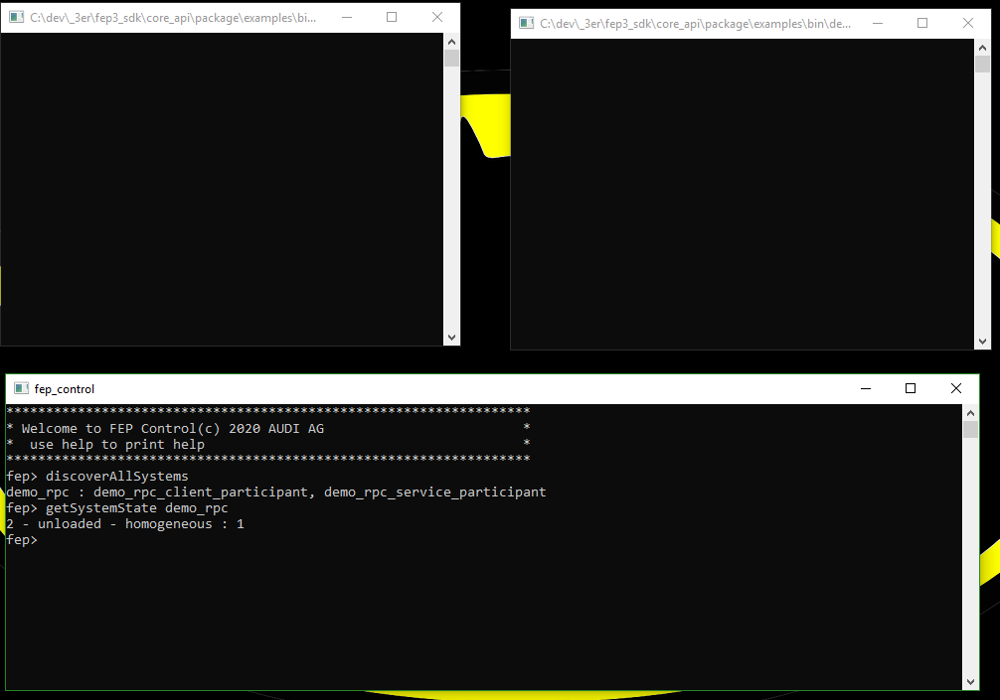
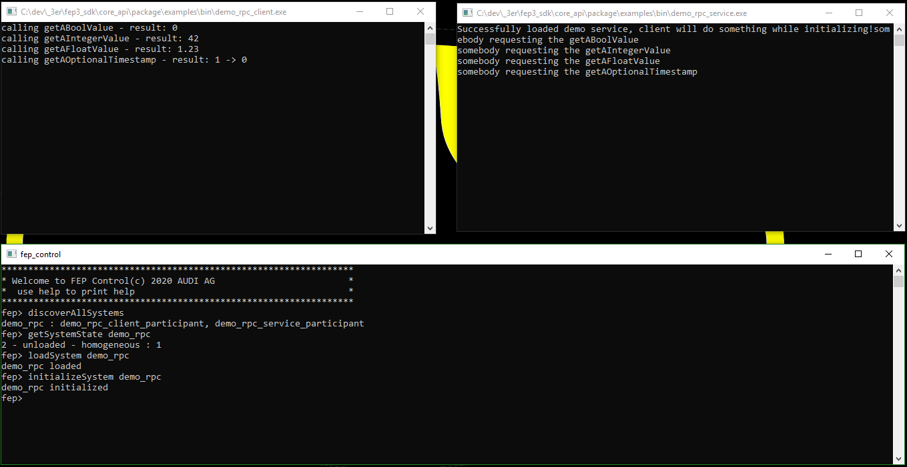
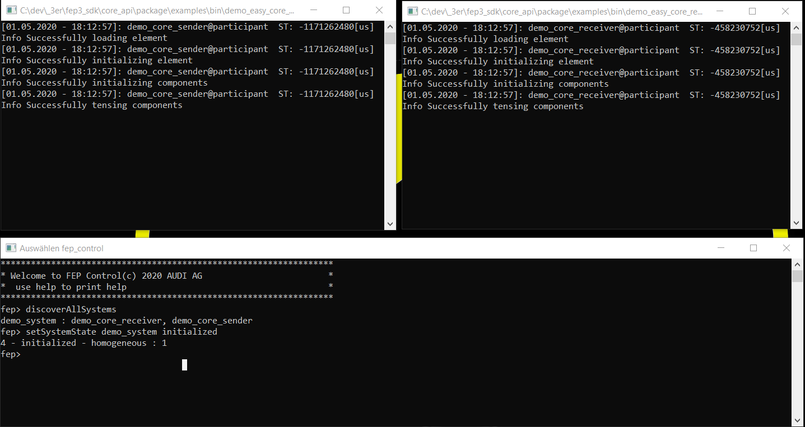
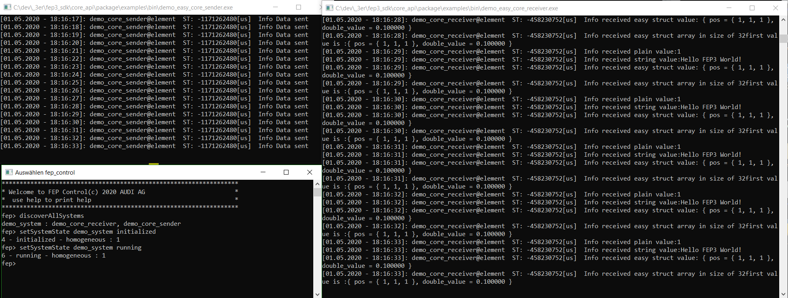

#
# Copyright @ 2021 VW Group. All rights reserved.
# 
#     This Source Code Form is subject to the terms of the Mozilla
#     Public License, v. 2.0. If a copy of the MPL was not distributed
#     with this file, You can obtain one at https://mozilla.org/MPL/2.0/.
# 
# If it is not possible or desirable to put the notice in a particular file, then
# You may include the notice in a location (such as a LICENSE file in a
# relevant directory) where a recipient would be likely to look for such a notice.
# 
# You may add additional accurate notices of copyright ownership.
# 
#

.. _Examples:

========
Examples
========

.. _label_minimal_participant:

Demo Minimal Participant
====================================

Summary
-------
This is a first very basic job, it creates a participant that contains a basic job that uses :cpp:class:`fep3::cpp::arya::DataJob`, whose :cpp:func:`fep3::cpp::arya::DataJob::Process` method is triggered with the default periodicity.

Source Code
-----------
::

    <fep3_sdk_DIR>/examples/src/minimal_participant/

	
.. _label_demo_rpc:

Demo RPC Service and Demo RPC Client
====================================

Summary
-------
The example shows how to implement a participant that provides a service via :term:`FEP Service Bus`.
It also shows the possibility to send requests to this service via :term:`RPC Client`.

See more detailed information under :ref:`label_guide_rpc_service_rpc_client`.

Source Code
-----------
::

    <fep3_sdk_DIR>/examples/src/rpc_service_bus/

How to start
------------

Unfortunately we have no launch script at the moment.
To start and try the example do the following:

    * start <fep3_sdk_DIR>/examples/bin/demo_rpc_service
    * start <fep3_sdk_DIR>/examples/bin/demo_rpc_client

You will see the following:

load and intialize the system to see following:

.. _label_demo_core_easy:

Demo Core Easy Sender and Demo Core Easy Receiver
=================================================

Summary
-------
The example shows how to implement a participant that uses:

    * :ref:`label_core_easy_logging`
    * creating Properties via Configuration
    * :ref:`label_core_data_writer_data_reader`
    * Jobs

Source Code
-----------
::

    <fep3_sdk_DIR>/examples/src/easy_core_example_element/

How to start
------------

Unfortunately we have no launch script at the moment.
To start and try the example do the following:

    * start <fep3_sdk_DIR>/examples/bin/demo_easy_core_receiver
    * start <fep3_sdk_DIR>/examples/bin/demo_easy_core_sender

You will see following after initializing:

running the system to see following:

.. _label_demo_cpp_easy:

Demo CPP Easy Sender and Demo CPP Easy Receiver
===============================================

Summary
-------
The example shows how to implement a participant that uses:

    * :ref:`label_core_easy_logging`
    * creating Properties via Configuration
    * :ref:`label_cpp_datajob` and :ref:`label_core_data_writer_data_reader`

Source Code
-----------
::

    <fep3_sdk_DIR>/examples/src/easy_cpp_example_datajob/

How to start
------------

Unfortunately we have no launch script at the moment.
To start and try the example do the following:

    * start <fep3_sdk_DIR>/examples/bin/demo_easy_cpp_receiver
    * start <fep3_sdk_DIR>/examples/bin/demo_easy_cpp_sender

.. _label_demo_logging:

Demo Logging and Demo Logging System
====================================

Summary
-------
The example shows how to implement a participant and control a system that uses:

    * :ref:`label_logging_service`
    * :ref:`label_core_job`
    * :ref:`label_logging_service_configuration`

The participant of this example sends a log to the console and via RPC once per second.
The system then changes this behavior after a few seconds by changing the filter settings of the participant logger.

Source Code
-----------
::

    <fep3_sdk_DIR>/examples/src/logging_example/

How to start
------------

Unfortunally we have no launch script at the moment.
To start and try the example do the following:

    * start <fep3_sdk_DIR>/examples/bin/demo_logging
    * start <fep3_sdk_DIR>/examples/bin/demo_logging_system

The control tool is not needed for this example. The system starts and stops by itself.
