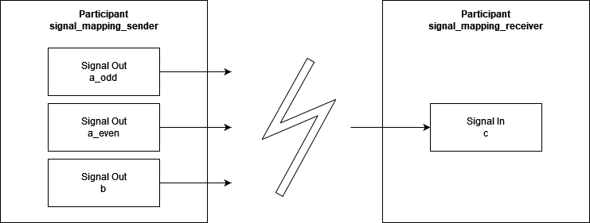

.. Copyright @ 2021 VW Group. All rights reserved.
.. 
.. This Source Code Form is subject to the terms of the Mozilla 
.. Public License, v. 2.0. If a copy of the MPL was not distributed 
.. with this file, You can obtain one at https://mozilla.org/MPL/2.0/.

.. _Examples:

========
Examples
========

.. _label_minimal_participant:

Demo Minimal Participant
========================

Summary
-------
This is a first very basic job, it creates a participant that contains a basic job that uses :cpp:class:`fep3::core::DefaultJob`.

Source Code
-----------
::

    <fep3_sdk_DIR>/examples/src/minimal_participant/

	
.. _label_demo_rpc:

Demo RPC Service and Demo RPC Client
====================================

Summary
-------
The example shows how to implement a participant that provides a service via :term:`FEP Service Bus`.
It also shows the possibility to send requests to this service via :term:`RPC Client`.

See more detailed information under :ref:`label_guide_rpc_service_rpc_client`.

Source Code
-----------
::

    <fep3_sdk_DIR>/examples/src/rpc_service_bus/

How to start
------------

Unfortunately, we have no launch script at the moment.
To start and try the example do the following:

    * start <fep3_sdk_DIR>/examples/bin/demo_rpc_service
    * start <fep3_sdk_DIR>/examples/bin/demo_rpc_client

You will see the following:

load and initialize the system to see following:

.. image:: images/demo_rpc_initialized.png

.. _label_demo_core_easy:

Demo Core Easy Sender and Demo Core Easy Receiver
=================================================

.. note:: 
   The :cpp:class:`fep3::core::Job` and :cpp:class:`fep3::cpp::DataJob` will be deprecated in the future. Please use :ref:`fep3::core::DefaultJob` and check the chapter :ref:`_label_jobs_new` for details.

Summary

Summary
-------
The example shows how to implement a participant that uses:

    * :ref:`label_core_easy_logging`
    * creating Properties via Configuration
    * :ref:`label_core_data_writer_data_reader`
    * Jobs

.. note:: The example uses signals described via DDL descriptions which are created from C structs using the DataDefinition generator functionality available within the dev_essential/[]@fep/stable Conan package.

Source Code
-----------
::

    <fep3_sdk_DIR>/examples/src/easy_core_example_element/

How to start
------------

Unfortunately, we have no launch script at the moment.
To start and try the example do the following:

    * start <fep3_sdk_DIR>/examples/bin/demo_easy_core_receiver
    * start <fep3_sdk_DIR>/examples/bin/demo_easy_core_sender

You will see following after initializing:

.. image:: images/demo_easy_core_initialized.png

running the system to see following:

.. image:: images/demo_easy_core_running.png

.. _label_demo_cpp_easy:

Demo CPP Easy Sender and Demo CPP Easy Receiver
===============================================

.. note:: 
   
   The :cpp:class:`fep3::core::Job` and :cpp:class:`fep3::cpp::DataJob` will be deprecated in the future. Please use :ref:`fep3::core::DefaultJob` and check the chapter :ref:`_label_jobs_new` for details.

Summary
-------
The example shows how to implement a participant that uses:

    * :ref:`label_core_easy_logging`
    * creating Properties via Configuration
    * :ref:`label_cpp_datajob` and :ref:`label_core_data_writer_data_reader`
    * configuration for :ref:`label_configuring_data_readers_and_data_writers`

.. note:: The example uses signals described via DDL descriptions which are created from C structs using the DataDefinition generator functionality available within the dev_essential/[]@fep/stable Conan package.

Source Code
-----------
::

    <fep3_sdk_DIR>/examples/src/easy_cpp_example_datajob/

How to start
------------

Unfortunately, we have no launch script at the moment.
To start and try the example do the following:

    * start <fep3_sdk_DIR>/examples/bin/demo_easy_cpp_receiver
    * start <fep3_sdk_DIR>/examples/bin/demo_easy_cpp_sender

Since the waiting mechanism is configured for reader-writer pairs, the receiver must have lower init priority than the sender, otherwise the initialization of the receiver fails.

.. _label_demo_cpp_data_triggered_job:

Demo Data Triggered Job
=======================

Summary
-------
The example shows how to implement a participant that uses:

    * Time-Triggered Job :ref:`label_clock_triggered_job`
    * Data-Triggered Job :ref:`label_data_triggered_job`

Source Code
-----------
::

    <fep3_sdk_DIR>/examples/src/data_triggered_simulation/

How to start
------------

    * start <fep3_sdk_DIR>/examples/bin/demo_data_triggered_sender
    * start <fep3_sdk_DIR>/examples/bin/demo_data_triggered_receiver

.. _label_demo_default_job:

Demo Default Job
================

Summary
-------
The example shows how to implement a participant that uses:

    * Time-Triggered Job :ref:`label_clock_triggered_job`
    * Data-Triggered Job :ref:`label_data_triggered_job`

Source Code
-----------
::

    <fep3_sdk_DIR>/examples/src/default_job_example/

How to start
------------

    * start <fep3_sdk_DIR>/examples/bin/demo_default_job_sender
    * start <fep3_sdk_DIR>/examples/bin/demo_default_job_receiver

.. _label_demo_logging:

Demo Logging and Demo Logging System
====================================

Summary
-------
The example shows how to implement a participant and control a system that uses:

    * :ref:`label_logging_service`
    * :ref:`label_core_job`
    * :ref:`label_logging_service_configuration`

The participant of this example sends a log to the console and via RPC once per second.
The system then changes this behavior after a few seconds by changing the filter settings of the participant logger.

Source Code
-----------
::

    <fep3_sdk_DIR>/examples/src/logging_example/

How to start
------------

Unfortunately, we have no launch script at the moment.
To start and try the example do the following:

    * start <fep3_sdk_DIR>/examples/bin/demo_logging
    * start <fep3_sdk_DIR>/examples/bin/demo_logging_system

The control tool is not needed for this example. The system starts and stops by itself.

.. _label_demo_component_plugin:

Demo Component Plugin
=====================

Summary
-------
The example shows how to write your own Component Plugin and use it in your fep element:

    * :ref:`label_multiple_components`
    * :ref:`label_component_plugin_main`

The participant of this example loads the plugin ``components_cpp_plugin`` at runtime and 
print the identifier and stored value inside the plugin.

Source Code
-----------
::

    <fep3_sdk_DIR>/examples/src/component_plugin/

How to start
------------

This example needs to load a specific components configuration file: ``demo_components_plugin.fep_components``.
This can be done by setting the environment variable ``FEP3_PARTICIPANT_COMPONENTS_FILE_PATH``, e.g.
For Linux:

.. code-block:: console

   export FEP3_PARTICIPANT_COMPONENTS_FILE_PATH=./demo_components_plugin.fep_components

For Windows:

.. code-block:: console

   set FEP3_PARTICIPANT_COMPONENTS_FILE_PATH=./demo_components_plugin.fep_components

After that you could simply start and try the example do the following:

    * start <fep3_sdk_DIR>/examples/bin/demo_plugin_element

The control tool is needed for this example. You must start the system manually.

Demo System Discovery
=====================

Summary
-------

The following snippets demonstrate the usage of the discovery functions in :term:`FEP System Library`.

Discover a system with the default timeout
------------------------------------------

.. literalinclude:: ../snippets/snippet_discover_system.cpp
    :start-after: //Begin(discover with default timeout)
    :end-before: //End(discover with default timeout)

Discover a system with user defined discovery URL and timeout
-------------------------------------------------------------

.. literalinclude:: ../snippets/snippet_discover_system.cpp
    :start-after: //Begin(discover with custom url and timeout)
    :end-before: //End(discover with custom url and timeout)

Discover all systems with user defined timeout and participant count
--------------------------------------------------------------------

.. literalinclude:: ../snippets/snippet_discover_system.cpp
    :start-after: //Begin(discover all systems with custom timeout and participant count)
    :end-before: //End(discover all systems with custom timeout and participant count)

Discover a system with user defined timeout and participant names
-----------------------------------------------------------------

.. literalinclude:: ../snippets/snippet_discover_system.cpp
    :start-after: //Begin(discover a system with custom timeout and participant names)
    :end-before: //End(discover a system with custom timeout and participant names)

.. _label_demo_async_waitset:

Demo Async WaitSet of Simulation Bus
====================================

Summary
-------

The example shows how to use :ref:`label_async_waitset` of RTI DDS to dispatch event asynchronously on receiving data.

Source Code
-----------
::

    <fep3_sdk_DIR>/examples/src/async_waitset_example/

How to start
------------

After that you could simply start and try the example do the following:

    * start <fep3_sdk_DIR>/examples/bin/demo_async_waitset_sender
    * start <fep3_sdk_DIR>/examples/bin/demo_async_waitset_receiver

The control tool is needed for this example. You must start the system manually.

.. _label_demo_multi_sender:

Demo Multiple Senders for One signal
====================================

Summary
-------

DDS supports the concept of arbitrary amount of DataWriters writing to the same topic.
The purpose of this example is to verify this feature. 

demo_multi_sender can be instantiated multiple times with different participant names.
Multiple instances of demo_multi_sender can send different plain C values to Simulation Bus via option ``-p, --value-to-send``.
The signal name of demo_multi_senders is identical. 

demo_one_receiver is a simple receiver to read the data samples which are sent by multiple demo_multi_sender.
The order of the received data sample is undeterministic. e.g. if one demo_multi_sender sends value "1,2", whereas
another demo_multi_sender sends value "3,4". The order of the received data sample at demo_one_receiver could be one of the following
six combinations:
``"1,2,3,4", "1,3,2,4" , "3,1,2,4", "1,3,4,2", "3,1,4,2" or "3,4,1,2"``

By modifying the QosPolicy `DESTINATION_ORDER`_, one could theoretically achieve the deterministic order of the data samples.
But currently this is not supported in FEP3 SDK. 

.. _DESTINATION_ORDER: https://community.rti.com/static/documentation/connext-dds/6.1.0/doc/manuals/connext_dds_professional/users_manual/index.htm#users_manual/DESTINATION_ORDER_QosPolicy.htm?Highlight=destination%20order

Source Code
-----------
::

    <fep3_sdk_DIR>/examples/src/multi_sender_for_one_signal_example/

How to start
------------

After that you could simply start and try the example do the following:

    * ``start <fep3_sdk_DIR>/examples/bin/demo_multi_sender --name sender1 --value-to-send 1,2``
    * ``start <fep3_sdk_DIR>/examples/bin/demo_multi_sender --name sender2 --value-to-send 3,4``
    * ``start <fep3_sdk_DIR>/examples/bin/demo_one_receiver``

The control tool is needed for this example. You must start the system manually.

After starting the system, you will see the following:

.. image:: images/demo_multiple_senders_for_one_signal.png

.. _label_demo_signal_mapping_renaming:

Demo Signal Mapping and Renaming
================================

Summary
-------

FEP supports DDL's Mapping functionality and provides an extra Signal Renaming functionality to adapt signals via configuration without having to recompile a participant.
For further details regarding FEP's Mapping and Renaming functionality, please have a look at :ref:`label_signal_mapping` and :ref:`label_signal_renaming`.

This example shows how to implement two FEP Participants which use Signal Mapping and Signal Renaming to exchange data via signals which do not fit by default.

.. To adapt the image import it into a draw.io editor. The source of the drawing is stored within the PNG file.

Participant 'signal_mapping_sender' provides three output signals 'a_odd', 'a_even' and 'b' which are by default not compatible to the 'signal_mapping_receiver' participant's input signal 'c'.
All four signals are described via DDL. The corresponding description files can be found at:

.. code-block:: console

   <fep3_sdk_DIR>/examples/src/signal_mapping_example/

.. note:: The DDL descriptions files have been created from header files using the 'header2ddl' tool which is available within the ddl_utility/[]@fep/stable Conan package.

Launching both participants and setting them to state 'running' results in no data being received on the receiver side as no signal will match the receiver participant's 'c' signal.
Neither by name nor by structure.

To make both participants exchange data we will use Signal Mapping to map signals coming from participant 'signal_mapping_sender' onto signal 'c' of participant 'signal_mapping_receiver' and Signal Renaming to provide required source signals for the Mapping process.

.. To adapt the image import it into a draw.io editor. The source of the drawing is stored within the PNG file.

Signal Renaming will be applied within the sender participant 'signal_mapping_sender' and result in signals 'a', 'a_even' and 'b' being transmitted.

Signal Mapping will be applied within receiver participant 'signal_mapping_receiver' and map incoming signals 'a' and 'b' into a new signal 'c'.

Signal Renaming is configured via FEP Properties and renames signals specified accordingly.
It is applied during initialization of a participant and therefore has to be configured ealier.
As the sender participant offers two signals of the same structure ('a_even', 'a_odd'), we can decide which one to use for the Signal Mapping and therefore creation of the target signal.
Both signals transmit values which are either even or odd and transmit them at different simulation steps.

Signal Mapping is configured via a configuration file of which the path has to be provided via FEP Property.
Optionally, required DDL descriptions for source signals have to be provided as the Mapping engine needs to know the structure of source signals to map them onto new target signals.
These DDL descriptions have to be provided via FEP Property as well.
Signal Mapping is applied during registration of signals and therefore has to be configured earlier.

Once Signal Renaming and Signal Mapping is configured, the receiver participant will receive a signal 'c' every time a Sample for the trigger signal 'a' is received.
The signal to trigger creation of target signals is configured within the Mapping Configuration.

For further details regarding Mapping capabilities and the Mapping Configuration, please have a look at the specification:
`Signal Mapping Format Specification <https://github.com/cariad-tech/dev_essential/blob/main/doc/extern/ddl/mapping_specification.md>`_ 

How to start
------------

First we have to start both participants.

.. code-block:: console

   <fep3_sdk_DIR>/examples/bin/signal_mapping_sender
   <fep3_sdk_DIR>/examples/bin/signal_mapping_receiver

We have to use FEP Tooling like e.g. the FEP Control tool from fep_sdk_base_utilities/[]@fep/stable or the FEP VS Code tooling to control the FEP Participants and configure them accordingly.

After launching both participants, they are in state 'unloaded' and we can start configuration.

First, we configure the sender participant 'signal_mapping_sender' to rename one of its 'a(even)/(odd)' signals to 'a' which is configured as source signal within the Mapping Configuration and therefore required for the Mapping to work.

.. code-block:: console

    setParticipantProperty demo_system signal_mapping_sender data_registry/renaming_output a_odd:a

Afterwards, we have to configure the receiver participant 'signal_mapping_receiver' to apply Mapping to specific signals via a Mapping Configuration file.

.. code-block:: console

    setParticipantProperty demo_system signal_mapping_receiver data_registry/mapping_configuration_file_path <fep3_sdk_DIR>/examples/src/signal_mapping_example/signal_a_b_to_c.map

Finally, we have to provide all DDL description files necessary for the Mapping engine to map source signals onto target signals. In general we need to provide the DDL descriptions for the source signals.

.. code-block:: console

    setParticipantProperty demo_system signal_mapping_receiver data_registry/mapping_ddl_file_paths <fep3_sdk_DIR>/examples/src/signal_mapping_example/a.description;<fep3_sdk_DIR>/examples/src/signal_mapping_example/b.description

Now as both sender and receiver participants are configured we can start the participants and check whether both participants exchange data.

.. code-block:: console

    setSystemState demo_system running

We see output similar to the following on the sender side:

.. code-block:: console

    signal_mapping_receiver@element  ST: 2001502100[ns]  Info Received 'test struct c': { first = 0, second = 0, third = 6, fourth = 1, fifth = 3 }
    signal_mapping_receiver@element  ST: 4001452200[ns]  Info Received 'test struct c': { first = 0, second = 0, third = 8, fourth = 3, fifth = 5 }
    signal_mapping_receiver@element  ST: 6002559400[ns]  Info Received 'test struct c': { first = 0, second = 0, third = 10, fourth = 5, fifth = 7 }

Which tells us in which simulation steps the sender participant transmitted which signal and what values the corresponding Sample contained.

On the receiver side we see output similar to the following:

.. code-block:: console

    signal_mapping_sender@element  ST: 1642600[ns]  Info 'b' sent:{ first = 4, second = 6 }
    signal_mapping_sender@element  ST: 2236100[ns]  Info 'a_even' sent:{ first = 0, second = 2 }
    signal_mapping_sender@element  ST: 2681200[ns]  Info 'global_send_count': 1
    signal_mapping_sender@element  ST: 1001711400[ns]  Info 'a_odd' sent:{ first = 1, second = 3 }
    signal_mapping_sender@element  ST: 1002091200[ns]  Info 'global_send_count': 2
    signal_mapping_sender@element  ST: 2001305500[ns]  Info 'b' sent:{ first = 6, second = 8 }
    signal_mapping_sender@element  ST: 2001615700[ns]  Info 'a_even' sent:{ first = 2, second = 4 }
    signal_mapping_sender@element  ST: 2001790200[ns]  Info 'global_send_count': 3
    signal_mapping_sender@element  ST: 3001704500[ns]  Info 'a_odd' sent:{ first = 3, second = 5 }
    signal_mapping_sender@element  ST: 3002131000[ns]  Info 'global_send_count': 4
    signal_mapping_sender@element  ST: 4001194100[ns]  Info 'b' sent:{ first = 8, second = 10 }
    signal_mapping_sender@element  ST: 4001699700[ns]  Info 'a_even' sent:{ first = 4, second = 6 }
    signal_mapping_sender@element  ST: 4001932800[ns]  Info 'global_send_count': 5
    signal_mapping_sender@element  ST: 5002104500[ns]  Info 'a_odd' sent:{ first = 5, second = 7 }
    signal_mapping_sender@element  ST: 5002333500[ns]  Info 'global_send_count': 6
    signal_mapping_sender@element  ST: 6002554400[ns]  Info 'b' sent:{ first = 10, second = 12 }
    signal_mapping_sender@element  ST: 6003344400[ns]  Info 'a_even' sent:{ first = 6, second = 8 }
    signal_mapping_sender@element  ST: 6003798900[ns]  Info 'global_send_count': 7

This tells us in which simulation steps the receiver participant received a Sample for signal 'c' and which values it contained.

If we want to interpret the output we have to keep in mind:
    * both jobs are time triggered and therefore do not get triggered if data is received but every time their cycle time passes
    * time triggered means a job can be triggered without logging if e.g. no valid sample is available
    * both jobs are configured to have a cycle time of 1s and therefore trigger every ~1s
    * incoming Samples are considered valid and are available via a Data Reader if their timestamp is older than the current simulation time

If we compare both outputs we can see:
    * at the first simulation step (0s), sender transmits a sample for 'b' and 'a_even' (which is not configured to be used for mapping and therefore not a trigger for receiver)
    * at the second simulation step (1s), sender transmits a sample for 'a_odd' which is used for mapping and triggers. The receiver does not log as the mapped sample's timestamp (1s) is not older than simulation time (1s) and therefore not considered valid.
    * at the third simulation step (2s), sender transmits a sample for 'b' and 'a_even'. receiver logs as the mapped sample's timestamp (1s) is older than simulation time (2s). The mapped sample contains values of 'a_odd' and 'b' as configured within the mapping configuration.
    * etc.

If we would configure 'a_even' to be used for mapping instead of 'a_odd', the values for creation of target signal would change accordingly and the receiver participant would trigger at different simulation steps.

.. warning::

    The behaviour of the example is not deterministic as we do neither synchronize data transmission nor time. Samples may get lost if a new sample arrives before the last sample has been logged and timestamps may drift apart.
    
.. _label_demo_dynamic_ddl_array:

Demo Dynamic DDL Array
======================

Source Code
-----------
::

    <fep3_sdk_DIR>/examples/src/dynamic_array/

How to start
------------

    * start <fep3_sdk_DIR>/examples/bin/demo_dynamic_array_sender
    * start <fep3_sdk_DIR>/examples/bin/demo_dynamic_array_receiver

How the serialization works
---------------------------

The ddl structure containing a dynamic array looks as follows (dynamic array can only be the last member of the structure).

.. literalinclude:: ../../../examples/src/dynamic_array/demo_dynamic_array.h
    :start-after: //Begin(ddl definition of a structure containing a dynamic array)
    :end-before: /End(ddl definition of a structure containing a dynamic array)

Since the maximum structure size cannot be calculated from DDL and as a result the corresponding :ref:`Qos Profile <label_configuring_qos>`  cannot be chosen,
a custom Stream type has to be defined:

.. literalinclude:: ../../../examples/src/dynamic_array/stream_type_file_ref_big.h
    :start-after: //Begin(ddl definition of a custom stream type)
    :end-before: //End(ddl definition of a custom stream type)

At the moment is only possible for a data sample to have a continuous memory, so we have to define also a structure where the
array has a maximum size:

.. literalinclude:: ../../../examples/src/dynamic_array/dynamic_array_data_sample.h
    :start-after: //Begin(Definition of structure with a maximum array size)
    :end-before: //End(Definition of structure with a maximum array size)

Then we create a Sample Type that handles the (de)serializing of the structure. The size of the structure to be serialized
is calculated as follows:

.. literalinclude:: ../../../examples/src/dynamic_array/dynamic_array_data_sample.h
    :start-after: //Begin(Calculating the size of the structure)
    :end-before: //End(Calculating the size of the structure)

Since now the size that can be read from or written to the Sample is defined, we can then implement the functions 
needed by cpp:class:`fep3::arya::IRawMemory` and cpp:class:`fep3::arya::IDataSample`. Reading and writing are simple byte copying
operations, for example the methods inherited from cpp:class:`fep3::arya::IDataSample` can be implemented as follows:

.. literalinclude:: ../../../examples/src/dynamic_array/dynamic_array_data_sample.h
    :start-after: //Begin(Writing to memory)
    :end-before: //End(Writing to memory)

Now we are read to use the implemented Stream Type and Sample in our participants.
In the sender side the stream type is initialized:

.. literalinclude:: ../../../examples/src/dynamic_array/demo_dynamic_array_sender_main.cpp
    :start-after: //Begin(Sender initialize custom stream type)
    :end-before: //End(Sender initialize custom stream type)

and the structure is serialized:

.. literalinclude:: ../../../examples/src/dynamic_array/demo_dynamic_array_sender_main.cpp
    :start-after: //Begin(Serialize the structure)
    :end-before: //End(Serialize the structure)

In the receiver side the stream type is initialized:

.. literalinclude:: ../../../examples/src/dynamic_array/demo_dynamic_array_receiver_main.cpp
    :start-after: //Begin(Receiver initialize custom stream type)
    :end-before: //End(Receiver initialize custom stream type)

and the received sample is deserialized:

.. literalinclude:: ../../../examples/src/dynamic_array/demo_dynamic_array_receiver_main.cpp
    :start-after: //Begin(Deserialize the structure)
    :end-before: //End(Deserialize the structure)
