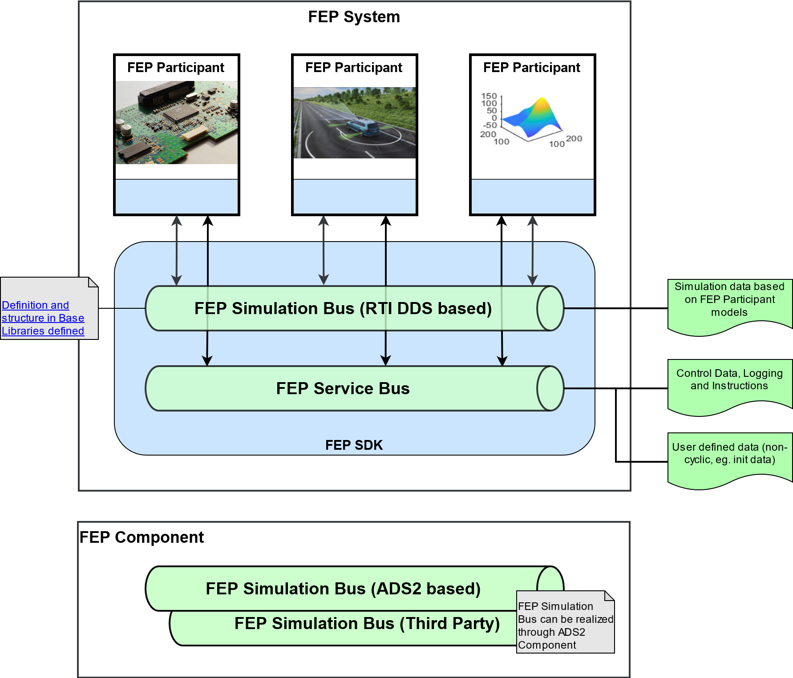

.. Copyright @ 2021 VW Group. All rights reserved.
.. 
.. This Source Code Form is subject to the terms of the Mozilla 
.. Public License, v. 2.0. If a copy of the MPL was not distributed 
.. with this file, You can obtain one at https://mozilla.org/MPL/2.0/.

.. _Overview_SDK:

========
Overview
========

Challenge
=========
What is the challenge or problems?
----------------------------------
To couple different simulation and software environments using a middleware.

How this SDK solved them?
-------------------------
* Testing with a virtual environment and a function in one common simulation.
* Lower effort due to reuse of simulation components. They don't need to be re-developed for different simulation environments or execution environments, which saves cost and time.
* Higher level of continuity in all development phases due to reuse of simulation components. This helps to create trust in the simulation and results can be compared to each other MIL → SIL → HIL → VIL.

Main Concepts of FEP SDK
=========================

What is a Participant
---------------------
Functions within the FEP SDK can be understood as services. 
That way, a FEP Component provides service functionality of a FEP Participant as component. 
FEP Participants can load diverse different components, as described in the :ref:`Application Architecture`.
The purpose of a FEP Participant is defined by the set of FEP Components it provides, while the behavior of a FEP Participant depends on the loaded FEP Component 
implementations(simulation data is transferred via RTI DDS or ADS2).

What is a System
----------------
The FEP System consists of the FEP Participants that can communicate through the simulation and the service bus.

:ref:`FEP Simulation Bus<label_simulation_bus>`

* Enables the exchange of simulation data based on FEP Participant applications.
* Faster data transfer than via FEP Service Bus (e.g. for real-time usage).
* Can be replaced by a FEP Component, like ADS2, whose communication format is than defined differently than the one of FEP native implementation.

:ref:`FEP Service Bus<label_service_bus>`

* Enables Discovery Mechanism in different networking environment.
* Enables the exchange of simulation control data and logging through RPC call.
* Slower data transfer than via FEP Simulation Bus.
* Can be replaced by a third party FEP Components.

.. _Application Architecture:

Application Architecture
------------------------

Entry points and application lifecycle types in FEP
---------------------------------------------------

FEP Participants can be roughly grouped by their communication type with either a simulation environment or other applications:

* C++ participant: All code written is C++, no 3rd party program needed. Used for simple sensor models, etc.
* Integrated Architecture: Usually a CLI program, which immediately starts a FEP Participant and invokes a simulator/program when it wants to simulate and closes it down automatically. E.g. FEP using an FMI library
* Plugin Architecture: The FEP participant is embedded in a simulation application and can be started by providing some sort of script for the application to adhere to the FEP state machine. E.g. a MATLAB/Simulink blockset with a script to start a participant in a model.
* Bridge Architecture: The FEP Participant is started separately from the simulation tool and will communicate by e.g shared memory, or other communication protocols. E.g. see the FEP Bridge VTD, where VTD can be started independently from FEP.

.. note::
   If you are writing an adapter for Test Automation Tool, which will control the FEP System, you will need the FEP System Library and FEP Utility API to do that.

SDK Libraries
=============

- :ref:`FEP Participant Library <FEP_Participant_Library>`
- :ref:`FEP System Library <FEP_System_Library>`

Included first party libraries
==============================

dev_essential
-------------

Like the name implies, this library is to be used for many helper and support functionality, commonly provided through libraries like boost. This is much smaller in scope, but provides many useful functions optimized for cross-platform usage, mainly for gcc under Linux and Visual Studio for Windows.
Some modules are superseded by highly similar modules in the std-library but are still kept in the library mainly for compatibility reasons.

It is very convenient to use, since fep_sdk_participant has already the public requirement via CMake. So use dev_essential's CMake targets depending on your needs:

a_util
~~~~~~

Provides a small portable utility library.
Please look in the dev_essential documentation and look under **a_util** to get an overview of modules.

.. _ddl_lib:

ddl
~~~
This module contains all utilities to parse, encode and decode the "Data Description Language" file, 
which FEP heavily relies on to serialize structured data. See :ref:`Reading and Writing Structured Data with DDL <ddl_communication>`. 

pkg_rpc
~~~~~~~

This contains an implementation of a JSON RPC server and client. FEP is reliant on RPC communication for its FEP Components, State machine, etc. fep_sdk_participant abstracts the whole RPC communication into an interface, and this uses in its default implementation pkg_rpc. 
In case of writing custom RPC Services, you will need pkg_rpc.
Here is an example of the :ref:`Demo RPC Client<label_demo_rpc>` and :ref:`How to create a RPC Service and a RPC Client within the FEP Service Bus<label_guide_rpc_service_rpc_client>`

Included third party libraries
==============================

Clipp for command line parsing
------------------------------

If you want to write a command line application, a very handy CLI parser called Clipp is supported by the FEP Participant for the Participant Factory.
See  :ref:`label_create_participant` for example usage.