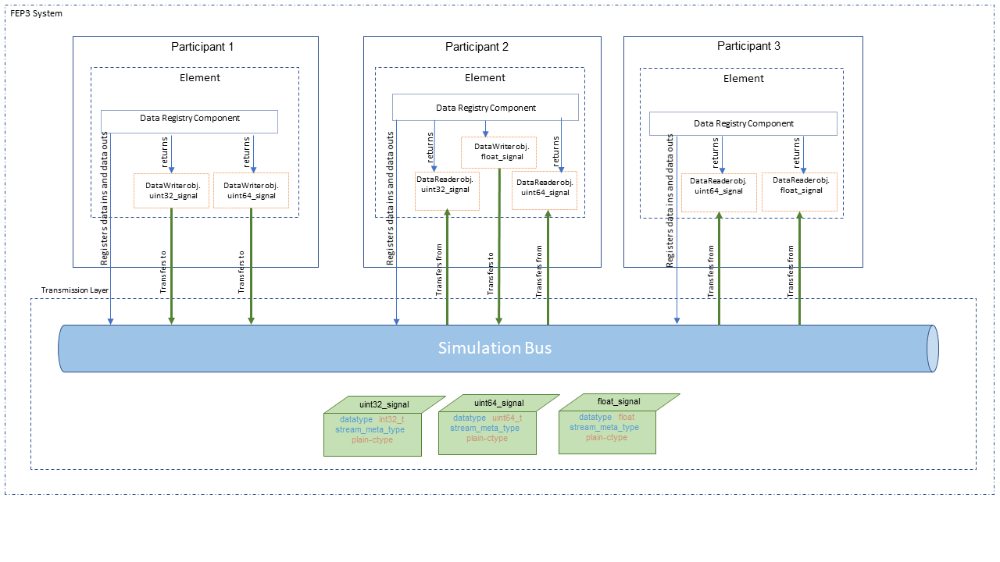
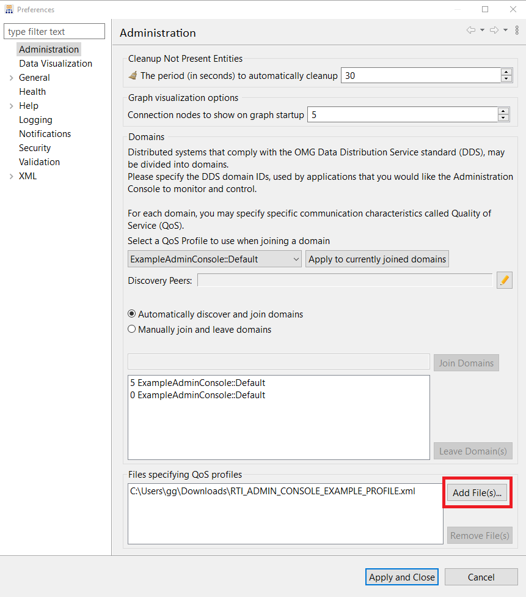
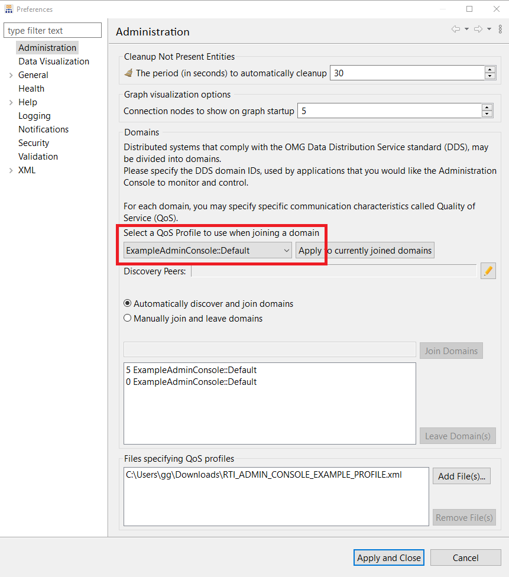
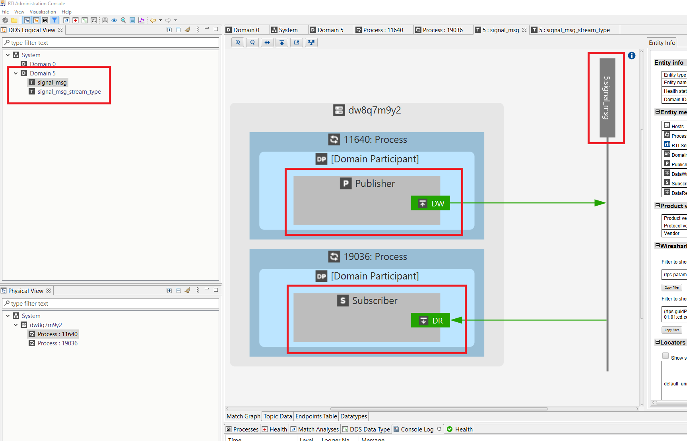

.. Copyright @ 2022 VW Group. All rights reserved.
..
.. This Source Code Form is subject to the terms of the Mozilla 
.. Public License, v. 2.0. If a copy of the MPL was not distributed 
.. with this file, You can obtain one at https://mozilla.org/MPL/2.0/.
.. _label_communication_advanced:

=============
Communication
=============

The participants in a FEP3 System can communicate using signals. A Signal is defined by direction(input or output), name, and Stream Meta Type. To exchange data between participants, communicating participants should create Data Reader or Data Writer objects using the same name and Stream Type. :cpp:class:`fep3::arya::IDataRegistry` is responsible for creating Data Reader and Data Writer objects to a signal. Data Reader objects are represented by :cpp:class:`fep3::arya::IDataRegistry::IDataReader` class and
and Data Writer objects are represented by :cpp:class:`fep3::arya::IDataRegistry::IDataWriter` class. :cpp:class:`fep3::arya::IDataRegistry::IDataReader` and :cpp:class:`fep3::arya::IDataRegistry::IDataWriter` are responsible for reading and writing samples from or to the simulation bus. The container to write and read data is :cpp:class:`fep3::arya::IDataSample`. This data is classified via the :cpp:class:`fep3::arya::IStreamType` .

After this chapter the user will have detailed knowledge about data sending and receiving data by using the :cpp:class:`fep3::arya::IDataRegistry` .

.. _label_data_transfer_overview:

Overview
========

The :cpp:class:`fep3::arya::IDataRegistry` interface is responsible for

* registering data readers and data writers
* registering data receive listeners for data triggered reception
* getting reader and writer objects from the simulation bus

To read and write samples from or to the simulation bus the :cpp:class:`fep3::arya::IDataRegistry::IDataReader` and :cpp:class:`fep3::arya::IDataRegistry::IDataWriter` classes from the data registry are used. :cpp:class:`fep3::arya::IDataRegistry` creates reader (:cpp:class:`fep3::arya::IDataRegistry::IDataReader`) and writer (:cpp:class:`fep3::arya::IDataRegistry::IDataWriter`) objects. To register the data readers and the data writers use :cpp:func:`fep3::arya::IDataRegistry::registerDataIn` and :cpp:func:`fep3::arya::IDataRegistry::registerDataOut` functions. After registration, make a call to  :cpp:func:`fep3::arya::IDataRegistry::getReader` or :cpp:func:`fep3::arya::IDataRegistry::getWriter` functions to access a reader or a writer object.

.. literalinclude:: ../snippets/snippet_data_transfer.cpp
    :start-after: //Begin(register data signal)
    :end-before: //End(register data signal)

Another option to register data readers and data writers is using :cpp:func:`fep3::base::addDataIn` and :cpp:func:`fep3::base::addDataOut` respectively. These helper functions register data and create reader or writer objects.

.. literalinclude:: ../snippets/snippet_data_transfer.cpp
    :start-after: //Begin(register data signal via fep3::base)
    :end-before: //End(register data signal via fep3::base)

To unregister data readers and data writers use :cpp:func:`fep3::arya::IDataRegistry::unregisterDataIn`/:cpp:func:`fep3::arya::IDataRegistry::unregisterDataOut` or  :cpp:func:`fep3::base::removeDataIn`/:cpp:func:`fep3::base::removeDataOut`.

.. literalinclude:: ../snippets/snippet_data_transfer.cpp
    :start-after: //Begin(unregister data signal)
    :end-before: //End(unregister data signal)

.. literalinclude:: ../snippets/snippet_data_transfer.cpp
    :start-after: //Begin(unregister data signal via fep3::base)
    :end-before: //End(unregister data signal via fep3::base)

.. _label_data_queue_capacity:

By default the reader object is created with a queue capacity of 1 and the writer object with queue capacity of 0 (see :cpp:func:`fep3::base::addDataIn` and :cpp:func:`fep3::base::addDataOut`). It means that the data reader and the data writer transfer single value at a time. There can be defined the maximum number of items that the reader queue or transmit queue can hold at a time via :cpp:var:`queue_capacity` parameter while creating the reader and writer. Then multiple samples can be transferred in a single simulation step.

.. literalinclude:: ../snippets/snippet_data_transfer.cpp
    :start-after: //Begin(addDataIn with queue capacity)
    :end-before: //End(addDataIn with queue capacity)

.. literalinclude:: ../snippets/snippet_data_transfer.cpp
    :start-after: //Begin(addDataOut with queue capacity)
    :end-before: //End(addDataOut with queue capacity)

In the above examples while creating data readers and data writers, the object of :cpp:class:`fep3::base::StreamTypeDDL` is passed. This class implements   :cpp:class:`fep3::arya::IStreamType` and is used to classify data.

Stream Meta Type and Stream Type
================================

The Stream Meta Type classifies the data. :cpp:class:`fep3::base::StreamMetaType` defines the name and  the mandatory properties for a data type. Both sender and receiver have exact definitions for the data using Stream Meta Type definition. The Stream Type inherits from the `fep3::base::IStreamType` and uses the corresponding Stream Meta Type class for defining the stream. Stream Type assigns a value and a type to mandatory properties defined by :cpp:class:`fep3::base::StreamMetaType`.

Here is a Stream Type implementation for the plain type int32_t.

.. literalinclude:: ../snippets/snippet_data_transfer.cpp
    :start-after: //Begin(basic example for Stream Type)
    :end-before: //End(basic example for Stream Type)

.. _Supported Stream Meta Type:

Supported Stream Meta Type
--------------------------

The following list of Stream Meta Types is natively supported in FEP3 by the referenced Stream Type classes:

+-----------------------------------------------+------------------------------------------------------------------------+----------------------------------------------------+
| Stream Meta Type name                         | Description                                                            | Stream Type class implementing                     |
|                                               |                                                                        | the Stream Meta Type                               |
+===============================================+========================================================================+====================================================+
| meta_type_plain                               | For plain c-type based samples                                         | :cpp:class:`fep3::arya::StreamTypePlain`           |
+-----------------------------------------------+------------------------------------------------------------------------+----------------------------------------------------+
| meta_type_plain_array                         | For plain c-type arrays                                                | :cpp:class:`fep3::arya::StreamTypePlainArray`      |
+-----------------------------------------------+------------------------------------------------------------------------+----------------------------------------------------+
| meta_type_string                              | For dynamic string data                                                | :cpp:class:`fep3::arya::StreamTypeString`          |
+-----------------------------------------------+------------------------------------------------------------------------+----------------------------------------------------+
| meta_type_ddl                                 | Main use case. For structured memory types which are described by DDL. | :cpp:class:`fep3::arya::StreamTypeDDL`             |
|                                               | The description is shipped within a Stream Type property.              |                                                    |
|                                               | The mandatory properties are "ddlstruct" and "ddldescription".         |                                                    |
|                                               | The "ddldescription" is a string and must have the whole ddl           |                                                    |
|                                               | description content. The "ddlstruct" has to be included in this        |                                                    |
|                                               | description.                                                           |                                                    |
+-----------------------------------------------+------------------------------------------------------------------------+----------------------------------------------------+
| meta_type_ddl_fileref                         | For structured memory types which are described by DDL.                | :cpp:class:`fep3::arya::StreamTypeDDLFileRef`      |
|                                               | The description has to be loaded from a file.                          |                                                    |
|                                               | The mandatory properties are "ddlstruct" and "ddlfileref".             |                                                    |
|                                               | The "ddlfileref" is a reference to a file which contains the whole ddl |                                                    |
|                                               | description content. The "ddlstruct" has to be included in this        |                                                    |
|                                               | description.                                                           |                                                    |
+-----------------------------------------------+------------------------------------------------------------------------+----------------------------------------------------+
| meta_type_ddl_array                           | For structured array memory types                                      | :cpp:class:`fep3::arya::StreamTypeDDLArray`        |
|                                               | The created Stream Type uses a single struct from a whole ddl          |                                                    |
|                                               | description content and constructs an array.                           |                                                    |
+-----------------------------------------------+------------------------------------------------------------------------+----------------------------------------------------+
| meta_type_ddl_array_fileref                   | For structured array memory types                                      | :cpp:class:`fep3::arya::StreamTypeDDLArrayFileRef` |
|                                               | The created Stream Type uses a single struct from a whole ddl          |                                                    |
|                                               | description file content and constructs an array.                      |                                                    |
+-----------------------------------------------+------------------------------------------------------------------------+----------------------------------------------------+
| meta_type_raw                                 | For unspecified data only the elements itself know the content         | :cpp:class:`fep3::arya::StreamTypeRaw`             |
+-----------------------------------------------+------------------------------------------------------------------------+----------------------------------------------------+
| meta_type_video                               | For video data                                                         | not implemented                                    |
+-----------------------------------------------+------------------------------------------------------------------------+----------------------------------------------------+
| meta_type_audio                               | For audio data                                                         | not implemented                                    |
+-----------------------------------------------+------------------------------------------------------------------------+----------------------------------------------------+
| Other :cpp:class:`fep3::arya::StreamMetaType` | User types which are described by the user but are unspecified         | See :ref:`label_write_your_own_stream_meta_type`   |
|                                               | for the simulation bus                                                 |                                                    |
+-----------------------------------------------+------------------------------------------------------------------------+----------------------------------------------------+

It depends on the simulation bus implementation used which Meta Type is supported.

.. _label_write_your_own_stream_meta_type:

Creating Stream Type
--------------------

Users can implement their Stream Meta Type definitions and corresponding Stream Type. In this case, all participants involved in a FEP System should be aware of this Stream Meta Type and the simulation bus implementation should support it.

To define a Stream Meta Type a name and a property list must be defined. The property list contains the names of the mandatory properties. In this example a Stream Meta Type to define image data type is created.

.. literalinclude:: ../snippets/snippet_data_transfer.cpp
    :start-after: //Begin(own meta type implementation)
    :end-before: //End(own meta type implementation)

To be able to use this Stream Meta Type, a Stream Type should be created. Then properties can be assigned with a value and the Stream Meta Type can be used in :cpp:class:`fep3::arya::IDataRegistry` functionalities.
:cpp:func:`fep3::base::StreamType::setProperty` assigns value and type for a property.

.. literalinclude:: ../snippets/snippet_data_transfer.cpp
    :start-after: //Begin(own stream type implementation)
    :end-before: //End(own stream type implementation)

After data is classified, a container is required to transfer data to and from the simulation bus. :cpp:class:`fep3::arya::IDataSample` provides raw memory containers for data transfer.

Data Sample
===========

Data Samples (see also :cpp:class:`fep3::arya::IDataSample`) are plain raw memory containers with 3 important information:

* time (in nano seconds) - see :cpp:func:`fep3::arya::IDataSample::getTime`
* size (in bytes) - see :cpp:func:`fep3::arya::IDataSample::getSize`
* counter (counting at writers time) - see :cpp:func:`fep3::arya::IDataSample::getCounter`

To access the data from the Data Sample, Raw Memory (see also :cpp:class:`fep3::arya::IRawMemory`) is used. Raw Memory provides access to any type of data by raw memory pointer and provides the size information.

Data Samples are written to simulation bus memory with an instance of :cpp:class:`fep3::arya::IDataRegistry::IDataWriter` and are read from a queue through an instance of :cpp:class:`fep3::arya::IDataRegistry::IDataReader`.

Data Reader and Data Writer
===========================

To transfer samples from or to the simulation bus the :cpp:class:`fep3::arya::IDataRegistry::IDataReader` and :cpp:class:`fep3::arya::IDataRegistry::IDataWriter` classes from the data registry are used.
The reader and the writer objects retrieved from these classes ensure that the corresponding signal is registered and prohibits invalid pointer access. A data reader or writer from the data registry is a nullptr if a signal is not registered (See :cpp:func:`fep3::base::addDataIn` or :cpp:func:`fep3::base::addDataOut`) beforehand and function calls will return an error if they are not valid.

To get the data reader or data writer object, call :cpp:func:`fep3::base::addDataIn` or :cpp:func:`fep3::base::addDataOut` respectively as shown in :ref:`label_data_transfer_overview`.

:cpp:class:`fep3::arya::IDataRegistry::IDataReader` object gives access to input data. Use :cpp:class:`fep::ISimulationBus::IDataReceiver` to receive data as a synchronous call (data triggered). Data Receiver receives Stream Type and Data Sample instances. Here is an example implementation of :cpp:class:`fep::ISimulationBus::IDataReceiver`. It is created for plain types. FEP3 provided :cpp:class:`fep3::arya::IRawMemory` implementation is used to read data from the Data Sample.

.. literalinclude:: ../snippets/snippet_data_transfer.cpp
    :start-after: //Begin(data receiver class)
    :end-before: //End(data receiver class)

Read from queue
---------------

Data can be requested from the reader queue directly via :cpp:func:`fep3::arya::IDataRegistry::IDataReader::pop`. Pass an instance of :cpp:class:`fep::ISimulationBus::IDataReceiver` implementation to :cpp:func:`fep3::arya::IDataRegistry::IDataReader::pop` function to read data. If reader queue is not empty, the front item of reading queue will be passed to callback entry of :cpp:class:`fep::ISimulationBus::IDataReceiver`. :cpp:func:`fep3::arya::IDataRegistry::IDataReader::size` returns the current queue size.

.. literalinclude:: ../snippets/snippet_data_transfer.cpp
    :start-after: //Begin(receive input data)
    :end-before: //End(receive input data)

Data triggered behaviour
------------------------

Use :cpp:func:`fep3::arya::IDataRegistry::registerDataReceiveListener` to implement data triggered behavior. Incoming data will immediately be passed to the callback of :cpp:class:`fep::ISimulationBus::IDataReceiver`.
If data triggered listener is set, the reader queue will be always empty. Thus :cpp:func:`fep3::arya::IDataRegistry::IDataReader::pop` will return related error.

.. literalinclude:: ../snippets/snippet_data_transfer.cpp
    :start-after: //Begin(data triggered behaviour)
    :end-before: //End(data triggered behaviour)

To stop data triggered behaviour use  :cpp:func:`fep3::arya::IDataRegistry::unregisterDataReceiveListener`,

.. literalinclude:: ../snippets/snippet_data_transfer.cpp
    :start-after: //Begin(end data triggered behaviour)
    :end-before: //End(end data triggered behaviour)

Write data
----------

:cpp:class:`fep3::arya::IDataRegistry::IDataWriter` object provides functionality to transmit the data. Write the data in a :cpp:class:`fep3::arya::IDataSample` instance and pass the container to :cpp:func:`fep3::arya::IDataRegistry::IDataWriter::write` function. :cpp:class:`fep3::arya::IDataRegistry::IDataWriter` transfers this data to simulation bus.

In this example, FEP3 :cpp:class:`fep3::base::DataSampleType<T>` is used. The :cpp:class:`fep3::base::DataSampleType<T>` object holds a plain C++ Type data. The data is multiplied by 2 then passed to the Data Sample container. Finally, the Data Writer transfers the data via Data Sample.

.. literalinclude:: ../snippets/snippet_data_transfer.cpp
    :start-after: //Begin(send output data)
    :end-before: //End(send output data)

.. _label_transfer_array_of_samples:

Transferring array of samples
-----------------------------

Until now the examples showed how to transfer a sample in one simulation step. If :cpp:var:`queue_capacity` is set to more than 1 (see :ref:`label_data_transfer_overview`) , an array of samples can be transferred to the simulation bus in one simulation step.
Here is an example FEP3 system with two participants. Writing participant transfers 10 items in one simulation step.

.. literalinclude:: ../snippets/snippet_data_transfer.cpp
    :start-after: //Begin(write multiple sample)
    :end-before: //End(write multiple sample)

Reading participant receives 10 item from reader queue in one simulation step.

.. literalinclude:: ../snippets/snippet_data_transfer.cpp
    :start-after: //Begin(read multiple sample)
    :end-before: //End(read multiple sample)
    

.. _label_transfer_dynamic_ddl_arrays:

Transferring DDL Structures containing  a dynamic ddl array
-----------------------------------------------------------

In case a DDL struct has defined a dynamic array, please see the :ref:`example <label_demo_dynamic_ddl_array>` on how to transfer such a structure.
For details about how to set up a dynamic ddl array please refer to the ddl documentation.

.. warning::

    Consider that in case you use DDL a structure a containing dynamic array, 
    DDL mapping is not supported and is also not supported by ADTF Signal Registry. In general DDL encourages the 
    use of static arrays whenever possible. Also the calculation of :ref:`Qos Profile <label_configuring_qos>` is not
    possible since DDL cannot calculate the size of a structure containing a dynamic array. Therefore, a user defined
    stream type is needed. For this refer to the :ref:`example <label_demo_dynamic_ddl_array>`.
    
    
.. _ddl_communication:

Reading and Writing Structured Data with DDL
=============================================

This section focuses on user configurable, structured and runtime resolved data type signals using the DDL format.
To do this, there are several things the user has to configure and internal helpers need to be set up.

This is very useful for FEP adapters connecting to possible a 100 or a 1000 values, which should be handled in a serialized package for performance and also usability.

.. note:: For parsing and every other interaction with the DDL use the ddl lib included in dev_essential! :ref:`See ddl library <ddl_lib>`.  

Why use types resolved at runtime only?
---------------------------------------

If you already have a binary artifact you cannot change, then see the :ref:`label_signal_mapping` chapter how to circumvent this. 
There also exists a source example  :ref:`label_demo_signal_mapping_renaming` "Demo Signal Mapping and Renaming"

Runtime resolved typing is often considered a bad idea for performance critical applications, which a middleware like FEP is aiming for.
This compromise is made, so that the transmission is

* platform independent
* convenient to the user, not needing to recompile, everytime the interface changes.

It is important to note, that using the ddl library in the correct way is very important to reduce the overhead this approach takes.

Mixed typing approach - Compile DDL definitions to C structs within header files
--------------------------------------------------------------------------------

This approach can be seen in the :ref:`easy_core_example_element label_demo_core_easy` example of the FEP SDK.

It enables the usage of structured data in a machine native way while still using the ddl description, namely by creating a C-structure out of it. 
This can be generated with the tool ddl2header.
At runtime, it is the faster method, and maybe the fastest read and write access method FEP provides.
But you need to keep your structures in sync with the ddl description and recompile it every time a structure changes.

.. warning:: This method has a pitfall! You are constrained by your platform regarding byte order, and by your compiler regarding alignment and padding. But these are configurable options in the DDL description!

Fully dynamic typing approach
-----------------------------

In this case a/an encoder/decoder will be created before starting a FEP Element (in initialize) and then the data elements will either be retrieved by name or by index, 
returning a variant type, which then can be cast into the datatype needed by the underlying simulation tool.

The following steps needed to be done with this approach:

1. Reading the DDL: 
  * The DDL file can be located anywhere, so it is good practice to provide a ddl_path property for the user.
2. Connecting and mapping the data to your internal simulation model signals
3. Creating Encoders/Decoders
4. Registering signals
5. Read/Write with codecs in job execute method

The following example showcases the setup and usage of DDL signals. For the full code see the fep_interface_example source.

.. literalinclude:: ../../../examples/src/fep_interface_example/fep_interface_example.cpp
    :start-after: //Begin(ddl_setup)
    :end-before: //End(ddl_setup)

.. literalinclude:: ../../../examples/src/fep_interface_example/fep_interface_example.cpp
    :start-after: //Begin(ddl_signal_read)
    :end-before: //End(ddl_signal_read)

Simulation Coupling
===================

Mechanisms and options to couple your simulation tool/simulation interface:

* Strictly coupled: SimStep is called between read and write, cycle time is thus always the same
* Loosely coupled (Synchronous Multi Rate): FEP job(s) and the simulation can have different cycle times, but FEP waits for simulation and vice-versa
* Uncoupled: FEP does not wait on simulation and vice-versa

When to use which?

Usually the API of the tool being connected determines the simulation coupling mechanism.

There is also the question of what kind of model artifacts the user wants to use in the FEP tool adapter.

* If the simulation tool can only support one simulation cycle time, use the strictly coupled variant.
* If the usecase is to connect a vECU, all the hardware busses (Ethernet, CAN, Flexray) will all have different read and write speeds. You would group them in one FEP Signal per bus and thus would need a job per FEP signal. We call it Synchronous Multi Rate
* If you are interfacing with a realtime target, like a HiL system, where the simulation is continuosly running and can not wait, an uncoupled solution would be the way to go. In that case buffers could be used to store the values when they are received. The internal model grabs them, when it is reading.

.. literalinclude:: ../snippets/snippet_data_transfer.cpp
    :start-after: //Begin(second participant)
    :end-before: //End(second participant)

Exchange Data Between Participants
==================================

As mentioned in the beginning of the :ref:`label_communication_advanced` chapter, a Signal is defined by direction(input or output), name, and Stream Meta Type in a FEP3 System. To exchange data between participants, communicating participants should the give same name and Stream Type while calling  :cpp:func:`fep3::base::addDataIn` or :cpp:func:`fep3::base::addDataOut` functions. In this way :cpp:class:`fep3::arya::IDataRegistry` returns a reader/writer object to the same signal. And please remember that used Stream Meta Type must be supported by selected simulation bus implementation.

In the example below there is FEP3 System named "demo_system" with three participant. This system has three signals.

* signal named "uint32_signal" with Stream Meta type :cpp:var:`fep3::arya::meta_type_plain`
* signal named "uint64_signal" with Stream Meta type :cpp:var:`fep3::arya::meta_type_plain`
* signal named "float_signal" with Stream Meta type :cpp:var:`fep3::arya::meta_type_plain`

Participant 1 creates :

* a writer for signal named "uint32_signal"
* a writer for signal named "uint64_signal"

.. literalinclude:: ../snippets/snippet_data_transfer.cpp
    :start-after: //Begin(first participant)
    :end-before: //End(first participant)

Participant 2 creates :

* a reader for signal named "uint32_signal"
* a reader for signal named "uint64_signal"
* a writer for signal named "float_signal"

.. literalinclude:: ../snippets/snippet_data_transfer.cpp
    :start-after: //Begin(second participant)
    :end-before: //End(second participant)

Participant 3 creates :

* a reader for signal named "uint64_signal"
* a reader for signal named "float_signal"

.. literalinclude:: ../snippets/snippet_data_transfer.cpp
    :start-after: //Begin(third participant)
    :end-before: //End(third participant)

Participants are creating Data Readers and Data Writers to the corresponding signals with this configuration and they can exchange the data between each other via reading/writing to the same signal as shown in the image below.

Exchange Data Between different operating systems and/or architectures
======================================================================

The API provided by FEP as summarized in :ref:`label_data_transfer_overview`, provides the possibility to exchange binary frames (represented by :cpp:class:`fep3::arya::IDataSample`)  between participants, but does not take any precautions so that the data sent are interpretable across platforms or operating systems.

For example, when using `fep3::core::arya::DataWriter::writeByType(T &data_to_write)` or `operator<< (fep3::core::arya::DataWriter&,T&)`, the byte representation of the type in memory is transmited in the :ref:`label_simulation_bus`.

This means, when exchanging samples between platforms with different byte order, type size or alignment, measures have to be taken (for example ddl Serialization, ddl mapping or structure padding/ alignment changes) to allow correct receiving of samples between different platforms or architectures. An example of using ddl serialization in FEP3 can be found in the
`FEP Participant Developer Guide Confluence page <https://www.cip.audi.de/wiki/display/FEPDEV/FEP+Participant+Developer+Guide#FEPParticipantDeveloperGuide-ReadingandWritingStructuredDatawithDDL>`_ 

.. _Configuring Data Exchange:

Configuring Data Exchange
=========================

There are mainly two ways to configure the behavior of exchanging data:

- by configuring the properties of participants using :ref:`label_configuration_service`.
- by configuring the Quality of Service Profile(:ref:`label_configuring_qos`) for RTI DDS Simulation Bus.

Configuring by Properties
-------------------------

All properties for configuring data exchange within RTI DDS Simulation Bus can be found in :ref:`label_component_property_table` under the component :ref:`label_simulation_bus`. 
Following is an introduction how to use them to configure the communication.

The Connext RTI DDS simulation bus main property tree entry node is ``rti_dds_simulation_bus``. You can find all the property names under this node.

.. _label_configuring_domain_id: 

Configure Domain ID of Participant
^^^^^^^^^^^^^^^^^^^^^^^^^^^^^^^^^^

Every participant has a specific DDS Domain ID. Only participants that belong to the same DDS domain may communicate on Simulation Bus using Connext DDS. A DDS domain is identified by a unique integer value known as a Domain ID. The default value of Domain ID for :term:`FEP Participant` is 5.

:c:macro:`FEP3_SIMBUS_PARTICIPANT_DOMAIN_PROPERTY` can be used to set the value.

.. literalinclude:: ../snippets/snippet_waiting_for_writers.cpp
    :start-at: FEP3_RTI_DDS_SIMBUS_PARTICIPANT_DOMAIN
    :end-at: FEP3_RTI_DDS_SIMBUS_PARTICIPANT_DOMAIN

Or configure ``rti_dds_simulation_bus/domain_participant`` before initializing the participant.

.. code-block:: console

    setParticipantProperty demo_system demo_cpp_sender rti_dds_simulation_bus/domain_participant 2

.. _label_configuring_data_readers_and_data_writers:

Configuring initialization of Data Readers and Data Writers 
^^^^^^^^^^^^^^^^^^^^^^^^^^^^^^^^^^^^^^^^^^^^^^^^^^^^^^^^^^^

The initialization of the communication channel is asynchronous, meaning that by default after the establishment of the readers and writers the system does not wait for them to connect.
This behavior can lead to sample loss, because the writer might not be connected to its reader when the first (few) sample(s) are sent.
To avoid this phenomenon (and not to cause deadlock) the following mechanism can be activated: a signal can be configured that its reader waits for at least one connecting writer, until a defined timeout passes.

* if :c:macro:`FEP3_SIMBUS_DATAWRITER_READY_TIMEOUT_PROPERTY` is not zero (default value), then the feature is enabled and this value defines the time in nanoseconds to wait
* :c:macro:`FEP3_SIMBUS_MUST_BE_READY_SIGNALS_PROPERTY` is a semicolon separated list of signal names for which the mechanism must be applied; if "*" is given then every signal is selected; when the feature :ref:`label_signal_renaming` is used, always the alias signal names must be applied (this is independent of renaming sender's output or receiver's input signals).

For example if we have three readers:

.. literalinclude:: ../snippets/snippet_waiting_for_writers.cpp
    :start-at: cpp::DataReader* _reader_small
    :end-at: cpp::DataReader* _reader_small

.. literalinclude:: ../snippets/snippet_waiting_for_writers.cpp
    :start-at: addDataIn("small_value"
    :end-at: addDataIn("large_value"

And we want to activate the feature for only the ``_reader_small`` and the ``_reader_mid``, we should configure the simulation bus like:

.. literalinclude:: ../snippets/snippet_waiting_for_writers.cpp
    :start-at: int64_t timeout_value
    :end-at: FEP3_RTI_DDS_SIMBUS_MUST_BE_READY_SIGNALS

If this feature is enabled for a signal and no writer connects to the reader before the timeout passes, the state transition is rejected and an error log is emitted.

It is important to note, that in the corresponding sender-receiver pairs, the sender must be initialized first, so the receiver must have lower init priority,
otherwise the reader can be initialized before the sender, so no writer is ready to connect to it.

Here is en example to set the priority in :term:`FEP Control`:

.. code-block:: console

    setStartPriority demo_system demo_cpp_sender 2
    setStartPriority demo_system demo_cpp_receiver 1

For a detailed example please see :ref:`label_demo_cpp_easy`.

.. _label_async_waitset:

Configuring Async WaitSet
^^^^^^^^^^^^^^^^^^^^^^^^^

By default the RTI Simulation uses a synchronous `WaitSet`_ to dispatch the event on receiving data.

If you have multiple Data Readers on different topics, the processing of one event of one topic may block the Data Readers on other topics to proceed. 
We have also implemented `Async WaitSet`_ to dispatch the event asynchronously, if your event blocks, which may be caused by I/O or high demand of computing resources. The Async WaitSet will maintain a thread pool for dispatching each event. The event on the same topic will not be dispatched again.

There are two properties to configure the Async WaitSet:

* if :c:macro:`FEP3_RTI_DDS_SIMBUS_ASYNC_WAITSET_PROPERTY` is true (false by default), then the Async WaitSet will be enabled. 
* :c:macro:`FEP3_RTI_DDS_SIMBUS_ASYNC_WAITSET_THREADS_PROPERTY` is the size of the thread pool for processing the dispatched event. By default it is set to 8.

.. literalinclude:: ../snippets/snippet_async_waitset.cpp
    :start-after: //Begin(SetAsyncWaitSet)
    :end-before: //End(SetAsyncWaitSet)

Or configure them before initializing the participants in :term:`FEP Control`:

.. code-block:: console

    setParticipantProperty demo_system demo_cpp_receiver rti_dds_simulation_bus/use_async_waitset true
    setParticipantProperty demo_system demo_cpp_receiver rti_dds_simulation_bus/async_waitset_threads 12

For a detailed example please see :ref:`label_demo_async_waitset`.

.. _WaitSet: https://community.rti.com/examples/waitsets 
.. _Async WaitSet: https://community.rti.com/examples/asynchronous-waitset

.. _label_configuring_qos:

Configuring the QoS
-------------------

In this chapter we will show you how to configure data exchange by configuring :ref:`QoS Profile` in the file ``USER_QOS_PROFILE.xml``.

It is a brief introduction of what we used in :term:`FEP Participant` and what configuration you can use to suit your scenarios of data exchange at best. If you find them not enough to fit into your scenarios, please also refer to the detailed official explanation of `Configuring QoS with XML`_ from RTI DDS.

.. _Configuring QoS with XML:
   https://community.rti.com/static/documentation/connext-dds/6.1.0/doc/manuals/connext_dds_professional/users_manual/index.htm#users_manual/XMLConfiguration.htm

Stream Type
^^^^^^^^^^^
We support different types of data samples to be transferred by default, with built-in `Supported Stream Meta Type`_.
By inheriting the `Built-in QoS Profiles`_ from RTI DDS, two base QoS profiles are provided from :term:`FEP` for all stream types:

* **smalldata**: for data sample smaller than 63.000 bytes/sample, inherited from ``BuiltinQosLibExp::Generic.StrictReliable``, 
* **largedata**: for data sample larger than 63.000 bytes/sample, inherited from ``BuiltinQosLibExp::Generic.StrictReliable.LargeData.FastFlow``

.. note::

    The :ref:`RTI Connext DDS Simulation Bus` chooses the correct QoS profile version for following `Supported Stream Meta Type`_ s depending on the sample size.
    ``meta_type_plain``, ``meta_type_plain_array``, ``meta_type_ddl``, ``meta_type_ddl_fileref``, ``meta_type_ddl_array``, ``meta_type_ddl_array_fileref``.

The base profile ``BuiltinQosLibExp::Generic.StrictReliable`` guarantees delivery of every published sample to all matching DataReaders.

By ``largedata``, it will enable `ASYNCHRONOUS PUBLISHER`_ automatically, which can send fragmented sequential data asynchronously.

There are three types of sub profiles for ``BuiltinQosLibExp::Generic.StrictReliable.LargeData`` available to choose:

* **FastFlow**: strictly reliable communication for large data with a 100 MB/sec (838 Mb/sec) flow controller.
* **MediumFlow**: strictly reliable communication for large data with a 25 MB/sec (209 Mb/sec) flow controller.  
* **SlowFlow**: Strictly reliable communication for large data with a 6.25 MB/sec (52 Mb/sec) flow controller.

If it is neccessary to reach an even higher throughput, we can use the built-in profile ``BuiltinQosLibExp::Generic.StrictReliable.HighThroughput``. 
But it will not send data asynchronously with segmentation in this QoS profile. For more details please read `Built-in QoS Profiles`_.

If we do not specify a default Flow Controller, we can build up our own `Flow Controller`_.

Example for a 10Gbps network:

.. code-block:: XML

    <datawriter_qos>
       <property>
           <value>
               <element>
                   <name>dds.flow_controller.token_bucket.10Gbps.token_bucket.max_tokens</name>
                   <value>300</value>
               </element>
               <element>
                   <name>dds.flow_controller.token_bucket.10Gbps.token_bucket.tokens_added_per_period</name>
                   <value>200</value>
               </element>
               <element>
                   <name>dds.flow_controller.token_bucket.10Gbps.token_bucket.bytes_per_token</name>
                   <value>65536</value>
               </element>
               <element>
                   <name>dds.flow_controller.token_bucket.10Gbps.token_bucket.period.sec</name>
                   <value>0</value>
               </element>
               <element>
                   <name>dds.flow_controller.token_bucket.10Gbps.token_bucket.period.nanosec</name>
                   <value>10000000</value>
               </element>
           </value>
       </property>
       <publish_mode>
           <kind>ASYNCHRONOUS_PUBLISH_MODE_QOS</kind>
           <flow_controller_name>dds.flow_controller.token_bucket.10Gbps</flow_controller_name>
       </publish_mode>
    </datawriter_qos>

After `Creating Stream Type`_, you can define your own QoS Profile.

Example:

.. code-block:: XML

    <qos_profile name="my_data_type" base_name="largedata">
        <datawriter_qos>
            <durability>
                <kind>VOLATILE_DURABILITY_QOS</kind>
            </durability>
        </datawriter_qos>
        <datareader_qos>
            <durability>
                <kind>VOLATILE_DURABILITY_QOS</kind>
            </durability>
        </datareader_qos>
    </qos_profile>

.. _Built-in QoS Profiles:  https://community.rti.com/kb/configuring-qos-built-profiles
.. _ASYNCHRONOUS PUBLISHER: https://community.rti.com/static/documentation/connext-dds/6.1.0/doc/manuals/connext_dds_professional/users_manual/index.htm#users_manual/ASYNCHRONOUS_PUBL_Qos.htm?Highlight=ASYNCHRONOUS_PUBLISHER
.. _Flow Controller: https://community.rti.com/static/documentation/connext-dds/6.1.0/doc/manuals/connext_dds_professional/users_manual/index.htm#users_manual/FlowControllers__DDS_Extension_.htm
 
Memory Management
^^^^^^^^^^^^^^^^^

The data are sent using the RTI DDS built-in type `BytesTopicType`_, which is also called Octets.
We have enabled so-called `Unbounded Built-in Types`_, which allows us to dynamically allocate the buffer for serialization.

Example:

.. code-block:: XML

    <participant_qos base_name="BuiltinQosLib::Generic.Participant.LargeData">
        <property>
            <value>
                <element>
                  <name>dds.builtin_type.octets.max_size</name>
                  <value>2147483647</value>
                </element>
            </value>
        </property>
    </participant_qos>

In order to limit the memory resource the participant is using, there are two important fields to configure:

* **dds.data_writer.history.memory_manager.fast_pool.pool_buffer_max_size**: the buffer size(in byte) is for serialization on DataWriter, which is dynamically allocated from heap if the serialized size of the data sample is <= this threshold, otherwise is obtained from a pre-allocated pool.

  * Default value for DataWriter: 100000

* **max_samples** in **resource_limits**: it sets the size of memory, and cause it to be allocated for send or receive queues.

  * Default value for DataWriter: 100

  * Default value for DataReader: 100

Example: 

.. code-block:: XML

    <datawriter_qos>
        <property>
            <value>
                <element>
                    <name>dds.data_writer.history.memory_manager.fast_pool.pool_buffer_max_size</name>
                    <value>100000</value>
                </element>
            </value>
        </property>
        <resource_limits>
            <max_samples>100</max_samples>
        </resource_limits>
    </datawriter_qos>
    <datareader_qos>
        <resource_limits>
            <max_samples>100</max_samples>
        </resource_limits>
    </datareader_qos>

The data sample will be firstly buffered, using either a pre-allocated buffer or a dynamically allocated buffer, then pushed to the send or receive queues(See `Memory Management without Batching`_). If the queue is filled up to the limit of ``max_samples``, ``write()`` operation of DataWriter will block, until a timeout is reached. This timeout can be specified by `max_blocking_time`_, which has a value of 100ms by default.

.. note::

   `Writing data can block and fail`_ if the DataWriter writes too fast and the queue of DataWriter is full. Please see suggestion for `Tuning Queue Sizes and Other Resource Limits`_

.. _max_blocking_time: https://community.rti.com/static/documentation/connext-dds/6.1.0/doc/api/connext_dds/api_cpp2/classdds_1_1core_1_1policy_1_1Reliability.html#a95793965d894fcf0242ea9215c14297e
.. _Unbounded Built-in Types: https://community.rti.com/static/documentation/connext-dds/6.1.0/doc/manuals/connext_dds_professional/users_manual/index.htm#users_manual/Managing_Memory_for_Built_in_Types.htm
.. _BytesTopicType: https://community.rti.com/static/documentation/connext-dds/6.1.0/doc/manuals/connext_dds_professional/users_manual/index.htm#users_manual/Octets_Built_in_Type.htm
.. _Writing data can block and fail: https://community.rti.com/static/documentation/connext-dds/6.1.0/doc/manuals/connext_dds_professional/users_manual/index.htm#users_manual/Writing_Data.htm#7.3.8.1_Blocking_During_a_write()
.. _Tuning Queue Sizes and Other Resource Limits: https://community.rti.com/static/documentation/connext-dds/6.1.0/doc/manuals/connext_dds_professional/users_manual/index.htm#users_manual/Tuning_Queue_Sizes_and_Other_Resource_Li.htm
.. _Memory Management without Batching: https://community.rti.com/static/documentation/connext-dds/6.1.0/doc/manuals/connext_dds_professional/users_manual/index.htm#users_manual/Memory_Management_without_Batching.htm

Reliability
^^^^^^^^^^^

The `RELIABILITY QosPolicy`_ determines whether or not data published by a DataWriter will be reliably delivered by Connext DDS to matching DataReaders.

By default ``RELIABLE_RELIABILITY_QOS`` is used for all data, which inherited from ``BuiltinQosLibExp::Generic.StrictReliable``.

Available values are: 

* **RELIABLE_RELIABILITY_QOS**: Connext DDS will make sure that data sent is received and missed DDS samples are reset.
* **BEST_EFFORT_RELIABILITY_QOS**: data samples are sent once and missed samples are acceptable.

Example:

.. code-block:: XML

    <datareader_qos>
        <reliability>
            <kind>RELIABLE_RELIABILITY_QOS</kind>
        </reliability>
    </datareader_qos>

.. _RELIABILITY QosPolicy: https://community.rti.com/static/documentation/connext-dds/6.1.0/doc/manuals/connext_dds_professional/users_manual/index.htm#users_manual/RELIABILITY_QosPolicy.htm

Durability
^^^^^^^^^^

The `DURABILITY QosPolicy`_ controls whether or not, and how, published DDS samples are stored by the DataWriter application for DataReaders that are found after the DDS samples were initially written.

By default:

* Stream Type: ``TRANSIENT_LOCAL_DURABILITY_QOS``
* Data Sample: ``VOLATILE_DURABILITY_QOS``

Available values are:

* **VOLATILE_DURABILITY_QOS**: Do not save or deliver historical DDS samples.
* **TRANSIENT_LOCAL_DURABILITY_QOS**: Save and deliver historical DDS samples if the DataWriter still exists.
* **TRANSIENT_DURABILITY_QOS**: Save and deliver historical DDS samples using Persistence Service to store samples in volatile memory.
* **PERSISTENT_DURABILITY_QOS**: Save and deliver historical DDS samples using Persistence Service to store samples in non-volatile memory.

Example:

.. code-block:: XML

    <datawriter_qos>
        <durability>
            <kind>VOLATILE_DURABILITY_QOS</kind>
        </durability>
    </datawriter_qos>

    <datareader_qos>
        <durability>
            <kind>VOLATILE_DURABILITY_QOS</kind>
        </durability>
    </datareader_qos>

.. _DURABILITY QosPolicy: https://community.rti.com/static/documentation/connext-dds/6.1.0/doc/manuals/connext_dds_professional/users_manual/index.htm#users_manual/DURABILITY_QosPolicy.htm

History
^^^^^^^

The `History QosPolicy`_ configures the number of DDS samples that Connext DDS will store locally for DataWriters and DataReaders.

Both for transferring the Stream Type and Data Sample, the default value ``KEEP_ALL_HISTORY_QOS`` is used.

Available values are:

* **KEEP_ALL_HISTORY_QOS**: keep the last *depth* number of DDS samples per instance.
* **KEEP_LAST_HISTORY_QOS**: keep all DDS samples

If ``KEEP_LAST_HISTORY_QOS`` is chosen, ``depth`` can be set for indicating how many last samples to keep.

Example:

.. code-block:: XML

    <datawriter_qos>
        <durability>
            <kind>TRANSIENT_LOCAL_DURABILITY_QOS</kind>
        </durability>
        <history>
            <kind>KEEP_ALL_HISTORY_QOS</kind>
        </history>
    </datawriter_qos>

    <datawriter_qos>
        <durability>
            <kind>TRANSIENT_LOCAL_DURABILITY_QOS</kind>
        </durability>
        <history>
            <kind>KEEP_LAST_HISTORY_QOS</kind>
            <depth>10</depth>
        </history>
    </datawriter_qos>

.. _History QosPolicy: https://community.rti.com/static/documentation/connext-dds/6.1.0/doc/manuals/connext_dds_professional/users_manual/index.htm#users_manual/HISTORY_QosPolicy.htm

Logging
^^^^^^^

The logging of RTI DDS Simulation Bus can be configured with following fields:

* **output_file**: The file to which the logged output is redirected. Default value is ``fep3_connext_rti_simulation_bus_log.txt``

* **print_format**: The format to be used to output Connext DDS diagnostic information

  * Default value: ``TIMESTAMPED``

  * Available values: ``DEFAULT``, ``TIMESTAMPED``, ``VERBOSE``, ``VERBOSE_TIMESTAMPED``, ``DEBUG``, ``MINIMAL``, ``MAXIMAL`` (See `Format of Logged Messages`_)

* **category**: The category for which logging needs to be enabled

  * Default value: ``ALL``

  * Available values: ``PLATFORM``, ``COMMUNICATION``, ``DATABASE``, ``ENTITIES``, ``API``, ``ALL`` (See `Controlling Messages from Connext DDS`_)

* **verbosity**: The verbosity at which Connext DDS diagnostic information will be logged

  * Default value: ``WARNING``

  * Available values: ``SILENT``, ``ERROR``, ``WARNING``, ``STATUS_LOCAL``, ``STATUS_REMOTE``, ``STATUS_ALL`` (See `Controlling Messages from Connext DDS`_)

.. note::
   Logging at high verbosities can be detrimental to your application's performance. You should generally not set the verbosity above WARNING, unless you are debugging a specific problem.

Example:

.. code-block:: XML

    <qos_profile name="participant" is_default_qos="true">
        <participant_factory_qos>
            <logging>
                <output_file>fep3_connext_rti_simulation_bus_log.txt</output_file>
                <verbosity>WARNING</verbosity>
                <category>ALL</category>
                <print_format>TIMESTAMPED</print_format>
            </logging>
        </participant_factory_qos>
    </qos_profile>

.. _Format of Logged Messages: https://community.rti.com/static/documentation/connext-dds/6.1.0/doc/manuals/connext_dds_professional/users_manual/index.htm#users_manual/Format_of_Logged_Messages.htm
.. _Controlling Messages from Connext DDS: https://community.rti.com/static/documentation/connext-dds/6.1.0/doc/manuals/connext_dds_professional/users_manual/index.htm#users_manual/Controlling_Messages_from_.htm

.. _label_rti_admin_console:

RTI Admin Console
=================

RTI provides tooling to monitor, configure and debug RTI DDS which can be used in combination with FEP Systems if the RTI DDS Simulation Bus component is used by the corresponding FEP Participants.
FEP uses DDS Domain IDs and DDS Domain Tags to separate various FEP Systems and Participants.

Only FEP Participants using the same DDS Domain ID and the same Domain Tags can communicate and exchange data with each other.
While DDS Domain IDs can be configured for every FEP Participant (:ref:`label_configuring_domain_id`), DDS Domain Tags are created automatically depending on the FEP System a Participant belongs to.

To use the RTI Admin Console tool in combination with a specific FEP System, the RTI Admin Console must use the same DDS Domain ID and Tag.
If the RTI Admin Console uses a different DDS Domain Tag than a FEP System, it won't be able to discover the corresponding DDS Publisher/Subscriber and therefore won't be able to provide any information
regarding the data being exchanged within this FEP System.

The RTI Admin Console's DDS Domain Tag can be exchanged by adapting its QoS settings.

The QoS settings used by the RTI Admin Console are stored within a :ref:`QoS Profile` ``Default`` in the file ``RTI_ADMIN_CONSOLE_EXAMPLE_PROFILE.xml`` located at ``$NDDSHOME/resource/xml/``.

.. note::
   If using RTI tooling prior to version 6.1, the file containing the RTI Admin Console QoS settings is called ``admin_console_example_profiles.xml``.

.. warning::
    Do not adapt the original file but make a copy of the original file and adapt the copy. The original settings can be restored only by reinstalling RTI.

To make the RTI Admin Console use the same DDS Domain Tag as our FEP System, we have to specify the DDS Domain Tag within the ``participant_qos`` of the :ref:`QoS Profile` ``Default``:

.. code-block:: XML

    <qos_profile name="Default" base_name="ExampleAdminConsole::BaseProfile">        
        ..
        <participant_qos>
            <property>
                <value>
                    <element>
                        <name>dds.domain_participant.domain_tag</name>
                        <value><DDS_DOMAIN_TAG></value>
                    </element>
                </value>
            </property>
        </participant_qos>
    </qos_profile>

.. note::
   Replace <DDS_DOMAIN_TAG> with the name of the FEP System which the RTI Admin Console shall monitor.

Finally, the RTI Admin Console tool has to use the adapted :ref:`QoS Profile` ``Default`` by specifying the file containing the profile and selecting the corresponding profile.

To add custom QoS Profiles to the RTI Admin Console, add the configuration file at ``Preferences/Administration/Files specifying QoS profiles/Add File(s)..``.

To specify the QoS Profile to be used by the RTI Admin Console, select the corresponding profile at ``Preferences/Administration/Select a QoS Profile to use when joining a domain``.

The RTI Admin Console discovers and visualizes Subscribers/Publishers and the corresponding Data Readers/Writers of FEP Participants being part of the same DDS Domain ID and Tag.

.. hint::
    Changing a RTI Admin Console's DDS Domain Tag prevents it from discovering topics present in the former Tag. To monitor multiple DDS Domain Tags in parallel multiple RTI Admin Console instances can be used.
