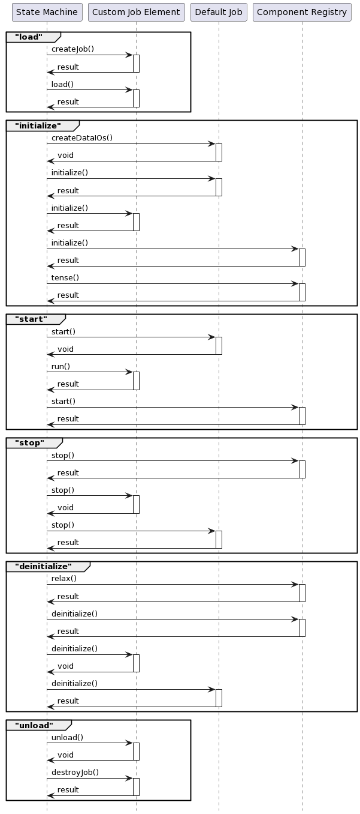

.. Copyright 2023 CARIAD SE.
.. 
.. This Source Code Form is subject to the terms of the Mozilla 
.. Public License, v. 2.0. If a copy of the MPL was not distributed 
.. with this file, You can obtain one at https://mozilla.org/MPL/2.0/.

.. _Participant:

===========
Participant
===========

:term:`FEP Participant` contains a set of :term:`FEP Components<FEP Component>` to fulfill different kinds of services.

Let's go through some services of a example, which offers through these components.
After this chapter the user will be able to create a basic FEP Participant, with a simple Job that reads and writes data.

Here is the example of a minimal version of a FEP Participant:

.. literalinclude:: ../snippets/snippet_minimal_participant.cpp
    :start-after: // Begin(MinimalJob)
    :end-before: // End(MinimalJob)

.. _label_jobs_new:

Jobs
====

Jobs are small runnable units to implement a functionality, which will be scheduled by :ref:`label_scheduler_service` component.

The convenient API :cpp:class:`fep3::core::DefaultJob` and :cpp:class:`fep3::core::CustomJobElement` offers the easiest way to construct a job directly in a participant.
There are categorically two types of jobs that can be created: cyclic clock-triggered jobs or data-triggered jobs.

.. _label_clock_triggered_job:

Clock-Triggered Job
-------------------
As shown in the example :ref:`label_minimal_participant`, a job that is triggered with a default period is implemented:

* The Class `MinimalJob` inherits from :cpp:class:`fep3::core::DefaultJob`, given a job name.

    .. literalinclude:: ../snippets/snippet_minimal_participant.cpp
        :start-after: // Begin(MinimalJob_CTOR)
        :end-before: // End(MinimalJob_CTOR)

* Two methods have to be implemented, :cpp:func:`fep3::core::DefaultJob::createDataIOs` and 
  :cpp:func:`fep3::core::DefaultJob::execute`. 

  Please check the :ref:`label_default_job_action_table` to see how these functions are called during state transitions.

    .. literalinclude:: ../snippets/snippet_minimal_participant.cpp
        :start-after: // Begin(MinimalJob_createDataIOs)
        :end-before: // End(MinimalJob_createDataIOs)

    .. literalinclude:: ../snippets/snippet_minimal_participant.cpp
        :start-after: // Begin(MinimalJob_execute)
        :end-before: // End(MinimalJob_execute)

* Create the job in a :term:`FEP Element` class, which inherits direct from :cpp:func:`fep3::core::CustomJobElement`. Following methods have to be implemented: :cpp:func:`fep3::core::CustomJobElement::getTypename`, :cpp:func:`fep3::core::CustomJobElement::getVersion`, :cpp:func:`fep3::core::CustomJobElement::createJob` and :cpp:func:`fep3::core::CustomJobElement::destroyJob`. 

  Please check the :ref:`label_custom_job_element_action_table` to see how these methods are called during state transitions.

    .. literalinclude:: ../snippets/snippet_minimal_participant.cpp
        :start-after: // Begin(MinimalJobElement)
        :end-before: // End(MinimalJobElement)

* By implementing :cpp:func:`fep3::core::DefaultJob::registerPropertyVariables` and :cpp:func:`fep3::core::DefaultJob::unregisterPropertyVariables`, any properties for the job can be registered.

    .. literalinclude:: ../snippets/snippet_minimal_participant.cpp
        :start-after: // Begin(MinimalJob_registerProperty)
        :end-before: // End(MinimalJob_registerProperty)

* Create the participant

    .. literalinclude:: ../snippets/snippet_minimal_participant.cpp
        :start-after: // Begin(MinimalJob_participant)
        :end-before: // End(MinimalJob_participant)

Runnable example can be found in :ref:`label_minimal_participant`.

How to configure a time-triggered job please refer to :ref:`label_clock_triggered_job_configuration`.

.. _label_data_triggered_job:

Data-Triggered Job
------------------

A Data-Triggered job can be created at ease, in a :term:`FEP Element` like before, by overriding the method :cpp:func:`fep3::core::CustomJobElement::createJob` with a :cpp:class:`fep3::catelyn::DataTriggeredJobConfiguration` instead of a :cpp:class:`fep3::catelyn::ClockTriggeredJobConfiguration`.

You can register multiple data signals with their specific names and get the job triggered every time when anyone of the signals has data arrived. Multiple signal names can be passed in as a `std::vector<std::string>`.

.. literalinclude:: ../snippets/snippet_default_job.cpp
    :start-after: // Begin(CustomJobElement_createJob_DataTriggered)
    :end-before: // End(CustomJobElement_createJob_DataTriggered)

.. note::

    The DataReaders for the signals have to be registered in the constructor, otherwise the program will complain that it can not find the signals.

.. note::

    In discrete timing mode, the job may not be triggered if the data is arrived in the same time frame. This behavior shall be fixed soon.

Runnable example can be found in :ref:`label_demo_default_job`.

How to configure a data-triggered job please refer to :ref:`label_data_triggered_job_configuration`.

Customized Job
--------------

Beside registering properties using :cpp:func:`fep3::core::DefaultJob::registerPropertyVariables`, the job can be customized by overriding following methods:

* :cpp:func:`fep3::core::DefaultJob::initialize`
* :cpp:func:`fep3::core::DefaultJob::start`
* :cpp:func:`fep3::core::DefaultJob::stop`
* :cpp:func:`fep3::core::DefaultJob::deinitialize`

They are optional to implement. The customized methods will be called specifically according to the :ref:`label_participant_state_machine`.

.. literalinclude:: ../snippets/snippet_default_job.cpp
    :start-after: // Begin(DefaultJob_optional_methods)
    :end-before: // End(DefaultJob_optional_methods)

Runnable example can be found in :ref:`label_demo_default_job`.

Following table shows in which state transition the functions are called.

.. _label_default_job_action_table:

DefaultJob Function Table
+++++++++++++++++++++++++

+-------------------------------------------------------------------+-----------------------------------+
| DefaultJob Function                                               | Called in action of State Machine |
+===================================================================+===================================+
| :cpp:func:`fep3::core::DefaultJob::registerPropertyVariables`     | load                              |
+-------------------------------------------------------------------+-----------------------------------+
| :cpp:func:`fep3::core::DefaultJob::createDataIOs`                 | initialize                        |
+-------------------------------------------------------------------+-----------------------------------+
| :cpp:func:`fep3::core::DefaultJob::initialize`                    | initialize                        |
+-------------------------------------------------------------------+-----------------------------------+
| :cpp:func:`fep3::core::DefaultJob::start`                         | start                             |
+-------------------------------------------------------------------+-----------------------------------+
| :cpp:func:`fep3::core::DefaultJob::stop`                          | stop                              |
+-------------------------------------------------------------------+-----------------------------------+
| :cpp:func:`fep3::core::DefaultJob::unregisterPropertyVariables`   | deinitialize                      |
+-------------------------------------------------------------------+-----------------------------------+

.. _customized_element:

Customized Element
------------------
Elements can also be customized by overriding the following methods:

* :cpp:class:`fep3::core::CustomJobElement::load`
* :cpp:class:`fep3::core::CustomJobElement::initialize`
* :cpp:class:`fep3::core::CustomJobElement::run`
* :cpp:class:`fep3::core::CustomJobElement::stop`
* :cpp:class:`fep3::core::CustomJobElement::deinitialize`
* :cpp:class:`fep3::core::CustomJobElement::unload`

.. literalinclude:: ../snippets/snippet_default_job.cpp
    :start-after: // Begin(CustomJobElement_optional_methods)
    :end-before: // End(CustomJobElement_optional_methods)

For creating the participant easily, the :cpp:class:`fep3::core::CustomElementFactory` can accept any type and any number of parameter to construct the customized :term:`FEP Element`.

.. note:: Do not create the participant again with the same parameters. The parameters are passed into the participant with `std::move` and will not be available in this scope after the participant is created.

.. literalinclude:: ../snippets/snippet_default_job.cpp
    :start-after: // Begin(CustomJobElement_customized_CTOR)
    :end-before: // End(CustomJobElement_customized_CTOR)

.. literalinclude:: ../snippets/snippet_default_job.cpp
    :start-after: // Begin(DefaultJob_CustomElementFactory)
    :end-before: // End(DefaultJob_CustomElementFactory)

Following table shows in which action of state transitions the functions are called.

.. _label_custom_job_element_action_table:

CustomJobElement Function Table
+++++++++++++++++++++++++++++++

+-----------------------------------------------------------------------+-----------------------------------+
| CustomJobElement Function                                             | Called in action of State Machine |
+=======================================================================+===================================+
| :cpp:func:`fep3::core::CustomJobElement::createJob`                   | load                              |
+-----------------------------------------------------------------------+-----------------------------------+
| :cpp:func:`fep3::core::CustomJobElement::load`                        | load                              |
+-----------------------------------------------------------------------+-----------------------------------+
| :cpp:func:`fep3::core::CustomJobElement::registerPropertyVariables`   | load                              |
+-----------------------------------------------------------------------+-----------------------------------+
| :cpp:func:`fep3::core::CustomJobElement::initialize`                  | initialize                        |
+-----------------------------------------------------------------------+-----------------------------------+
| :cpp:func:`fep3::core::CustomJobElement::run`                         | start                             |
+-----------------------------------------------------------------------+-----------------------------------+
| :cpp:func:`fep3::core::CustomJobElement::stop`                        | stop                              |
+-----------------------------------------------------------------------+-----------------------------------+
| :cpp:func:`fep3::core::CustomJobElement::deinitialize`                | deinitialize                      |
+-----------------------------------------------------------------------+-----------------------------------+
| :cpp:func:`fep3::core::CustomJobElement::unregisterPropertyVariables` | unload                            |
+-----------------------------------------------------------------------+-----------------------------------+
| :cpp:func:`fep3::core::CustomJobElement::unload`                      | unload                            |
+-----------------------------------------------------------------------+-----------------------------------+
| :cpp:func:`fep3::core::CustomJobElement::destroyJob`                  | unload                            |
+-----------------------------------------------------------------------+-----------------------------------+

Runnable example can be found in :ref:`label_demo_default_job`.

.. _label_default_job_function_call_sequence:

DefaultJob API function call sequence
-------------------------------------

The following diagram shows the sequence of CustomJobElement, DefaultJob and Component function calls when traversing the State Machine.

.. _label_sim_data:

Simulation Data
===============

In :ref:`label_jobs_new`, it is described how a runnable with a default periodicity can be triggered. 
However, it would be more useful if this runnable could receive and send data.
Let's assume that the runnable should receive an integer, multiple it by 2 and pass it to the output.

For this a data source and a data sink are needed, that are :cpp:class:`fep3::arya::IDataRegistry::IDataReader` 
and :cpp:class:`arya::IDataRegistry::IDataWriter` which read or write a dedicated signal respectively.
So, in this example, input is read from "small_value" signal and output is written to the "big_value" signal.

First the reader is initialized

.. literalinclude:: ../snippets/snippet_minimal_participant.cpp
    :start-at: addDataIn
    :end-at: addDataIn

and the writer.

.. literalinclude:: ../snippets/snippet_minimal_participant.cpp
    :start-at: addDataOut
    :end-at: addDataOut

Now what only remains is to read the input

.. literalinclude:: ../snippets/snippet_minimal_participant.cpp
    :start-at: *_reader >>
    :end-at: *_reader >>

calculate the output value

.. literalinclude:: ../snippets/snippet_minimal_participant.cpp
    :start-at: value = received_plain_value
    :end-at: value = received_plain_value

and write it in the :cpp:func:`MinimalDataJob::execute` method.

.. literalinclude:: ../snippets/snippet_minimal_participant.cpp
    :start-at: *_writer <<
    :end-at: *_writer <<

Every :cpp:class:`fep3::core::DefaultJob` provides functionality to log information regarding samples which have been purged during runtime.
Samples might be purged in various situations.

If the corresponding data reader's internal sample queue size is too small for the number of samples being received,
old samples may be purged and replaced by new samples.
Additionally, samples are purged actively when clearing a data reader
backlog :cpp:func:`fep3::core::arya::DataReader::clear` or popping samples :cpp:func:`fep3::core::arya::DataReader::purgeAndPopSampleBefore`.

To receive information regarding the amount of purged samples when the :cpp:class:`fep3::core::DefaultJob` is stopped,
configure the buffer capacity for purged samples using a :cpp:class:`fep3::core::DefaultJob` 's property :c:macro:`FEP3_PURGED_SAMPLES_LOG_CAPACITY_PROPERTY`.

.. note::
   Property :c:macro:`FEP3_PURGED_SAMPLES_LOG_CAPACITY_PROPERTY` is evaluated during initialization.

The :cpp:class:`fep3::core::DefaultJob` will inform whether samples have been purged during runtime and provide information regarding the samples
like their timestamps and the number of samples purged.

The default value is :c:macro:`FEP3_PURGED_SAMPLES_LOG_CAPACITY_DEFAULT_VALUE`.
Therefore, logging of purged samples is enabled by default.
To disable logging of purged samples, set the property's value to "0".

The full example can be found in :ref:`label_minimal_participant`.

For a detailed explanation of the data exchange see :ref:`label_communication_advanced`.

Every reader has an internal signal queue which is filled on signal reception. If the input signals are not read in the job cycle, samples may remain in this queue.
In the next job cycle, maybe samples valid for the old cycle are read. 
Therefore every :cpp:class:`fep3::core::DefaultJob` provides the possibility to clear the reader's queue automatically at the end of the job cycle.
This functionality can be enabled by :cpp:class:`fep3::core::DefaultJob` 's property :c:macro:`FEP3_CLEAR_INPUT_SIGNALS_QUEUES_PROPERTY`.

.. note::
   Property :c:macro:`FEP3_CLEAR_INPUT_SIGNALS_QUEUES_PROPERTY` is evaluated during initialization.

By default, the reader's input signal queue is not cleared automatically. The default value of this property is 'false'. 
To enable this functionality, set the property's value to 'true'.

.. _label_sim_time:

Simulation Time
===============

In :ref:`label_sim_data`, it is described how a job can interact with signals, in this section we will see how we can set the job's cycle time.
The :ref:`label_scheduler_service` and its :ref:`label_scheduler_service_active_scheduler` are responsible for the triggering each time a Job's cycle time passes.

A job's cyclic time can be configured with :cpp:class:`fep3::arya::JobConfiguration` as described in :ref:`label_job_registry_job_configuration` .
:cpp:class:`fep3::cpp::arya::DataJob` provides two constructors to set only the cyclic time :cpp:func:`fep3::cpp::arya::DataJob::DataJob(const std::string &, fep3::arya::Duration)` or pass the
:cpp:class:`fep3::arya::JobConfiguration` in :cpp:func:`fep3::cpp::arya::DataJob::DataJob(const std::string&, fep3::arya::JobConfiguration)`

Configuration
=============

Assuming now that the job should be able to work with some parameters that will not compile time variables, rather could be changed in runtime.

After registering a property :class:`fep3::cpp::PropertyVariable`

.. literalinclude:: ../snippets/snippet_minimal_participant.cpp
    :start-after: // Begin(MinimalJob_registerProperty)
    :end-before: // End(MinimalJob_registerProperty)

and the bonded variable can be used for accessing the property value.

.. literalinclude:: ../snippets/snippet_minimal_participant.cpp
    :start-at: * _factor
    :end-at: * _factor

Detailed description on properties can be found in :ref:`label_configuration_service`.

When to use?
------------

Properties are considered first class functionality in FEP and thus it is highly recommended to add
every configuration as a property, even if there is a CLI equivalent.
There are exceptions though, where configuration is required that needs to be evaluated before the participant is even in unloaded.

It is good practice to even expose your model configuration to FEP. 
An example would be workspace variables in MATLAB/Simulink, which you can't change otherwise, because the GUI is probably blocked.

This also provides a unified access to configurations for a test automation tool.

Best practices
--------------

* Customize job and element with the functions described in :ref:`label_default_job_action_table` and :ref:`label_custom_job_element_action_table`. The are fully integrated with the state machine, at same time offering a great flexibility.
* Properties in Job and Element should be set using the :cpp:func:`fep3::core::DefaultJob::registerPropertyVariables` and :cpp:func:`fep3::core::CustomJobElement::registerPropertyVariables`. 
* Properties should be made available as early as possible
* Properties should be set as early as possible.
* Properties should be evaluated as late as possible (during initialize)
* The FEP Utility Tooling does not allow to change properties in state initialized - only in state unloaded and loaded.
* The documentation of a property should state during what state change the property's value will be evaluated
* A FEP Participant should provide a log message every time a property value is evaluated to provide feedback to FEP System Designer / Operator
* Properties should not reset their value when reverting the state machine
* A property that has been created in load shall be deleted in unload.

Conventions
-----------

Naming
~~~~~~

To have a consistent experience, please use the FEP SDKs naming convention, which requires snake_case style property names.

If you use physical units, you can use the conversion functions to accept values like "10m".

Grouping/Nodes
~~~~~~~~~~~~~~

Properties are structured in a tree like way. Each property vertex/node can have an arbitrary amount of childrens. That is how you can group your configuration in a parent-child relationship of any depth.
Note that we use a labeled tree structure. The label consists of a type and a value. 
Even if FEP3 can label each vertex/node of the property tree, not every UI can visualize it. 
So we advise to use the type _node_ to indicate that the value is invalid and that this vertex/node has one or more child vertices/nodes.

Indicate somehow, if a property is read only and for extra information.
For example you could name your nodes *my_tool_config* and *my_tool_info*.
That would show, that entries in *my_tool_config* are configurable and all in *my_tool_info* are read only.
Don't add properties to the default SDK property nodes!
Grouping can be done by features or indicating lifecycle management of properties.

Example 
~~~~~~~

Example if using a property type for parsing SI-meter units:

.. code-block::

    distance_sensor:
        enabled: true
        initial_measurement: 10m
    logging: .... (native nodes)

In this case the user can expect, that the node can toggle the feature distance_sensor and thus disable the properties (and their effect) under it, if set to "false".

Path-like String Properties
~~~~~~~~~~~~~~~~~~~~~~~~~~~

Properties representing a path should resolve relative paths from a working artifact (e.g. model) and *not* the FEP executable, since that can be anywhere on the disk.
There is an exception, if you have a plain C++ participant, the executable is basically the model.

Logging
=======

In case a logging mechanism is needed, there are dedicated macros that provide logging for various severity grades (DEBUG, FATAL, ERROR, WARNING, INFO, RESULT).
An example of the logging macro usage is included in :ref:`label_minimal_participant`.

.. literalinclude:: ../snippets/snippet_minimal_participant.cpp
    :start-at: FEP3_LOG_INFO
    :end-at: std::to_string(value));

Detailed description on logging service can be found in :ref:`label_logging_service`

