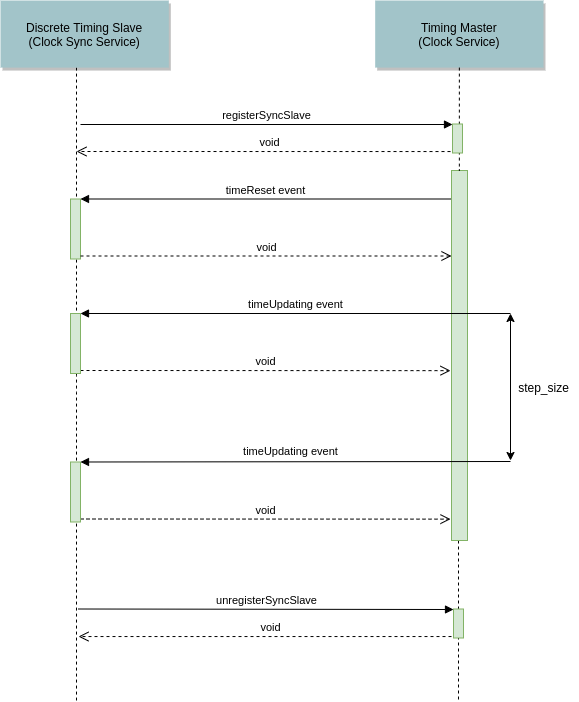

.. Copyright @ 2021 VW Group. All rights reserved.
.. 
.. This Source Code Form is subject to the terms of the Mozilla 
.. Public License, v. 2.0. If a copy of the MPL was not distributed 
.. with this file, You can obtain one at https://mozilla.org/MPL/2.0/.

.. _label_clock_sync_service:

===================
 Clock Sync Service
===================

.. sidebar::  Clock Sync Service

        .. contents::

Summary
=======

+------------------------------------------------------+-----------------------------------------------------------------------------+
| Name                                                 |  Clock Sync Service                                                         |
+------------------------------------------------------+-----------------------------------------------------------------------------+
| Component Interface                                  |  :cpp:class:`fep3::arya::IClockSyncService`                                 |
+------------------------------------------------------+-----------------------------------------------------------------------------+
| RPC Service Interface                                |  :cpp:class:`fep3::rpc::arya::IRPCClockSyncSlaveDef`                        |
|                                                      |                                                                             |
+------------------------------------------------------+-----------------------------------------------------------------------------+
| RPC Service Description                              |  :ref:`label_rpc_service_clock_sync_slave`                                  |
+------------------------------------------------------+-----------------------------------------------------------------------------+
| native delivery                                      |  CPP-plugin                                                                 |
+------------------------------------------------------+-----------------------------------------------------------------------------+
| CPP-plugin possible                                  |  yes                                                                        |
+------------------------------------------------------+-----------------------------------------------------------------------------+
| C-plugin possible                                    |  no                                                                         |
+------------------------------------------------------+-----------------------------------------------------------------------------+

Overview
========

The :ref:`label_clock_sync_service` provides functionality to synchronize the local time of a slave participant with the time of a timing master participant.
For this purpose, two native timing slave clock implementations are provided. To synchronize a timing slave with a timing master,
the timing master and the corresponding :ref:`label_clock_service_main_clock` have to be configured using FEP Properties.
Depending on the timing master's :ref:`label_clock_service_main_clock`, various :ref:`label_clock_sync_service_native` can be configured as active clock for a timing slave.

The counterpart of a slave is the :ref:`label_clock_sync_master` on the master side.

Component Interface
===================

The :cpp:class:`fep3::arya::IClockSyncService` currently offers no functionality.

RPC Service Interface
=====================

The :cpp:class:`fep3::rpc::arya::IRPCClockSyncSlaveDef` offers the following functionality:

* Being able to receive a *syncTimeEvent*.

There are currently the following types of *syncTimeEvent* s (See :cpp:class:`fep3::rpc::arya::IRPCClockSyncMasterDef` for details).

* timeUpdateBefore
* timeUpdating
* timeUpdateAfter
* timeReset

Configuration
=============

In order to establish a slave synchronization, the :ref:`label_clock_service_main_clock` of the :ref:`label_clock_service` has to be set.
Using the :ref:`label_clock_sync_service_native` either the :ref:`label_clock_sync_slave_master_on_demand` or :ref:`label_clock_sync_slave_master_on_demand_discrete`
can be set as the :ref:`label_clock_service_main_clock` of the slave.

Properties
----------

.. list-table::
   :widths: 20 60 20
   :header-rows: 1

   * - Name
     - Code Macro
     - Default Value
   * - MainClock
     - :c:macro:`FEP3_CLOCK_SERVICE_MAIN_CLOCK`
     - :c:macro:`FEP3_CLOCK_LOCAL_SYSTEM_REAL_TIME`

.. _label_clock_sync_service_native:

Native Implementations
======================

Among the following built-in native implementations for slave clocks can be choosen.

.. list-table::
   :header-rows: 1

   * - Name
     - Code Macro
     - Type
   * - :ref:`label_clock_sync_slave_master_on_demand_discrete`
     - :c:macro:`FEP3_CLOCK_SLAVE_MASTER_ONDEMAND_DISCRETE`
     - :ref:`label_clock_type_discrete`
   * - :ref:`label_clock_sync_slave_master_on_demand`
     - :c:macro:`FEP3_CLOCK_SLAVE_MASTER_ONDEMAND`
     - :ref:`label_clock_type_continuous`

.. _label_clock_sync_slave_master_on_demand:

slave_master_on_demand
----------------------

The :ref:`label_clock_sync_slave_master_on_demand` is a :ref:`label_clock_type_continuous` timing slave clock.
It cyclically requests the current simulation time from the timing master's continuous clock and synchronizes it's local time with the time of the master using the `Cristian's algorithm <https://en.wikipedia.org/wiki/Cristian%27s_algorithm>`_.

A concrete setup could look like that:

    * The timing master has to use a continuous main clock (e.g. :ref:`label_clock_implementation_local_system_realtime`).
    * The timing slave uses the :ref:`label_clock_sync_slave_master_on_demand` clock to cyclically (here every 100ms) synchronize its local time with the timing master.

.. note:: The :ref:`label_clock_sync_slave_master_on_demand` clock can only be used if the clock of the master is of :ref:`label_clock_type_continuous` type.

The following image shows a continuous synchronization in more detail.

At first the *timing slave* registers with the *timing master*. This is necessary to receive the *timeReset* events.
After registration and once the simulation starts the *timing master* will first send a *timeReset* event to the *slave*.
After that the *timing slave* will cyclically retrieve the *master* time in an interval of *sync_cycle_time* (in wall clock time).
In case of the :ref:`label_clock_sync_slave_master_on_demand` clock this time will be used to set the local time of the *slave* using the `Cristian's algorithm <https://en.wikipedia.org/wiki/Cristian%27s_algorithm>`_.
When the simulation is stopped the *timing slave* will unregister from the *master*.

.. image:: images/continuous_sync.png

Properties
^^^^^^^^^^

The :ref:`label_clock_sync_slave_master_on_demand` clock can be configured using the following properties.

.. list-table::
   :widths: 20 60 20
   :header-rows: 1

   * - Name
     - Code Macro
     - Default Value
   * - SyncCycleTime
     - :c:macro:`FEP3_CLOCKSYNC_SERVICE_CONFIG_SLAVE_SYNC_CYCLE_TIME`
     - :c:macro:`FEP3_CLOCK_SIM_TIME_STEP_SIZE_DEFAULT_VALUE`

.. _label_clock_sync_slave_master_on_demand_discrete:

slave_master_on_demand_discrete
-------------------------------

The :ref:`label_clock_sync_slave_master_on_demand_discrete` clock will try to register to the timing master (:c:macro:`FEP3_CLOCKSYNC_SERVICE_CONFIG_TIMING_MASTER`)
when the :ref:`label_clock_sync_service` is tensing (:cpp:func:`fep3::arya::IComponent::tense()`).
If the timing master is not available by that time it will cyclically try to register again.
After registration the :ref:`label_clock_sync_slave_master_on_demand_discrete` clock will receive *timeUpdating* events from the timing master and will set its local time accordingly.

A concrete setup could look like that:

    * The timing master has to use a discrete :ref:`label_clock_service_main_clock` (e.g. :ref:`label_clock_implementation_local_system_simtime`).
    * The timing slave uses the :ref:`label_clock_sync_slave_master_on_demand_discrete` clock.

.. note:: The :ref:`label_clock_sync_slave_master_on_demand_discrete` clock can only be used if the clock of the master is of :ref:`label_clock_type_discrete` type.

The following image shows a discrete synchronization in more detail.

At first the *timing slave* registers with the *timing master*.
After registration and once the simulation starts the *timing master* will first send a *timeReset* event to the *slave*.
After that it will send *timeUpdating* events whenever it's local time changes. The time of the *master* will change in an interval of *step_size*.
The *step_size* is the resolution of the simulation time. Since it's a simulated time,
the real time difference (in wall clock time) between to *timeUpdating* events is not necessarily the *step_size* (see :ref:`label_clock_implementation_local_system_simtime` for details).
When the simulation is stopped the *timing slave* will unregister from the *master*.

