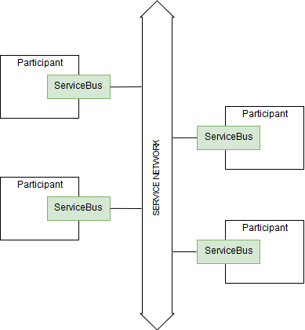
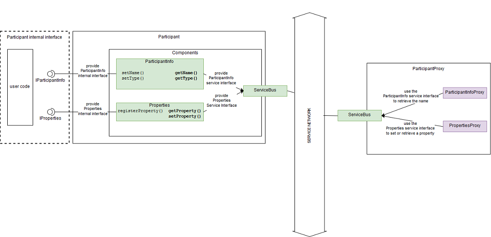
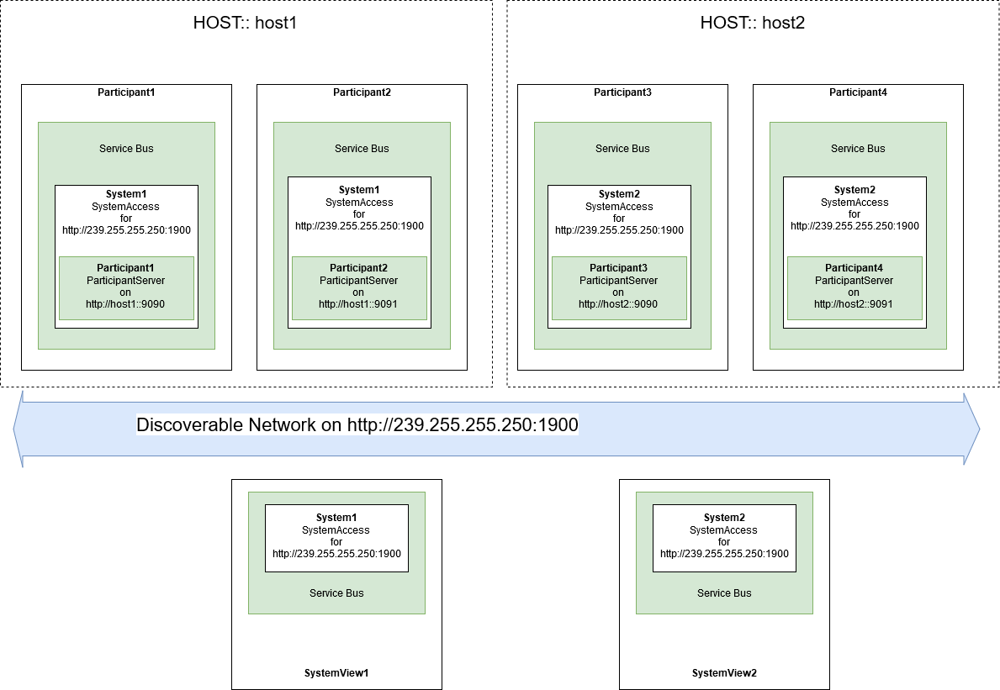

#
# Copyright @ 2021 VW Group. All rights reserved.
# 
#     This Source Code Form is subject to the terms of the Mozilla
#     Public License, v. 2.0. If a copy of the MPL was not distributed
#     with this file, You can obtain one at https://mozilla.org/MPL/2.0/.
# 
# If it is not possible or desirable to put the notice in a particular file, then
# You may include the notice in a location (such as a LICENSE file in a
# relevant directory) where a recipient would be likely to look for such a notice.
# 
# You may add additional accurate notices of copyright ownership.
# 
#


.. _label_service_bus:

===========
Service Bus
===========

.. sidebar:: Service Bus

        .. contents::


Summary
=======

+------------------------------------------------------+-----------------------------------------------------------------+
| Name                                                 |  Service Bus                                                    |
+------------------------------------------------------+-----------------------------------------------------------------+
| Component Interface                                  |  :cpp:class:`fep3::arya::IServiceBus`                           |
+------------------------------------------------------+-----------------------------------------------------------------+
| RPC Service Interface                                |  :cpp:class:`fep3::rpc::arya::IRPCParticipantInfoDef`           |
|                                                      |  :cpp:class:`fep3::rpc::arya::IRPCParticipantInfo`              |
+------------------------------------------------------+-----------------------------------------------------------------+
| RPC Service Description                              |  participant_info.json                                          |
+------------------------------------------------------+-----------------------------------------------------------------+
| native delivery                                      |  built-in for HTTP,                                             |
|                                                      |  cpp-plugin for HTTP                                            |
+------------------------------------------------------+-----------------------------------------------------------------+
| cpp-plugin possible                                  |  yes                                                            |
+------------------------------------------------------+-----------------------------------------------------------------+
| c-plugin possible                                    |  no                                                             |
+------------------------------------------------------+-----------------------------------------------------------------+

Overview
========

A :term:`FEP Participant` is a network node within a :term:`FEP System`.
The participant is the "gate" to connect to the defined network.
So, one main part of a participant is called :term:`FEP Service Bus`. The defined network is called "service network".

From a participant's point of view the :term:`FEP Service Bus` has the following important features:

- provide one service access point for any control remote procedure call to the participant from the network world
- provide the possibility to response to a request from system perspective
- provide a service interface which may be used from the service network world

The FEP System is formed by a set of FEP Participants.
The smallest FEP System contains *one* FEP Participant.

From a system's point of view the :term:`FEP Service Bus` has the following important features:

- network discovery to discover current participants which are connected to the same service network
- provide access to the participants services to control it by remote procedure calls
- provide the possibility to request any public functionality within the participant that are provided by a service
- connect to a defined set of participants which may be part of the FEP System



FEP Participant components and the FEP Service Bus
--------------------------------------------------

The participant's functionality is separated into clear defined services. These services are called `FEP Components`.
Each component is able to use the service bus (which is also provided as a component) to
provide some service interfaces for its specific task.

Examples:
`````````



:Logging Service Component: The task for the Logging Service Component is to provide a possibility to log information,
                            error descriptions or warnings to a single service.
                            The service interface of this component is to send logging information to other service bus attendees.
                            To do so, the Logging Service Component will i.e. provide a possibility for a
                            remote procedure call method like ``getLogMessages()``.
:Configuration Component: The task for the Configuration Component is to provide a possibility to set and retrieve the values of properties.
                          These properties will be registered with a name and might be a parameter for any other functionality.
                          The service interface of this service will provide some remote procedure calls like ``getProperty(name)``
                          and ``setProperty(name, value)``.

.. tip::
   Each component has a participant internal interface to program the participants functionality and a participant service interface
   to provide a remote procedure access via service bus.


System Access, Participant Server, Participant Requester
--------------------------------------------------------

The system access is a single communication access point to the service bus at a dedicated system and network.
Each system access may register a participant server at the systems network url.
Usually, this system URL is used to discover other participants using the same protocol.

Other participants can be only discovered and appear in the system, if a Participant Server was created.
This server will provide the registered service on the dedicated server url.

To use the service of a participant from systems point of view,
you need to know the address of this far Participant Server.
Otherwise you will not be able to communicate with it.
It depends on the protocol used by the requester implementation
if this address might be a dedicated url address as it is within a ``http`` implementation
or a single communication channel on a `dds` service bus.

Example
```````


:Discover Addresses via System Access: Discoverable participants on the whole system network address http://239.255.255.250:190 are:
                                       | "Participant1" with the url http://host1:9090 for System1
                                       | "Participant2" with http://host1:9091 for System1
                                       | "Participant3" with the url http://host2:9090 for System2
                                       | "Participant4" with http://host2:9091 for System2
                                       | SystemView1 and SystemView2 did not register a server to the network, so they are not seen and are not discoverable.
:System1 with Participant Servers: Discoverable participants on "System1" are:
                                   | "Participant1" with the url http://host1:9090
                                   | "Participant2" with http://host1:9091
                                   | SystemView1 did not register a server to the network, so they it is not seen and is not discoverable.
:System2 with Participant Servers: Discoverable participants on "System2" are:
                                   | "Participant3" with the url http://host2:9090
                                   | "Participant4" with http://host2:9091
                                   | SystemView2 did not register a server to the network, so they it is not seen and is not discoverable.


HTTP Service Bus
================

The delivered service bus as native :term:`FEP Component` will come with following implementations:

* :ref:`HTTP Service Bus`
* :ref:`RTI Service Bus`


.. _HTTP Service Bus:

HTTP Service Bus
----------------

.. _HTTP Server:

HTTP Server and Service Registry
````````````````````````````````

The HTTP Server is a implementation of a real HTTP Server which will react on *HTTP REQUEST* messages.
This implementation uses the Library of the :term:`Package RPC` .

The server itself must be initialized for a valid location address. Examples for valid addresses are:

* *http://localhost:9090* - this will open a socket on the network device of the "localhost" and port 9090.
* *http://0.0.0.0:9090* - this will open a socket on every network device and port 9090. So it will be available on "localhost" and each of the network addresses.
* *http://localhost:0* - this will open a socket on the network device of the "localhost" and will find a free port starting at 9090.
* *http://0.0.0.0:0* - this will open a socket on every network device and will find a free port starting at 9090.

The dynamic mechanism of finding a free port will make only sense if the dynamic discovery of the :ref:`HTTP System Access` is used.
Otherwise it is not possible to discover and obtain the port the other participant opened while initializing.

The Service Registry implementation will forward HTTP REQUESTS to the objects registered by name:

* If a :term:`RPC Service` is registered with the name *clock_master* the HTTP server will forward every HTTP REQUEST to it with the address i.e. *http://localhost:9090/clock_master*.


.. _HTTP System Access:

HTTP System Access and SSDP Discovery
`````````````````````````````````````

The HTTP System Access will provide the possibility to discover all other servers within the same network and with the same system name.
The system access must be created via a valid **multicast address** and a port. The default address is:

* *http://230.230.230.1:9990*

Each server (somewhere in the network) using the same address will be discovered (if the firewall ruleset does not prevent that!).
Each :ref:`HTTP Server` will send discovery messages containing its name and a system name. Both are provided with :cpp:func:`~fep3::IServiceBus::ISystemAccess::createServer`.
For usage within the :term:`FEP Participant` this will be the name of the participant and the system name which are both provided to :cpp:func:`~fep3::core::createParticipant`.

This mechanism is using the SSDP (Simple Service Discovery Protocol) from the UPnP standard v1.1.
This implementation will follow chapter 1 of the specification
http://www.upnp.org/specs/arch/UPnP-arch-DeviceArchitecture-v1.1.pdf, but is no fully UPnP 1.1 implementation.


In case of disabled discovery, each :term:`RPC Requester` has to be created using a full address.
A call of :cpp:func:`~fep3::IServiceBus::getRequester` must use i.e. *http://other_interface:9097* and
can not be used by its alias name it was created within this system (see :cpp:func:`~fep3::IServiceBus::ISystemAccess::createServer`).

Native Service Bus Delivery
```````````````````````````

The service bus is delivered as a built-in component so it will automatically be created. Also it will be provided as a separate :term:`CPP Plugin` ( *lib/http/fep3_http_service_bus.dll* / *lib/http/fep3_http_service_bus.so*).

.. _RTI Service Bus:

RTI Service Bus
---------------

No implementation yet.

