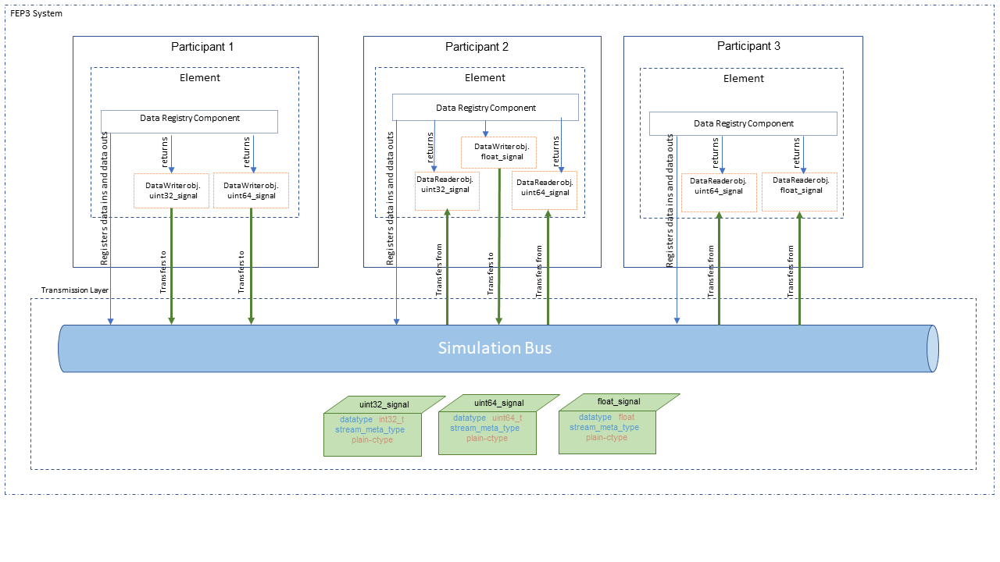

.. Copyright @ 2021 VW Group. All rights reserved.
.. 
..     This Source Code Form is subject to the terms of the Mozilla
..     Public License, v. 2.0. If a copy of the MPL was not distributed
..     with this file, You can obtain one at https://mozilla.org/MPL/2.0/.
.. 
.. If it is not possible or desirable to put the notice in a particular file, then
.. You may include the notice in a location (such as a LICENSE file in a
.. relevant directory) where a recipient would be likely to look for such a notice.
.. 
.. You may add additional accurate notices of copyright ownership.

.. _FEP_Participant_Library:

================================
FEP Participant Library
================================

.. _label_components_new:

Basic Concepts
--------------

In this chapter the basic concepts of FEP SDK will be explained by going through the example code of :ref:`label_minimal_participant`.

After this chapter the user will be able to create a basic FEP Participant, with a simple Job that reads and writes data.

.. literalinclude:: ../snippets/snippet_minimal_participant.cpp

Components
----------

The functional parts of the :term:`FEP Participant` are called :term:`FEP Components<FEP Component>`.
Each :term:`FEP Component` covers some specific functionality, e.g. functionality to exchange simulation data with other participants.

:term:`FEP Components<FEP Component>` can be accessed via the :term:`FEP Participant` API's
template method getComponent() in :cpp:class:`fep3::arya::Participant`, passing the :term:`FEP Component Interface`
as template argument.

.. _label_jobs_new:

Jobs
****

Jobs are small runnable units to implement a functionality that needs to be part of a distributed scheduler.
At the moment the configurations of jobs are only possible for cyclic time triggered events.
In future there might be a possibility to add data triggered jobs as well.

The job class :cpp:class:`fep3::arya::IJob`  has three interface functions.

* 	The :cpp:func:`fep3::arya::IJob::executeDataIn` is to read
	and prepare the incoming data for the *execute* call. Do *not* implement any functional behavior in here,
	but read all data from the IDataRegistry::IDataReader.

* The :cpp:func:`fep3::arya::IJob::execute` is to implement the jobs functional behavior.

* The :cpp:func:`fep3::arya::IJob::executeDataOut` is to flush the :cpp:class:`fep3::core::arya::DataWriter` queues.

As a first example a job that is triggered with a default period is implemented, as shown in :ref:`label_minimal_participant`.

First the Class :cpp:class:`MinimalDataJob` has to be defined and the :cpp:func:`fep3::cpp::arya::DataJob::process` method implemented, which is the actual method to be periodically called.
The :cpp:class:`MinimalDataJob`, inherits from :cpp:class:`fep3::cpp::arya::DataJob` and not directly from :cpp:class:`fep3::arya::IJob`, since :cpp:class:`fep3::cpp::arya::DataJob` also encapsulates
some steps that otherwise would have to be implemented if directly inheriting from :cpp:class:`fep3::arya::IJob`.

.. literalinclude:: ../snippets/snippet_minimal_participant.cpp
    :start-after: //Begin(DataJob_process)
    :end-before: //End(DataJob_process)

Then the participant has to be instantiated and executed (:ref:`label_participant_execution`). 

.. literalinclude:: ../snippets/snippet_minimal_participant.cpp
    :start-at: createParticipant
    :end-at: part.exec

.. _label_sim_data:

Simulation Data
***************

In :ref:`label_jobs_new`, it is described how a runnable with a default periodicity can be triggered. However, it would be more useful if this runnable could receive and send data.
Let's assume that the runnable should receive an integer, multiple it by 2 and pass it to the output.

For this a data source and a data sink are needed, that are :cpp:class:`fep3::arya::IDataRegistry::IDataReader` and :cpp:class:`arya::IDataRegistry::IDataWriter` which read or write a dedicated signal respectively.
So, in this example, input is read from "small_value" signal and output is written to the "big_value" signal.

First the reader is initialized

.. literalinclude:: ../snippets/snippet_minimal_participant.cpp
    :start-at: addDataIn
    :end-at: addDataIn

and the writer.

.. literalinclude:: ../snippets/snippet_minimal_participant.cpp
    :start-at: addDataOut
    :end-at: addDataOut

Now what only remains is to read the input

.. literalinclude:: ../snippets/snippet_minimal_participant.cpp
    :start-at: *_reader >>
    :end-at: *_reader >>

calculate the output value

.. literalinclude:: ../snippets/snippet_minimal_participant.cpp
    :start-at: value = received_plain_value
    :end-at: value = received_plain_value

and write it in the :cpp:func:`MinimalDataJob::Process` method.

.. literalinclude:: ../snippets/snippet_minimal_participant.cpp
    :start-at: *_writer <<
    :end-at: *_writer <<

The full example can be found in :ref:`label_minimal_participant`.

For a detailed explanation of the data exchange see :ref:`label_communication_advanced`.

.. _label_sim_time:

Simulation Time
***************

In :ref:`label_sim_data`, it is described how a job can interact with signals, in this section we will see how we can set the job's cycle time.
The :ref:`label_scheduler_service` and its :ref:`label_scheduler_service_active_scheduler` are responsible for the triggering each time a Job's cycle time passes.

A job's cyclic time can be configured with :cpp:class:`fep3::arya::JobConfiguration` as described in :ref:`label_job_registry_job_configuration` .
:cpp:class:`fep3::cpp::arya::DataJob` provides two constructors to set only the cyclic time :cpp:func:`fep3::cpp::arya::DataJob::DataJob(const std::string &, fep3::arya::Duration)` or pass the 
:cpp:class:`fep3::arya::JobConfiguration` in :cpp:func:`fep3::cpp::arya::DataJob::DataJob(const std::string&, fep3::arya::JobConfiguration)`

Configuration
*************
Assuming now that the job should be able to work with some parameters that will not compile time variables, rather could be changed in runtime.

After registering a property :class:`fep3::cpp::PropertyVariable` 

.. literalinclude:: ../snippets/snippet_minimal_participant.cpp
    :start-at: registerPropertyVariable
    :end-at: registerPropertyVariable

the values of the  property variables are updated

.. literalinclude:: ../snippets/snippet_minimal_participant.cpp
    :start-at: updatePropertyVariables
    :end-at: updatePropertyVariables

and the bonded variable can be used for accessing the property value.

.. literalinclude:: ../snippets/snippet_minimal_participant.cpp
    :start-at: * _factor
    :end-at: * _factor

Detailed description on properties can be found in :ref:`label_configuration_service`.

Logging
*******

In case a logging mechanism is needed, there are dedicated macros that provide logging for various severity grades (DEBUG, FATAL, ERROR, WARNING, INFO, RESULT).
An example of the logging macro usage is included in :ref:`label_minimal_participant`.

.. literalinclude:: ../snippets/snippet_minimal_participant.cpp
    :start-at: FEP3_LOG_INFO
    :end-at: std::to_string(value));

Detailed description on logging service can be found in :ref:`label_logging_service`

Advanced Concepts
-----------------
In :ref:`label_components_new` a basic example of a FEP Participant was presented, which was using some helper classes of the FEP SDK,
that encapsulate some of the implementation that otherwise has to be done by the user. In this chapter, some more advanced concepts will be presented.

FEP Element
***********

Embedding the element in a FEP participant
^^^^^^^^^^^^^^^^^^^^^^^^^^^^^^^^^^^^^^^^^^

A custom Element should inherit from :cpp:class:`fep3::core::arya::ElementConfigurable` or :cpp:class:`fep3::core::arya::ElementBase`.

.. literalinclude:: ../snippets/snippet_core_receiver_main.cpp
    :start-at: class EasyCoreReceiverElement
    :end-before: //Implementation of the CTOR!

.. literalinclude:: ../snippets/snippet_core_receiver_main.cpp
    :start-at: EasyCoreReceiverElement()
    :end-at: FEP3_PARTICIPANT_LIBRARY_VERSION_STR)

In order to create an object of :cpp:class:`fep3::arya::Participant`  there are some overloads of the function to choose from in
:cpp:func:`fep3::arya::createParticipant` , :cpp:func:`fep3::cpp::arya::createParticipant`, :cpp:func:`fep3::core::arya::createParticipant`,
providing different alternatives for initialization.

In this example the following overload is used
:cpp:class:`template\<typename element_factory> createParticipant(int , char const *const *, const std::string& , const fep3::arya::ParserDefaultValues&)`
that provides also the possibility of parsing the command line arguments.

.. literalinclude:: ../snippets/snippet_core_receiver_main.cpp
    :start-at: createParticipant
    :end-at: "" });

The :cpp:class:`fep3::arya::IElementFactory` can either be passed as a template parameter or as a constructor argument and it is the interface that will eventually call
the constructor of the custom Element Class and create an object instance during the *load_element* action of the :ref:`label_participant_state_machine`.
The destructor of the created object is called in the *unload_element* action of the :ref:`label_participant_state_machine`.
The lifetime of the created Factory object on the other hand is equal to the lifetime of the participant, meaning there is only one instance of :cpp:class:`fep3::arya::IElementFactory`
created during the :cpp:class:`fep3::arya::Participant`'s lifetime.

.. _label_create_participant:

Creating participant overloads
^^^^^^^^^^^^^^^^^^^^^^^^^^^^^^

These convenience wrappers serve common use cases and require less arguments to be passed. For stand-alone participant executables
it is recommended to use those overloads that take 'argc' and 'argv' as arguments in order to enable command line argument parsing,
so that parameters like name of participant or system can be changed on startup and are not hard-coded into them.

*createParticipant* convenience wrappers of the CPP Library
"""""""""""""""""""""""""""""""""""""""""""""""""""""""""""

These convenience wrappers are for simple participants where the entire implementation can be described with a :cpp:class:`fep3::cpp::arya::DataJob` and no custom element is required.

.. literalinclude:: ../snippets/snippet_participant.cpp
    :start-after: //Begin(CppBasic)
    :end-before: //End(CppBasic)

To add user defined command line arguments a parser object has to be created and passed to the *createParticipant* function.

.. literalinclude:: ../snippets/snippet_participant.cpp
    :start-after: //Begin(CppUserArg)
    :end-before: //End(CppUserArg)

*createParticipant* convenience wrappers of the Core Library
""""""""""""""""""""""""""""""""""""""""""""""""""""""""""""

These convenience wrappers are for participants with custom elements and also allow to define the element version and a default value for the system address URL.

.. literalinclude:: ../snippets/snippet_participant.cpp
    :start-after: //Begin(CoreBasic)
    :end-before: //End(CoreBasic)

This will make the optional arguments required and change how the executable is called:

With default values defined:

.. code-block:: none

    > myParticipantExecutable -n MyParticipant -s MySystem

Without default values defined:

.. code-block:: none

    > myParticipantExecutable MyParticipant MySystem

When having access to 'argc/argv', it is strongly recommended to also pass those to your participant.
Only skip this, to provide other means to e.g. configure your participants name and system.

.. literalinclude:: ../snippets/snippet_participant.cpp
    :start-after: //Begin(CoreNoParsing)
    :end-before: //End(CoreNoParsing)

Adding user defined command line arguments is identical to the CPP library. Only the :cpp:func:`fep3::arya::createParticipant` call is slightly different.

.. literalinclude:: ../snippets/snippet_participant.cpp
    :start-after: //Begin(CoreUserArg)
    :end-before: //End(CoreUserArg)

.. _label_participant_execution:

Execution
^^^^^^^^^

After instantiating the participant, it has to be executed via :cpp:func:`fep3::arya::Participant::exec`. If the execution succeeds,
this method blocks until the :ref:`label_participant_state_machine` reaches the state ``Final``.

.. _label_participant_state_machine:

State Machine
^^^^^^^^^^^^^

A participant instance has the following state machine:

.. image:: images/participant_statemachine.svg

.. attention::
    State 'Paused' is not supported yet. Trying to set a participant and its components to state 'Paused' results in an error.

Once the participant instance has been created, its state machine is in state 'Unloaded'. The state machine can then be controlled by events via
the :ref:`label_service_bus`.

The following table shows the calls to the FEP Participant API as performed by the element-related guards and actions (postfixed by ``..._element`` in the state machine diagram):

+-------------------------------------------+----------------------------------------------------------+
| guard/action                              | calls on the FEP Participant API                         |
+===========================================+==========================================================+
| load_element                              | :cpp:func:`fep3::arya::IElementFactory::createElement`   |
|                                           | :cpp:func:`fep3::arya::IElement::loadElement`            |
+-------------------------------------------+----------------------------------------------------------+
| unload_element                            | :cpp:func:`fep3::arya::IElement::unloadElement`          |
|                                           | :cpp:func:`fep3::arya::~IElement`                        |
+-------------------------------------------+----------------------------------------------------------+
| initialize_element                        | :cpp:func:`fep3::arya::IElement::initialize`             |
+-------------------------------------------+----------------------------------------------------------+
| deinitialize_element                      | :cpp:func:`fep3::arya::IElement::deinitialize`           |
+-------------------------------------------+----------------------------------------------------------+
| run_element                               | :cpp:func:`fep3::arya::IElement::run`                    |
+-------------------------------------------+----------------------------------------------------------+
| stop_element                              | :cpp:func:`fep3::arya::IElement::stop`                   |
+-------------------------------------------+----------------------------------------------------------+

Note: For a description of the calls to the FEP Component API as performed by the component-related guards and actions (postfixed by ``..._components`` in the state machine diagram),
please refer to :ref:`label_calls_to_component`.

.. _label_element_interface:

Implementing the :cpp:func:`fep3::core::arya::ElementBase::load`  and :cpp:func:`fep3::core::arya::ElementBase::initialize`
^^^^^^^^^^^^^^^^^^^^^^^^^^^^^^^^^^^^^^^^^^^^^^^^^^^^^^^^^^^^^^^^^^^^^^^^^^^^^^^^^^^^^^^^^^^^^^^^^^^^^^^^^^^^^^^^^^^^^^^^^^^

Typically in the :cpp:func:`fep3::core::arya::ElementBase::load` overload of the custom Element class the job is registered

.. literalinclude:: ../snippets/snippet_core_receiver_main.cpp
    :start-at: load()
    :end-before: //End(load)

whereas in the :cpp:func:`fep3::core::arya::ElementBase::initialize` any data receivers or writers of the Element are registered.

.. literalinclude:: ../snippets/snippet_core_receiver_main.cpp
    :start-at: initialize()
    :end-before: //End(initialize)

For loading external data in the Element class (for example from an external file), either of these two functions could be used.

Using a custom *ElementFactory*
^^^^^^^^^^^^^^^^^^^^^^^^^^^^^^^

In some use cases the implementation of a custom *ElementFactory* should be necessary. For example, in cases that additional arguments should be
passed to the constructor of the Element Class.

In this exemplary use case, some command line arguments have to be forwarded to the Element Class constructor.

The :cpp:class:`CustomElementFactory` is defined

.. literalinclude:: ../snippets/snippet_element_factory.cpp
    :start-at: class CustomElementFactor
    :end-before: //End(CustomElementFactory)

The constructor of :cpp:class:`EasyCoreReceiverElement` is now modified to accommodate for the additional arguments

.. literalinclude:: ../snippets/snippet_element_factory.cpp
    :start-at: EasyCoreReceiverElement(
    :end-at: file_path))

that are used in the :cpp:func:`EasyCoreReceiverElement::process` function

.. literalinclude:: ../snippets/snippet_element_factory.cpp
    :start-at: fep3::Optional<int32_t> received_plain_value;
    :end-before: return {};

The constructor simply stores the command line parameters and forwards them in the constructor :cpp:func:`EasyCoreReceiverElement::EasyCoreReceiverElement` when
:cpp:func:`CustomElementFactory::createElement` is called during the *load_element* action of :ref:`label_participant_state_machine`.

.. literalinclude:: ../snippets/snippet_element_factory.cpp
    :start-at: createElement(
    :end-before: //End(createElement)

So, by using a custom factory, the main function should look like this:

.. literalinclude:: ../snippets/snippet_element_factory.cpp
    :start-at: int main(

.. _label_configurable_fep_element:

Configurable FEP Element
************************

The :cpp:class:`fep3::core::arya::ElementConfigurable` provides the ability to develop a FEP Element that has a configuration. A configuration contains properties that are not
meant to be changed periodically, but can be used to set static data, for more details see Configuration Service :ref:`label_configuration_service_overview`.

The convenience class :cpp:class:`fep3::core::arya::ElementConfigurable` can be used for easy setting up a configurable FEP Element:

.. literalinclude:: ../snippets/snippet_core_sender.cpp
    :start-at: class EasyCoreSenderElement
    :end-at: class EasyCoreSenderElement

The properties should be then member of the element class:

.. literalinclude:: ../snippets/snippet_core_sender.cpp
    :start-at: core::PropertyVariable<int32_t>
    :end-at: core::PropertyVariable<int32_t>

and registered in the constructor:

.. literalinclude:: ../snippets/snippet_core_sender.cpp
    :start-at: EasyCoreSenderElement()
    :end-before: //End(EasyCoreSenderElement_ctor)

Then the updated element value can be accessed only after calling  :cpp:func:`fep3::base::arya::Configuration::updatePropertyVariables`

.. literalinclude:: ../snippets/snippet_core_sender.cpp
    :start-at: updatePropertyVariables();
    :end-at: updatePropertyVariables();

.. literalinclude:: ../snippets/snippet_core_sender.cpp
    :start-at: = _prop_to_send_as_integer
    :end-at: = _prop_to_send_as_integer

By inheriting from cpp:class:`fep3::core::arya::ElementConfigurable`, the participant will have a property node named *element*. In this example, assuming the system is called *demo_system*
and the participant *demo_participant*, the property value can be accessed from the *fep_control* as follows:

.. code-block:: console

    getParticipantProperty demo_system demo_core_sender element/integer_value

If the property value has to be set to *5* for example, this can also be done from the *fep_control*:

.. code-block:: console

    setParticipantProperty demo_system demo_core_sender element/integer_value 5

Properties can also be changed programmatically as shown in :ref:`label_configuration_service_overview`.
It is also possible to have an observer reacting on a property value change, see :ref:`label_property_observers`.

.. note:: Regarding the proper use cases for properties please see also :ref:`label_using_properties_in_fep`

.. _label_component_property_table:

Component Properties
^^^^^^^^^^^^^^^^^^^^

The following table summarizes the properties that are used by the FEP components, along with the member function of the compoment that the
:cpp:func:`fep3::base::arya::Configuration::updatePropertyVariables` is called.

+------------------------------------+--------------+---------------------------------+-----------------------+-----------------------------------+---------------+
|  Component                         | Type         |          Property Name          | Default Value         | updatePropertyVariables called    |     Reference |
+====================================+==============+=================================+=======================+===================================+===============+
| :ref:`label_clock_service`         | std::string  | main_clock                      | local_system_realtime | tense()                           |               |
+------------------------------------+--------------+---------------------------------+-----------------------+-----------------------------------+---------------+
| :ref:`label_clock_service`         | int64_t      | time_update_timeout             | 5000000000            | tense()                           |               |
+------------------------------------+--------------+---------------------------------+-----------------------+-----------------------------------+---------------+
| :ref:`label_clock_service`         | double       | time_factor                     | 1.0                   | tense()                           |               |
+------------------------------------+--------------+---------------------------------+-----------------------+-----------------------------------+---------------+
| :ref:`label_clock_service`         | int64_t      | step_size                       | 100000000             | tense()                           |               |
+------------------------------------+--------------+---------------------------------+-----------------------+-----------------------------------+---------------+
|:ref:`label_clock_sync_service`     | std::string  | timing_master                   | ""                    | initialize()                      |               |
+------------------------------------+--------------+---------------------------------+-----------------------+-----------------------------------+---------------+
|:ref:`label_clock_sync_service`     | int64_t      | sync_cycle_time                 | 100000000             | initialize()                      |               |
+------------------------------------+--------------+---------------------------------+-----------------------+-----------------------------------+---------------+
| :ref:`label_data_registry`         |std::string   | mapping_configuration           | ""                    | initialize(), registerDataIn()    |               |
+------------------------------------+--------------+---------------------------------+-----------------------+-----------------------------------+---------------+
| :ref:`label_data_registry`         |std::string   |mapping_configuration_file_path  | ""                    | initialize(), registerDataIn()    |               |
+------------------------------------+--------------+---------------------------------+-----------------------+-----------------------------------+---------------+
| :ref:`label_logging_service`       | std::string  | default_sinks                   | console               | initialize()                      |               |
+------------------------------------+--------------+---------------------------------+-----------------------+-----------------------------------+---------------+
| :ref:`label_logging_service`       | int32_t      | default_severity                | LoggerSeverity::info  | initialize()                      |               |
+------------------------------------+--------------+---------------------------------+-----------------------+-----------------------------------+---------------+
| :ref:`label_logging_service`       |  std::string | default_sink_file               | ""                    | initialize()                      |               |
+------------------------------------+--------------+---------------------------------+-----------------------+-----------------------------------+---------------+
| :ref:`label_scheduler_service`     | std::string  | scheduler                       | clock_based_scheduler | tense()                           |               |
+------------------------------------+--------------+---------------------------------+-----------------------+-----------------------------------+---------------+
|:ref:`label_simulation_bus`         | int32_t      | participant_domain              | 5                     | initialize()                      |               |
+------------------------------------+--------------+---------------------------------+-----------------------+-----------------------------------+---------------+

.. _label_communication_advanced:

Communication
*************

The participants in a FEP3 System can communicate using signals. A Signal is defined by direction(input or output), name, and Stream Meta Type. To exchange data between participants, communicating participants should create Data Reader or Data Writer objects using the same name and Stream Type. :cpp:class:`fep3::arya::IDataRegistry` is responsible for creating Data Reader and Data Writer objects to a signal. Data Reader objects are represented by :cpp:class:`fep3::arya::IDataRegistry::IDataReader` class and 
and Data Writer objects are represented by :cpp:class:`fep3::arya::IDataRegistry::IDataWriter` class. :cpp:class:`fep3::arya::IDataRegistry::IDataReader` and :cpp:class:`fep3::arya::IDataRegistry::IDataWriter` are responsible for reading and writing samples from or to the simulation bus. The container to write and read data is :cpp:class:`fep3::arya::IDataSample`. This data is classified via the :cpp:class:`fep3::arya::IStreamType` . 

After this chapter the user will have detailed knowledge about data sending and receiving data by using the :cpp:class:`fep3::arya::IDataRegistry` .  

.. _label_data_transfer_overview:

Overview
^^^^^^^^

The :cpp:class:`fep3::arya::IDataRegistry` interface is responsible for

* registering data readers and data writers
* registering data receive listeners for data triggered reception
* getting reader and writer objects from the simulation bus

To read and write samples from or to the simulation bus the :cpp:class:`fep3::arya::IDataRegistry::IDataReader` and :cpp:class:`fep3::arya::IDataRegistry::IDataWriter` classes from the data registry are be used. :cpp:class:`fep3::arya::IDataRegistry` creates reader (:cpp:class:`fep3::arya::IDataRegistry::IDataReader`) and writer (:cpp:class:`fep3::arya::IDataRegistry::IDataWriter`) objects. To register the data readers and the data writers use :cpp:func:`fep3::arya::IDataRegistry::registerDataIn` and :cpp:func:`fep3::arya::IDataRegistry::registerDataOut` functions. After registration, make a call to  :cpp:func:`fep3::arya::IDataRegistry::getReader` or :cpp:func:`fep3::arya::IDataRegistry::getWriter` functions to access a reader or a writer object. 

.. literalinclude:: ../snippets/snippet_data_transfer.cpp
    :start-after: //Begin(register data signal)
    :end-before: //End(register data signal)

Another option to register data readers and data writers is using :cpp:func:`fep3::base::addDataIn` and :cpp:func:`fep3::base::addDataOut` respectively. These helper functions register data and create reader or writer objects. 

.. literalinclude:: ../snippets/snippet_data_transfer.cpp
    :start-after: //Begin(register data signal via fep3::base)
    :end-before: //End(register data signal via fep3::base)

To unregister data readers and data writers use :cpp:func:`fep3::arya::IDataRegistry::unregisterDataIn`/:cpp:func:`fep3::arya::IDataRegistry::unregisterDataOut` or  :cpp:func:`fep3::base::removeDataIn`/:cpp:func:`fep3::base::removeDataOut`.

.. literalinclude:: ../snippets/snippet_data_transfer.cpp
    :start-after: //Begin(unregister data signal)
    :end-before: //End(unregister data signal)

.. literalinclude:: ../snippets/snippet_data_transfer.cpp
    :start-after: //Begin(unregister data signal via fep3::base)
    :end-before: //End(unregister data signal via fep3::base)

.. _label_data_queue_capacity:

By default the reader object is created with a queue capacity of 1 and the writer object with queue capacity of 0 (see :cpp:func:`fep3::base::addDataIn` and :cpp:func:`fep3::base::addDataOut`). It means that the data reader and the data writer transfer single value at a time. There can be defined the maximum number of items that the reader queue or transmit queue can hold at a time via :cpp:var:`queue_capacity` parameter while creating the reader and writer. Then multiple samples can be transfered in a single simulation step. 

.. literalinclude:: ../snippets/snippet_data_transfer.cpp
    :start-after: //Begin(addDataIn with queue capacity)
    :end-before: //End(addDataIn with queue capacity)

.. literalinclude:: ../snippets/snippet_data_transfer.cpp
    :start-after: //Begin(addDataOut with queue capacity)
    :end-before: //End(addDataOut with queue capacity)

In the above examples while creating data readers and data writers, the object of :cpp:class:`fep3::base::StreamTypeDDL` is passed. This class implements   :cpp:class:`fep3::arya::IStreamType` and is used to classify data.

Stream Meta Type and Stream Type
^^^^^^^^^^^^^^^^^^^^^^^^^^^^^^^^

The Stream Meta Type classifies the data. :cpp:class:`fep3::base::StreamMetaType` defines the name and  the mandatory properties for a data type. Both sender and receiver have exact definitions for the data using Stream Meta Type definition. The Stream Type inherits from the `fep3::base::IStreamType` and uses the corresponding Stream Meta Type class for defining the stream. Stream Type assigns a value and a type to mandatory properties defined by :cpp:class:`fep3::base::StreamMetaType`. 

Here is a Stream Type implementation for the plain type int32_t. 

.. literalinclude:: ../snippets/snippet_data_transfer.cpp
    :start-after: //Begin(basic example for Stream Type)
    :end-before: //End(basic example for Stream Type)

Defaults delivery by FEP SDK
""""""""""""""""""""""""""""
The following list of Stream Meta Types is natively supported in FEP3 by the referenced Stream Type classes:

+-----------------------------------------------+------------------------------------------------------------------------+----------------------------------------------------+
| Stream Meta Type name                         | Description                                                            | Stream Type class implementing                     |
|                                               |                                                                        | the Stream Meta Type                               |
+===============================================+========================================================================+====================================================+
| meta_type_plain                               | For plain c-type based samples                                         | :cpp:class:`fep3::arya::StreamTypePlain`           |
+-----------------------------------------------+------------------------------------------------------------------------+----------------------------------------------------+
| meta_type_plain_array                         | For plain c-type arrays                                                | :cpp:class:`fep3::arya::StreamTypePlainArray`      |
+-----------------------------------------------+------------------------------------------------------------------------+----------------------------------------------------+
| meta_type_string                              | For dynamic string data                                                | :cpp:class:`fep3::arya::StreamTypeString`          |
+-----------------------------------------------+------------------------------------------------------------------------+----------------------------------------------------+
| meta_type_ddl                                 | Main use case. For structured memory types which are described by DDL. | :cpp:class:`fep3::arya::StreamTypeDDL`             |
|                                               | The description is shipped within a Stream Type property.              |                                                    |
|                                               | The mandatory properties are "ddlstruct" and "ddldescription".         |                                                    |
|                                               | The "ddldescription" is a string and must have the whole ddl           |                                                    |
|                                               | description content. The "ddlstruct" has to be included in this        |                                                    |    
|                                               | description.                                                           |                                                    | 
+-----------------------------------------------+------------------------------------------------------------------------+----------------------------------------------------+
| meta_type_ddl_fileref                         | For structured memory types which are described by DDL.                | :cpp:class:`fep3::arya::StreamTypeDDLFileRef`      |
|                                               | The description has to be loaded from a file.                          |                                                    |
|                                               | The mandatory properties are "ddlstruct" and "ddlfileref".             |                                                    |
|                                               | The "ddlfileref" is a reference to a file which contains the whole ddl |                                                    |
|                                               | description content. The "ddlstruct" has to be included in this        |                                                    |
|                                               | description.                                                           |                                                    | 
+-----------------------------------------------+------------------------------------------------------------------------+----------------------------------------------------+
| meta_type_ddl_array                           | For structured array memory types                                      | :cpp:class:`fep3::arya::StreamTypeDDLArray`        |
|                                               | The created Stream Type uses a single struct from a whole ddl          |                                                    |
|                                               | description content and constructs an array.                           |                                                    |
+-----------------------------------------------+------------------------------------------------------------------------+----------------------------------------------------+
| meta_type_ddl_array_fileref                   | For structured array memory types                                      | :cpp:class:`fep3::arya::StreamTypeDDLArrayFileRef` |
|                                               | The created Stream Type uses a single struct from a whole ddl          |                                                    |
|                                               | description file content and constructs an array.                      |                                                    |
+-----------------------------------------------+------------------------------------------------------------------------+----------------------------------------------------+
| meta_type_raw                                 | For unspecified data only the elements itself know the content         | :cpp:class:`fep3::arya::StreamTypeRaw`             |
+-----------------------------------------------+------------------------------------------------------------------------+----------------------------------------------------+
| meta_type_video                               | For video data                                                         | not implemented                                    |
+-----------------------------------------------+------------------------------------------------------------------------+----------------------------------------------------+
| meta_type_audio                               | For audio data                                                         | not implemented                                    |
+-----------------------------------------------+------------------------------------------------------------------------+----------------------------------------------------+
| Other :cpp:class:`fep3::arya::StreamMetaType` | User types which are described by the user but are unspecified         | See :ref:`label_write_your_own_stream_meta_type`   |
|                                               | for the simulation bus                                                 |                                                    |
+-----------------------------------------------+------------------------------------------------------------------------+----------------------------------------------------+

It depends on the simulation bus implementation used which Meta Type is supported. 

.. _label_write_your_own_stream_meta_type:

Creating Stream Type
""""""""""""""""""""

Users can implement their Stream Meta Type definitions and corresponding Stream Type. In this case, all participants involved in a FEP System should be aware of this Stream Meta Type and the simulation bus implementation should support it. 

To define a Stream Meta Type a name and a property list must be defined. The property list contains the names of the mandatory properties. In this example a Stream Meta Type to define image data type is created.     

.. literalinclude:: ../snippets/snippet_data_transfer.cpp
    :start-after: //Begin(own meta type implementation)
    :end-before: //End(own meta type implementation)

To be able to use this Stream Meta Type, a Stream Type should be created. Then properties can be assigned with a value and the Stream Meta Type can be used in :cpp:class:`fep3::arya::IDataRegistry` functionalities.
:cpp:func:`fep3::base::StreamType::setProperty` assigns value and type for a property. 

.. literalinclude:: ../snippets/snippet_data_transfer.cpp
    :start-after: //Begin(own stream type implementation)
    :end-before: //End(own stream type implementation)

After data is classified, a container is required to transfer data to and from the simulation bus. :cpp:class:`fep3::arya::IDataSample` provides raw memory containers for data transfer.

DataSample
^^^^^^^^^^
Data Samples (see also :cpp:class:`fep3::arya::IDataSample`) are plain raw memory containers with 3 important information:

* time (in nano seconds) - see :cpp:func:`fep3::arya::IDataSample::getTime`
* size (in bytes) - see :cpp:func:`fep3::arya::IDataSample::getSize`
* counter (counting at writers time) - see :cpp:func:`fep3::arya::IDataSample::getCounter`

To access the data from the Data Sample, Raw Memory (see also :cpp:class:`fep3::arya::IRawMemory`) is used. Raw Memory provides access to any type of data by raw memory pointer and provides the size information. 

Data Samples are written to simulation bus memory with an instance of :cpp:class:`fep3::arya::IDataRegistry::IDataWriter` and are read from a queue through an instance of :cpp:class:`fep3::arya::IDataRegistry::IDataReader`.

Data Reader and Data Writer
^^^^^^^^^^^^^^^^^^^^^^^^^^^

To transfer samples from or to the simulation bus the :cpp:class:`fep3::arya::IDataRegistry::IDataReader` and :cpp:class:`fep3::arya::IDataRegistry::IDataWriter` classes from the data registry are used.
The reader and the writer objects retrieved from these classes ensure that the corresponding signal is registered and prohibits invalid pointer access. A data reader or writer from the data registry is a nullptr if a signal is not registered (See :cpp:func:`fep3::base::addDataIn` or :cpp:func:`fep3::base::addDataOut`) beforehand and function calls will return an error if they are not valid.

To get the data reader or data writer object, call :cpp:func:`fep3::base::addDataIn` or :cpp:func:`fep3::base::addDataOut` respectively as shown in :ref:`label_data_transfer_overview`. 

:cpp:class:`fep3::arya::IDataRegistry::IDataReader` object gives access to input data. Use :cpp:class:`fep::ISimulationBus::IDataReceiver` to receive data as a synchronous call (data triggered). Data Receiver receives Stream Type and Data Sample instances. Here is an example implementation of :cpp:class:`fep::ISimulationBus::IDataReceiver`. It is created for plain types. FEP3 provided :cpp:class:`fep3::arya::IRawMemory` implementation is used to read data from the Data Sample. 

.. literalinclude:: ../snippets/snippet_data_transfer.cpp
    :start-after: //Begin(data receiver class)
    :end-before: //End(data receiver class)

Read from queue 
"""""""""""""""

Data can be requested from the reader queue directly via :cpp:func:`fep3::arya::IDataRegistry::IDataReader::pop`. Pass an instance of :cpp:class:`fep::ISimulationBus::IDataReceiver` implementation to :cpp:func:`fep3::arya::IDataRegistry::IDataReader::pop` function to read data. If reader queue is not empty, the front item of reading queue will be passed to callback entry of :cpp:class:`fep::ISimulationBus::IDataReceiver`. :cpp:func:`fep3::arya::IDataRegistry::IDataReader::size` returns the current queue size. 

.. literalinclude:: ../snippets/snippet_data_transfer.cpp
    :start-after: //Begin(receive input data)
    :end-before: //End(receive input data)

Data triggered behaviour
""""""""""""""""""""""""
Use :cpp:func:`fep3::arya::IDataRegistry::registerDataReceiveListener` to implement data triggered behavior. Incoming data will immediately be passed to the callback of :cpp:class:`fep::ISimulationBus::IDataReceiver`. 
If data triggered listener is set, the reader queue will be always empty. Thus :cpp:func:`fep3::arya::IDataRegistry::IDataReader::pop` will return related error. 

.. literalinclude:: ../snippets/snippet_data_transfer.cpp
    :start-after: //Begin(data triggered behaviour)
    :end-before: //End(data triggered behaviour)

To stop data triggered behaviour use  :cpp:func:`fep3::arya::IDataRegistry::unregisterDataReceiveListener`,

.. literalinclude:: ../snippets/snippet_data_transfer.cpp
    :start-after: //Begin(end data triggered behaviour)
    :end-before: //End(end data triggered behaviour)

Write data 
""""""""""

:cpp:class:`fep3::arya::IDataRegistry::IDataWriter` object provides functionality to transmit the data. Write the data in a :cpp:class:`fep3::arya::IDataSample` instance and pass the container to :cpp:func:`fep3::arya::IDataRegistry::IDataWriter::write` function. :cpp:class:`fep3::arya::IDataRegistry::IDataWriter` transfers this data to simulation bus. 

In this example, FEP3 :cpp:class:`fep3::base::DataSampleType<T>` is used. The :cpp:class:`fep3::base::DataSampleType<T>` object holds a plain C++ Type data. The data is multipled by 2 then passed to the Data Sample container. Finally, the Data Writer transfers the data via Data Sample.

.. literalinclude:: ../snippets/snippet_data_transfer.cpp
    :start-after: //Begin(send output data)
    :end-before: //End(send output data)

Transfering array of samples
""""""""""""""""""""""""""""

Until now the examples showed how to transfer a sample in one simulation step. If :cpp:var:`queue_capacity` is set to more than 1 (see :ref:`label_data_transfer_overview`) , an array of samples can be transferred to the simulation bus in one simulation step. 
Here is an example FEP3 system with two participants. Writing participant transfers 10 items in one simulation step.

.. literalinclude:: ../snippets/snippet_data_transfer.cpp
    :start-after: //Begin(write multiple sample)
    :end-before: //End(write multiple sample)

Reading participant receives 10 item from reader queue in one simulation step.

.. literalinclude:: ../snippets/snippet_data_transfer.cpp
    :start-after: //Begin(read multiple sample)
    :end-before: //End(read multiple sample)

Exchange Data Between Participants
^^^^^^^^^^^^^^^^^^^^^^^^^^^^^^^^^^

As mentioned in the beginning of the :ref:`label_communication_advanced` chapter, a Signal is defined by direction(input or output), name, and Stream Meta Type in a FEP3 System. To exchange data between participants, communicating participants should the give same name and Stream Type while calling  :cpp:func:`fep3::base::addDataIn` or :cpp:func:`fep3::base::addDataOut` functions. In this way :cpp:class:`fep3::arya::IDataRegistry` returns a reader/writer object to the same signal. And please remember that used Stream Meta Type must be supported by selected simulation bus implementation. 

In the example below there is FEP3 System named "demo_system" with three participant. This system has three signals. 

* signal named "uint32_signal" with Stream Meta type :cpp:var:`fep3::arya::meta_type_plain`
* signal named "uint64_signal" with Stream Meta type :cpp:var:`fep3::arya::meta_type_plain`
* signal named "float_signal" with Stream Meta type :cpp:var:`fep3::arya::meta_type_plain`

Participant 1 creates :

* a writer for signal named "uint32_signal"
* a writer for signal named "uint64_signal"

.. literalinclude:: ../snippets/snippet_data_transfer.cpp
    :start-after: //Begin(first participant)
    :end-before: //End(first participant)

Participant 2 creates :

* a reader for signal named "uint32_signal"
* a reader for signal named "uint64_signal"
* a writer for signal named "float_signal"

.. literalinclude:: ../snippets/snippet_data_transfer.cpp
    :start-after: //Begin(second participant) 
    :end-before: //End(second participant) 

Participant 3 creates :

* a reader for signal named "uint64_signal"
* a reader for signal named "float_signal"

.. literalinclude:: ../snippets/snippet_data_transfer.cpp
    :start-after: //Begin(third participant) 
    :end-before: //End(third participant)  

Participants are creating Data Readers and Data Writers to the corresponding signals with this configuration and they can exchange the data between each other via reading/writing to the same signal as shown in the image below. 

Configuring data exchange
^^^^^^^
Buffers
"""""""

DDS
"""

Timing
******

Advanced Logging
****************

Custom Component
****************

RPC service
***********

Appendix
--------

API Levels
**********

base

core

cpp

How and when to use them

Native Components
*****************

Performance (Here?)
*******************

Platform Notes 
**************
