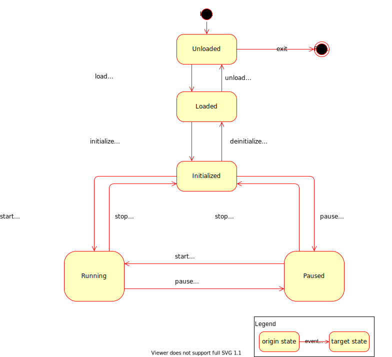

#
# Copyright @ 2021 VW Group. All rights reserved.
# 
#     This Source Code Form is subject to the terms of the Mozilla
#     Public License, v. 2.0. If a copy of the MPL was not distributed
#     with this file, You can obtain one at https://mozilla.org/MPL/2.0/.
# 
# If it is not possible or desirable to put the notice in a particular file, then
# You may include the notice in a location (such as a LICENSE file in a
# relevant directory) where a recipient would be likely to look for such a notice.
# 
# You may add additional accurate notices of copyright ownership.
# 

.. _FEP_Participant_Library:

================================
FEP Participant Library
================================

.. _label_components_new:

Basic Concepts
--------------

In this chapter the basic concepts of FEP SDK will be explained by going through the example code of :ref:`label_minimal_participant`.

After this chapter the user will be able to create a basic FEP Participant, with a simple Job that reads and writes data.

.. literalinclude:: ../snippets/snippet_minimal_participant.cpp

Components
----------

The functional parts of the :term:`FEP Participant` are called :term:`FEP Components<FEP Component>`.
Each :term:`FEP Component` covers some specific functionality, e.g. functionality to exchange simulation data with other participants.

:term:`FEP Components<FEP Component>` can be accessed via the :term:`FEP Participant` API's
template method getComponent() in :cpp:class:`fep3::arya::Participant`, passing the :term:`FEP Component Interface`
as template argument.

.. _label_jobs_new:

Jobs
****

Jobs are small runnable units to implement a functionality that needs to be part of a distributed scheduler. 
At the moment the configurations of jobs is only possible for cyclic time triggered events.
In future there might be a possibility to add data triggered jobs as well.

The job class :cpp:class:`fep3::arya::IJob`  has three interface functions.

* 	The :cpp:func:`fep3::arya::IJob::executeDataIn` is to read
	and prepare the incoming data for the *execute* call. Do *not* implement any functional behavior in here,
	but read all data from the IDataRegistry::IDataReader.

* The :cpp:func:`fep3::arya::IJob::execute` is to implement the jobs functional behavior.

* The :cpp:func:`fep3::arya::IJob::executeDataOut` is to flush the :cpp:class:`fep3::core::arya::DataWriter` queues.

As a first example a job that is triggered with a default period is implemented, as shown in :ref:`label_minimal_participant`.

First the Class :cpp:class:`MinimalDataJob` has to be defined and the :cpp:func:`fep3::cpp::arya::DataJob::process` method implemented, which is the actual method to be periodically called.
The :cpp:class:`MinimalDataJob`, inherits from :cpp:class:`fep3::cpp::arya::DataJob` and not directly from :cpp:class:`fep3::arya::IJob`, since :cpp:class:`fep3::cpp::arya::DataJob` also encapsulates
some steps that otherwise would have to be implemented if directly inheriting from :cpp:class:`fep3::arya::IJob`.

.. literalinclude:: ../snippets/snippet_minimal_participant.cpp
    :lines: 15-30

Then the participant has to be instantiated and excecuted (:ref:`label_participant_execution`). 

.. literalinclude:: ../snippets/snippet_minimal_participant.cpp
    :lines: 38-40
	
.. _label_sim_data:

Simulation Data
***************

In :ref:`label_jobs_new`, it is described how a runnable with a default periodicity can be triggered. However it would be more usefull if this runnable could receive and send data.
Let's assume that the runnable should receive an integer, multiple it by 2 and pass it to the output.

For this a data source and a data sink are needed, that are :cpp:class:`fep3::arya::IDataRegistry::IDataReader` and :cpp:class:`arya::IDataRegistry::IDataWriter` which read or write a dedicated signal respectively.
So in this example, input is read from "small_value" signal and output is written to the "big_value" signal.

First the reader is initialized

.. literalinclude:: ../snippets/snippet_minimal_participant.cpp
    :lines: 9

and the writer.

.. literalinclude:: ../snippets/snippet_minimal_participant.cpp
    :lines: 10

Now what only remains is to read the input

.. literalinclude:: ../snippets/snippet_minimal_participant.cpp
    :lines: 19

calculate the output value

.. literalinclude:: ../snippets/snippet_minimal_participant.cpp
    :lines: 21
	
and write it in the :cpp:func:`MinimalDataJob::Process` method.

.. literalinclude:: ../snippets/snippet_minimal_participant.cpp
    :lines: 28
	
The full example can be found in :ref:`label_minimal_participant`.

For a detailed explanation of the data exchange see :ref:`label_communication_advanced`.

.. _label_sim_time:

Simulation Time
***************

In :ref:`label_sim_data`, it is described how a job can interact with signals, in this section we will see how we can set the job's cycle time.
The :ref:`label_scheduler_service` and its :ref:`label_scheduler_service_active_scheduler` are responsible for the triggering each time a Job's cycle time passes.

A job's cyclic time can be configured with :cpp:class:`fep3::arya::JobConfiguration` as described in :ref:`label_job_registry_job_configuration` .
:cpp:class:`fep3::cpp::arya::DataJob` provides two constructors in case you would like to set only the cyclic time :cpp:class:`fep3::cpp::arya::DataJob::DataJob(const std::string &, fep3::arya::Duration)` or pass the 
:cpp:class:`fep3::arya::JobConfiguration` in :cpp:class:`fep3::cpp::arya::DataJob::DataJob(const std::string&, fep3::arya::JobConfiguration)`

	
Configuration
*************
Assuming now that the job should be able to work with some parameters that will not compile time variables, rather could be changed in runtime.

After resgistering a property :class:`fep3::cpp::PropertyVariable` 

.. literalinclude:: ../snippets/snippet_minimal_participant.cpp
    :lines: 12

the values of the  property variables are updated 

.. literalinclude:: ../snippets/snippet_minimal_participant.cpp
    :lines: 16

and the binded variable can be used for accessing the property value.

.. literalinclude:: ../snippets/snippet_minimal_participant.cpp
    :lines: 21

Detailed description on properties can be found in :ref:`label_configuration_service`.

Logging
*******

In case a logging mechanism is needed, there are dedicated macros that provide logging for various severity grades (DEBUG, FATAL, ERROR, WARNING, INFO, RESULT).
An example of the logging macro usage is included in :ref:`label_minimal_participant`.

.. literalinclude:: ../snippets/snippet_minimal_participant.cpp
    :lines: 23-26
	

Detailed description on logging service can be found in :ref:`label_logging_service`

Advanced Concepts
-----------------
In :ref:`label_components_new` a basic example of a FEP Participant was presented, which was using some helper classes of the FEP SDK,
that encapsulate some of the implementation that otherwise has to be done by the user. In this chapter, some more advanced concepts will be presented.

FEP Element
***********

Embedding the element in a fep participant
^^^^^^^^^^^^^^^^^^^^^^^^^^^^^^^^^^^^^^^^^^

A custom Element should inherit from :cpp:class:`fep3::core::arya::ElementConfigurable` or :cpp:class:`fep3::core::arya::ElementBase`.

.. literalinclude:: ../snippets/snippet_core_receiver_main.cpp
    :lines: 60-62, 68-70

In order to create an object of :cpp:class:`fep3::arya::Participant`  there are some overloads of the function to choose from in
:cpp:func:`fep3::arya::createParticipant` , :cpp:func:`fep3::cpp::arya::createParticipant`, :cpp:func:`fep3::core::arya::createParticipant`,
providing different alternatives for initialization.

In this example the following overload is used
:cpp:class:`template\<typename element_factory> createParticipant(int , char const *const *, const std::string& , const fep3::arya::ParserDefaultValues&)`
that provides also the possibility of parsing the command line arguments.

.. literalinclude:: ../snippets/snippet_core_receiver_main.cpp
    :lines: 140-143

The :cpp:class:`fep3::arya::IElementFactory` can either be passed as a template parameter or as a constructor argument and it is the interface that will eventually call
the constructor of the custom Element Class and create an object instance during the load_element action of the :ref:`label_participant_state_machine`.
The destructor of the created object is called in the unload_element action of the :ref:`label_participant_state_machine`.
The lifetime of the created Factory object on the other hand is equal to the lifetime of the participant, meaning there is only one instance of :cpp:class:`fep3::arya::IElementFactory`
created during the :cpp:class:`fep3::arya::Participant`'s lifetime.

.. _label_create_participant:

Creating participant overloads
^^^^^^^^^^^^^^^^^^^^^^^^^^^^^^

These convenience wrappers serve common use cases and require less arguments to be passed. For stand-alone participant executables
it is recommended to use those overloads that take argc and argv as arguments in order to enable command line argument parsing,
so that parameters like name of participant or system can be changed on startup and are not hard-coded into them.

createParticipant convenience wrappers of the Cpp Library
"""""""""""""""""""""""""""""""""""""""""""""""""""""""""

These convenience wrappers are for simple participants where the entire implementation can be described with a :cpp:class:`fep3::cpp::arya::DataJob` and no custom element is required.

.. literalinclude:: ../snippets/snippet_participant.cpp
    :start-after: //Begin(CppBasic)
    :end-before: //End(CppBasic)

To add user defined command line arguments a parser object has to be created and passed to the createParticipant function.

.. literalinclude:: ../snippets/snippet_participant.cpp
    :start-after: //Begin(CppUserArg)
    :end-before: //End(CppUserArg)

createParticipant convenience wrappers of the Core Library
""""""""""""""""""""""""""""""""""""""""""""""""""""""""""

These convenience wrappers are for participants with custom elements and also allow to define the element version and a default value for the system address url.

.. literalinclude:: ../snippets/snippet_participant.cpp
    :start-after: //Begin(CoreBasic)
    :end-before: //End(CoreBasic)

This will make the optional arguments required and change how the executable is called:

With default values defined:

.. code-block:: none

    > myParticipantExecutable -n MyParticipant -s MySystem

Without default values defined:

.. code-block:: none

    > myParticipantExecutable MyParticipant MySystem

If you are having access to argc/argv, it is strongly recommended to also pass those to your participant.
Only skip this, if you provide other means to e.g. configure your participants name and system.

.. literalinclude:: ../snippets/snippet_participant.cpp
    :start-after: //Begin(CoreNoParsing)
    :end-before: //End(CoreNoParsing)

Adding user defined command line arguments is identical to the cpp library. Only the :cpp:func:`fep3::arya::createParticipant` call is slightly different.

.. literalinclude:: ../snippets/snippet_participant.cpp
    :start-after: //Begin(CoreUserArg)
    :end-before: //End(CoreUserArg)

.. _label_participant_execution:

Execution
^^^^^^^^^

After instantiating the participant, it has to be executed via :cpp:func:`fep3::arya::Participant::exec`. If the execution succeeds,
this method blocks until the :ref:`label_participant_state_machine` reaches the state ``Final``.

.. _label_participant_state_machine:

State Machine
^^^^^^^^^^^^^

A participant instance has the following state machine:

.. attention::
    State 'Paused' is not supported yet. Trying to set a participant and its components to state 'Paused' results in an error.

Once the participant instance has been created, its state machine is in state "Unloaded". The state machine can then be controlled by events via
the :ref:`label_service_bus`.

The following table shows the calls to the FEP Participant API as performed by the element-related guards and actions (postfixed by ``..._element`` in the state machine diagram):

+-------------------------------------------+----------------------------------------------------------+
| guard/action                              | calls on the FEP Participant API                         |
+===========================================+==========================================================+
| load_element                              | :cpp:func:`fep3::arya::IElementFactory::createElement`   |
|                                           | :cpp:func:`fep3::arya::IElement::loadElement`            |
+-------------------------------------------+----------------------------------------------------------+
| unload_element                            | :cpp:func:`fep3::arya::IElement::unloadElement`          |
|                                           | :cpp:func:`fep3::arya::~IElement`                        |
+-------------------------------------------+----------------------------------------------------------+
| initialize_element                        | :cpp:func:`fep3::arya::IElement::initialize`             |
+-------------------------------------------+----------------------------------------------------------+
| deinitialize_element                      | :cpp:func:`fep3::arya::IElement::deinitialize`           |
+-------------------------------------------+----------------------------------------------------------+
| run_element                               | :cpp:func:`fep3::arya::IElement::run`                    |
+-------------------------------------------+----------------------------------------------------------+
| stop_element                              | :cpp:func:`fep3::arya::IElement::stop`                   |
+-------------------------------------------+----------------------------------------------------------+

Note: For a description of the calls to the FEP Component API as performed by the component-related guards and actions (postfixed by ``..._components`` in the state machine diagram),
please refer to :ref:`label_calls_to_component`.

.. _label_element_interface:

Implementing the :cpp:func:`fep3::arya::IElement::loadElement`  and :cpp:func:`fep3::arya::IElement::initialize`
^^^^^^^^^^^^^^^^^^^^^^^^^^^^^^^^^^^^^^^^^^^^^^^^^^^^^^^^^^^^^^^^^^^^^^^^^^^^^^^^^^^^^^^^^^^^^^^^^^^^^^^^^^^^^^^^

Typically in the :cpp:func:`fep3::arya::IElement::loadElement` overload of the custom Element class the job is registered

.. literalinclude:: ../snippets/snippet_core_receiver_main.cpp
    :lines: 85-99

whereas in the :cpp:func:`fep3::arya::IElement::initialize` any data receivers or writers of the Element are registered.

.. literalinclude:: ../snippets/snippet_core_receiver_main.cpp
    :lines: 91-97

For loading external data in the Element class (for example from an external file), either of these two functions could be used.

Using a custom ElementFactory
^^^^^^^^^^^^^^^^^^^^^^^^^^^^^

In some use cases the implementation of a custom ElementFactory should be necessary. For example in cases that additional arguments should be
passed to the constructor of the Element Class.

In this examplary use case, some command line arguments have to be forwarded to the Element Class constructor.

The :cpp:class:`CustomElementFactory` is defined

.. literalinclude:: ../snippets/snippet_element_factory.cpp
    :lines: 157-180

The constructor of :cpp:class:`EasyCoreReceiverElement` is now modified to accomondate for the additional arguments

.. literalinclude:: ../snippets/snippet_element_factory.cpp
    :lines: 83-87

that are used in the :cpp:func:`EasyCoreReceiverElement::process` function

.. literalinclude:: ../snippets/snippet_element_factory.cpp
    :lines: 140-144

The constructor simply stores the command line paramenters and forwards them in the constructor :cpp:func:`EasyCoreReceiverElement::EasyCoreReceiverElement` when
:cpp:func:`CustomElementFactory::createElement` is called during the load_element action of :ref:`label_participant_state_machine`.

.. literalinclude:: ../snippets/snippet_element_factory.cpp
    :lines: 172-175
	
So by using a custom factory, the main function should look like this:

.. literalinclude:: ../snippets/snippet_element_factory.cpp
    :lines: 182-203

.. _label_configurable_fep_element:

Configurable FEP Element
************************

The :cpp:class:`fep3::core::arya::ElementConfigurable` provides you with the ability to develop a FEP Element that has a configuration. A configuration contains properties that are not
meant to be changed periodically, but can be used to set static data, for more details see Configuration Service :ref:`label_configuration_service_overview`.

The convenience class :cpp:class:`fep3::core::arya::ElementConfigurable` can be used for easy setting up a configurable FEP Element:

.. literalinclude:: ../snippets/snippet_core_sender.cpp
    :lines: 62

The properties should be then member of the element class:

.. literalinclude:: ../snippets/snippet_core_sender.cpp
    :lines: 139
	
and registered in the constructor:

.. literalinclude:: ../snippets/snippet_core_sender.cpp
    :lines: 65-81
	
Then the updated element value can be accessed only after calling  :cpp:func:`fep3::base::arya::Configuration::updatePropertyVariables`

.. literalinclude:: ../snippets/snippet_core_sender.cpp
    :lines: 119, 122

By inheriting from cpp:class:`fep3::core::arya::ElementConfigurable`, the participant will have a property node named *element*. In this example, assuming the system is called *demo_system*
and the participant *demo_participant*, the property value can be accessed from the fep_control as follows:

.. code-block:: console

    getParticipantProperty demo_system demo_core_sender element/integer_value

If the property value has to be set to *5* for example, this can also be done from the fep_control:

.. code-block:: console

    setParticipantProperty demo_system demo_core_sender element/integer_value 5

Properties can also be changed programatically as shown in :ref:`label_configuration_service_overview`.
It is also possible to have an observer reacting on a property value change, see :ref:`label_property_observers`.

.. note:: Regarding the proper use cases for properties please see also :ref:`label_using_properties_in_fep`

.. _label_component_property_table:

Component Propierties
^^^^^^^^^^^^^^^^^^^^^

The following table sumarizes the properties that are used by the FEP components, along with the member function of the compoment that the
:cpp:func:`fep3::base::arya::Configuration::updatePropertyVariables` is called.

+------------------------------------+--------------+---------------------------------+-----------------------+-----------------------------------+---------------+
|  Component                         | Type         |          Property Name          | Default value         | updatePropertyVariables called    |     Reference |
+====================================+==============+=================================+=======================+===================================+===============+
| :ref:`label_clock_service`         | std::string  | main_clock                      | local_system_realtime | tense()                           |               |
+------------------------------------+--------------+---------------------------------+-----------------------+-----------------------------------+---------------+
| :ref:`label_clock_service`         | int64_t      | time_update_timeout             | 5000000000            | tense()                           |               |
+------------------------------------+--------------+---------------------------------+-----------------------+-----------------------------------+---------------+
| :ref:`label_clock_service`         | double       | time_factor                     | 1.0                   | tense()                           |               |
+------------------------------------+--------------+---------------------------------+-----------------------+-----------------------------------+---------------+
| :ref:`label_clock_service`         | int64_t      | step_size                       | 100000000             | tense()                           |               |
+------------------------------------+--------------+---------------------------------+-----------------------+-----------------------------------+---------------+
|:ref:`label_clock_sync_service`     | std::string  | timing_master                   | ""                    | initialize()                      |               |
+------------------------------------+--------------+---------------------------------+-----------------------+-----------------------------------+---------------+
|:ref:`label_clock_sync_service`     | int64_t      | sync_cycle_time                 | 100000000             | initialize()                      |               |
+------------------------------------+--------------+---------------------------------+-----------------------+-----------------------------------+---------------+
| :ref:`label_data_registry`         |std::string   | mapping_configuration           | ""                    | initialize(), registerDataIn()    |               |
+------------------------------------+--------------+---------------------------------+-----------------------+-----------------------------------+---------------+
| :ref:`label_data_registry`         |std::string   |mapping_configuration_file_path  | ""                    | initialize(), registerDataIn()    |               |
+------------------------------------+--------------+---------------------------------+-----------------------+-----------------------------------+---------------+
| :ref:`label_logging_service`       | std::string  | default_sinks                   | console               | initialize()                      |               |
+------------------------------------+--------------+---------------------------------+-----------------------+-----------------------------------+---------------+
| :ref:`label_logging_service`       | int32_t      | default_severity                | LoggerSeverity::info  | initialize()                      |               |
+------------------------------------+--------------+---------------------------------+-----------------------+-----------------------------------+---------------+
| :ref:`label_logging_service`       |  std::string | default_sink_file               | ""                    | initialize()                      |               |
+------------------------------------+--------------+---------------------------------+-----------------------+-----------------------------------+---------------+
| :ref:`label_scheduler_service`     | std::string  | scheduler                       | clock_based_scheduler | tense()                           |               |
+------------------------------------+--------------+---------------------------------+-----------------------+-----------------------------------+---------------+
|:ref:`label_simulation_bus`         | int32_t      | participant_domain              | 5                     | initialize()                      |               |
+------------------------------------+--------------+---------------------------------+-----------------------+-----------------------------------+---------------+

.. _label_communication_advanced:

Communication
*************

Timing
******

Advanced Logging
****************

Custom Component
****************

RPC service
***********

Appendix
--------

API Levels
**********

base

core

cpp

How and when to use them

Native Components
*****************

Performance (Here?)
*******************

Platform Notes 
**************
