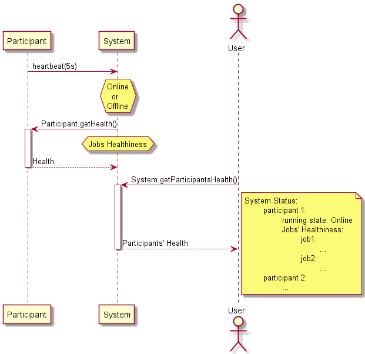

.. Copyright 2023 CARIAD SE.
..
.. This Source Code Form is subject to the terms of the Mozilla 
.. Public License, v. 2.0. If a copy of the MPL was not distributed 
.. with this file, You can obtain one at https://mozilla.org/MPL/2.0/.

.. _FEP_System_Library:

==================
User Documentation
==================

A :term:`FEP System` is a collection of participants that provide :term:`RPC Service` interfaces to control them.
Each service can be reached via the class :cpp:class:`fep3::ParticipantProxy` created within a :cpp:class:`fep3::System`.

Currently a participant is identified by its name and its system relation.
As long as participants take part in the same :ref:`label_service_bus` it can
be discovered via the discover mechanism provided by this service bus implementation.
Otherwise you need to know the name, system and address of the participant to connect it.

Creating a system to control it
===============================

The system library has no possibility to execute or start-up any other processes.
The provided functionality can *discover systems*, *connect already started participants* and *control participants and systems*.
If a participant shut downed and stopped its service bus connection it could not be restarted!

.. _label_set_init_and_start_policy:

Participant Discovery
===========================================
The system Library provides some convenience functions for discovering a single or all discoverable systems.
For discovering a single system the :cpp:func:`fep3::discoverSystemByURL` and :cpp:func:`fep3::discoverSystem` functions can be used, whereas for
discovering all Systems, :cpp:func:`fep3::discoverAllSystemsByURL` and :cpp:func:`fep3::discoverAllSystems` functions can be used.
The functions ending with *ByURL*, allow the URL in which the system can be discovered to be defined, in comparison to the other functions where the default URL
is used.

:cpp:func:`fep3::discoverSystemByURL` and :cpp:func:`fep3::discoverSystem` provide three overloads, while :cpp:func:`fep3::discoverAllSystemsByURL` and :cpp:func:`fep3::discoverAllSystems` provide two. For this example the overloads of `fep3::discoverSystem` will be explained but the behavior is the same for all discovery functions mentioned:

.. _discoverSystem_by_time:

.. cpp:function:: fep3::System fep3::discoverSystem(std::string name, std::chrono::milliseconds timeout = 1000ms).

    This function will wait for the value defined in *timeout* in milliseconds and then return the discovered System or Systems (for :cpp:func:`fep3::discoverAllSystemsByURL` and :cpp:func:`fep3::discoverAllSystems`)

.. _discoverSystem_by_time_and_name:

.. cpp:function:: fep3::System fep3::discoverSystem(std::string name, std::vector<std::string> participant_names, std::chrono::milliseconds timeout = 1000ms).

    This function will return the discovered System once **at least** the given participants are discovered **or** the discovery time expired. The returned System can contain additional participants to the ones given in the command. The participant names have be an exact match, no wildcards or regex are supported. In case *participant_names* is not a subset of discovered participants' names at the end of the timeout, the function will throw a :cpp:class:`std::runtime_error`. This overload is not available in :cpp:func:`fep3::discoverAllSystemsByURL` and :cpp:func:`fep3::discoverAllSystems`.

.. _discoverSystem_by_time_and_count:

.. cpp:function:: fep3::System fep3::discoverSystem(std::string name, uint32_t participant_count, std::chrono::milliseconds timeout = 1000ms)

    This function will return the discovered System or Systems once **at least** the given count participants are discovered **or** the discovery time expired. The returned System can contain a greater number of participants to the one given in the command. In case the number of participants discovered at the end of the timeout is less than *participant_count*, the function will throw a :cpp:class:`std::runtime_error`.

.. warning::

    When using the :cpp:func:`fep3::discoverAllSystems` and :cpp:func:`fep3::discoverAllSystemsByURL`, consider that in case multiple systems are discoverable, the function may not return the System and participants expected. This can be the case if the expected count of participants is discovered in multiple systems.

.. _label_warning_discovery_overloads:

.. warning::

    It is strongly advised that whenever possible the overloads with *participant_names* or *participant_count* of :cpp:func:`fep3::discoverAllSystems` and :cpp:func:`fep3::discoverSystem` are used. Discovery time could fluctuate, therefore in case specific participants or participant count are expected to be discovered, the corresponding system discovery function should be used.

Triggering state transitions of Participants
============================================

The FEP System library will trigger :ref:`label_participant_state_machine` transitions of participants using the :term:`RPC Service`.
The functions :cpp:func:`fep3::System::load`, :cpp:func:`fep3::System::initialize`, :cpp:func:`fep3::System::stop`, etc.. trigger the  corresponding action
in the state machine. In case the transition is not allowed , for example the System is in state :cpp:enumerator:`fep3::rpc::arya::ParticipantState::loaded` 
and :cpp:func:`fep3::System::start` is called, then
the function will throw an exception. Triggering of individual Participant state machine transitions is done according to the :cpp:enumerator:`fep3::System::InitStartExecutionPolicy` 
(the policy applies to all transitions including load and unload).

.. _label_state_transition_timeout:

Timeout
-------
The state transition functions take a timeout argument. The timeout must be in milliseconds, and defines the time after which the system library
will log a warning in case the state transition is not yet complete. The timeout **does not** abort the execution of the current state transition.
Even if the timeout warning is logged, in case the state transition completes succesfully neither the system library will log any error 
nor the transition function will throw.

Execution policy
-----------------

The execution policy can be changed by calling :cpp:func:`fep3::System::setInitAndStartPolicy`.
For transitions to and from states :cpp:enumerator:`fep3::rpc::arya::ParticipantState::initialized` and :cpp:enumerator:`fep3::rpc::arya::ParticipantState::running`,
the execution policy is applied to the set of participants that have the same priority.
The execution according to the policy is done as follows:

* :cpp:enumerator:`fep3::System::InitStartExecutionPolicy::sequential` : Each participant's transition is called in sequence, meaning that the participant's state transition is 
  completed before the next participant's transition will be triggered. In case the current transition fails, the following transitions will be canceled and the function will throw an exception.

* :cpp:enumerator:`fep3::System::InitStartExecutionPolicy::parallel` : The participants' transitions are triggered in parallel within a thread pool.
  This means the maximum number of participants that can transition in parallel is controlled by the parameter *thread_count*
  when calling :cpp:func:`fep3::System::setInitAndStartPolicy`. The default execution policy is :cpp:enumerator:`fep3::System::InitStartExecutionPolicy::parallel`
  with a thread count of 4. In case a transition fails, the following transitions will be canceled and the function will throw an exception. However this means
  that transitions already running in the thread pool will be awaited for completion.

Init and  Start priority
------------------------
Each participant has an initialization and start priority assigned that can be changed with :cpp:func:`fep3::ParticipantProxy::setInitPriority` 
and :cpp:func:`fep3::ParticipantProxy::setStartPriority`
and retrieved with :cpp:func:`fep3::ParticipantProxy::getInitPriority` and :cpp:func:`fep3::ParticipantProxy::getStartPriority`.
Participants with the highest init priority will transition first from :cpp:enumerator:`fep3::rpc::arya::ParticipantState::loaded` 
to :cpp:enumerator:`fep3::rpc::arya::ParticipantState::initialized` and transition last from :cpp:enumerator:`fep3::rpc::arya::ParticipantState::initialized` 
to :cpp:enumerator:`fep3::rpc::arya::ParticipantState::loaded`.

Summing  up, a single state transition looks as in the following diagram.

.. raw:: html

    <object data="../single_transition_example.svg" type="image/svg+xml"></object>
   
.. warning::
    Constraints:

    * In case the parallel state transition is used, the participants should run in different processes.

Setting the system state
------------------------

In case we want to trigger for example, a transition from :cpp:enumerator:`fep3::rpc::arya::ParticipantState::unloaded` to
:cpp:enumerator:`fep3::rpc::arya::ParticipantState::running`, we have to call :cpp:func:`fep3::System::load`, 
:cpp:func:`fep3::System::initialize` and :cpp:func:`fep3::System::start`  in sequence. However this is not convenient, and for this reason 
:cpp:func:`fep3::System::setSystemState` exists. This function will iterate the :ref:`label_participant_state_machine` through
the correct transitions in order for the expected final state to be reached. The timeout argument in the function affects each state
transition seperately an not the whole transition duration, more details on the state transition timeout can 
be found :ref:`here <label_state_transition_timeout>`. The most interesting feature of :cpp:func:`fep3::System::setSystemState`
is that it can handle an :term:`Inhomogeneous FEP System`. The behavior in these cases is better explained in the following 2 diagrams.

Example 1 Inhomogeneous FEP System when all participants are "below" the target state : 

.. raw:: html

    <object data="../multi_transition_example.svg" type="image/svg+xml"></object>
    
Example 2 Inhomogeneous FEP System when all participants are "below" or "above" the target state : 

.. raw:: html

    <object data="../multi_transition_example_2.svg" type="image/svg+xml"></object>
    
    
.. _label_accessing_participants_health:

Accessing the Participants Health
==================================

The :term:`FEP System Library`  uses the :term:`RPC Service` of :ref:`label_health_service` in order to aggregate the participants' health and also can check if
the participant is still online.

.. note:: Online in this context does not mean if the participant is in state running, but whether the participant executable is still running. The participant's
          running state is based on whether the participant is still sending :term:`Discovery Messages` in :term:`Participant Discovery` protocol.

Participant health status polling and liveliness
------------------------------------------------

The :term:`Participant Discovery` protocol implemented in :ref:`label_service_bus`, sends periodically messages as a :term:`heartbeat`.

The default :term:`heartbeat` period of a participant is 5 seconds but it can be adjusted or its value can be checked using :cpp:func:`fep3::System::setHeartbeatInterval` and :cpp:func:`fep3::System::getHeartbeatInterval` respectively.
When :term:`FEP System Library` receives a :term:`heartbeat message <Heartbeat>` from a discovered participant, it polls its health using its :ref:`label_health_service_rpc_interface`, so by changing the heartbeat interval the polling rate of the participants' health can be adjusted.

.. warning::
    Decreasing the :term:`heartbeat` period in order to increase the polling frequency of the health service can negatively impact the network load and/or :term:`FEP Participant` or :term:`FEP System Library` performance.

.. warning::
    20 seconds is the timeout that the :term:`Participant Discovery` in :ref:`label_service_bus` uses, so reducing the :term:`heartbeat` period near this threshold value will potentially cause participant :term:`discovery <Participant Discovery>` to malfunction.

The participant is considered to be online if it has sent a :term:`heartbeat` message in the last 20 seconds. This value is called the *liveliness timeout* and it can be changed using :cpp:func:`fep3::System::setLivelinessTimeout`
or the value can be checked with :cpp:func:`fep3::System::getLivelinessTimeout`.

The participants' health will be returned by calling :cpp:func:`fep3::System::getParticipantsHealth`. The returned structure contains the running state of the participant as well as the last and total count of errors of the jobs running in each participant in the system.

In case the Health feature should be deactivated (for example in order to reduce the network load) the function :cpp:func:`fep3::System::setHealthListenerRunningStatus` can be used. This will completely deactivate the listening of the :term:`heartbeat` messages and the polling of the participants' health via the :term:`RPC Service`. The current running status of the health listeners can be checked with :cpp:func:`fep3::System::getHealthListenerRunningStatus`.

.. warning::
    Calling :cpp:func:`fep3::System::getParticipantsHealth` with deactivated health listeners will result in an exception.

Some useful troubleshooting tips regarding health service in :term:`FEP System Library` can be found in :ref:`Health Service Troubleshooting <label_health_service_troubleshooting>`.
